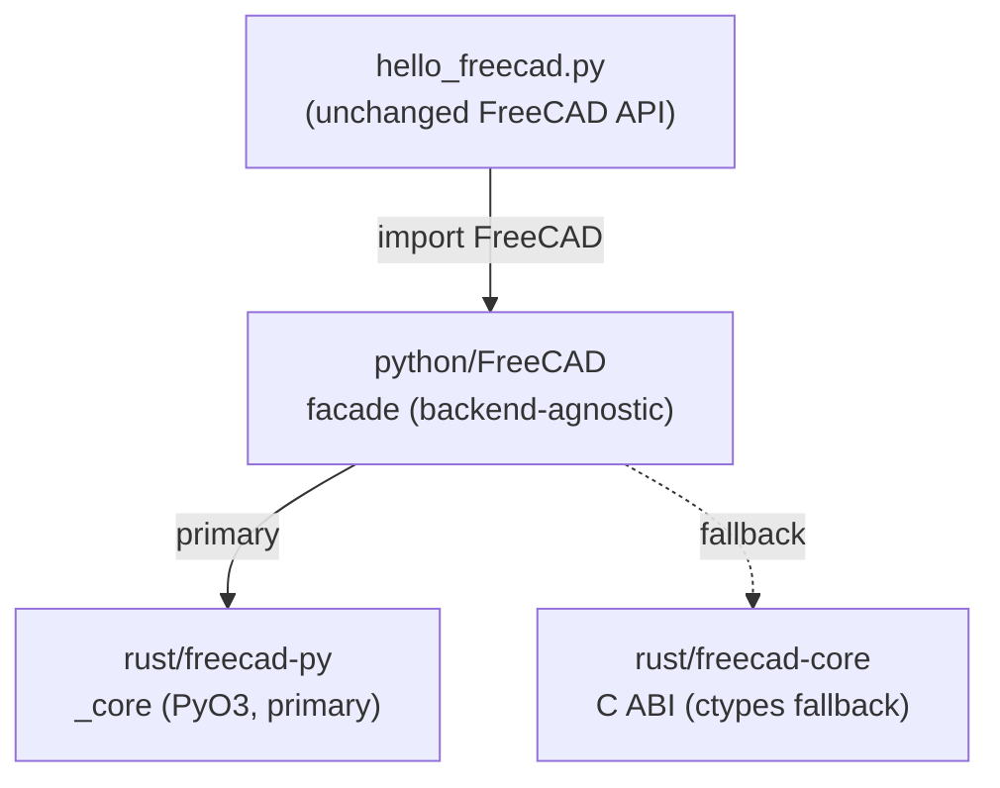

# freecad-rs-poc

**Milestones 0–1:** run a FreeCAD headless "hello world" Python script on a Rust core,
with the C++ Python bindings replaced by Rust bindings.

* **M0** — hello world on a Rust object model, bridged to Python over a C ABI + `ctypes`.
* **M1** — the bridge migrated to **PyO3**: `FreeCAD` is now a native Rust extension
  module (`_core`); the `ctypes` path is retained as a fallback.

This is a proof of concept, not a product. It exists to validate the single
riskiest assumption of the rewrite plan: *that a Python script written against
FreeCAD's public `App` API can be served by a Rust implementation instead of the
C++ one, without changing the script.*

## The idea



* **`hello_freecad.py`** uses only the public FreeCAD API. The same file is
  intended to run against upstream FreeCAD.
* **`python/FreeCAD/`** is a drop-in module that speaks that API and selects a
  backend; it knows nothing about C++ or Coin.
* **`rust/freecad-py/`** exposes the model as real `#[pyclass]` types via PyO3
  (primary; importable as `FreeCAD._core`).
* **`rust/freecad-core/`** implements the same model behind a flat C ABI, used as
  the `ctypes` fallback.

## Build & run

```sh
./build.sh     # cargo build --release, then package the .so into python/FreeCAD/
./run.sh       # PYTHONPATH=python python3 hello_freecad.py
```

Expected output:

```
FreeCAD version : 0.1.0
Active document : HelloWorld
Document label  : HelloWorld
Object count    : 1
  - Box (App::FeaturePython) label='Hello, FreeCAD'
obj.Description : Created by the Rust core
Properties      : ['Description']
Documents       : ['HelloWorld']
Active after close: None
OK
```

Tests:

```sh
PYTHONPATH=python python3 -m unittest discover -s tests -v
```

## The two bridges

* **PyO3 (`rust/freecad-py`)** — the destination (M1). `FreeCAD._core` is a native
  Rust extension exposing `Document`/`DocumentObject` as `#[pyclass]` types. It is
  built with `abi3` and `PYO3_USE_ABI3_FORWARD_COMPATIBILITY=1`, because this sandbox
  runs CPython 3.14, which is newer than PyO3 0.25 officially targets.
* **C ABI + `ctypes` (`rust/freecad-core`)** — the M0 bootstrap, kept as a fallback.
  It needs no CPython headers, so it builds in the most restricted environments.

`FreeCAD/__init__.py` imports `_core` if present, otherwise `_ctypes_backend`, and
reports which via `FreeCAD.backend` (`"pyo3"` or `"ctypes"`). Both backends expose
the same surface, so `hello_freecad.py` and the tests are backend-agnostic.

See [`../docs/rewrite-strategy.md`](../docs/rewrite-strategy.md) for the direction and
[`../docs/coin-bridge-reuse-assessment.md`](../docs/coin-bridge-reuse-assessment.md)
for the underlying analysis.

## What is implemented vs. not

Implemented (enough for the hello world and a workbench-style script):

* documents: `newDocument`, `closeDocument`, `getDocument`, `listDocuments`,
  `ActiveDocument`, unique-name allocation, `Name`/`Label`.
* objects: `addObject` (default naming), `getObject`, `removeObject`, `Objects`,
  `CountObjects`, `Name`/`Label`/`TypeId`/`Document`, `recompute`.
* properties: `addProperty`, `get`/`setPropertyByName`, dynamic attribute
  mapping (`obj.Foo`), `PropertiesList`, `getTypeIdOfProperty`.
* two interchangeable backends: PyO3 `_core` (primary) and the C ABI `ctypes`
  fallback, selected automatically and reported as `FreeCAD.backend`.

Not implemented (deliberately out of scope for this milestone):

* the geometry kernel (`Part::Box` etc. produce no shape),
* the dependency graph / real `recompute` semantics,
* expressions, transactions, observers, `FeaturePython` scripting callbacks,
* persistence (`.FCStd`), `App`/`Gui` split, Coin3D, Qt,
* thread-safety guarantees beyond a coarse global mutex.

## Layout

```
hello_freecad.py          the milestone script (public FreeCAD API only)
run.sh / build.sh         convenience wrappers
python/FreeCAD/           drop-in module: __init__.py (facade + backend selector)
    _core.abi3.so         built PyO3 extension (gitignored)
    _ctypes_backend.py    ctypes fallback backend
    _ffi.py               ctypes bindings for the fallback
rust/freecad-py/          PyO3 bindings (primary)
rust/freecad-core/        Rust object model + flat C ABI (fallback)
tests/test_parity.py      behavioural checks
```
