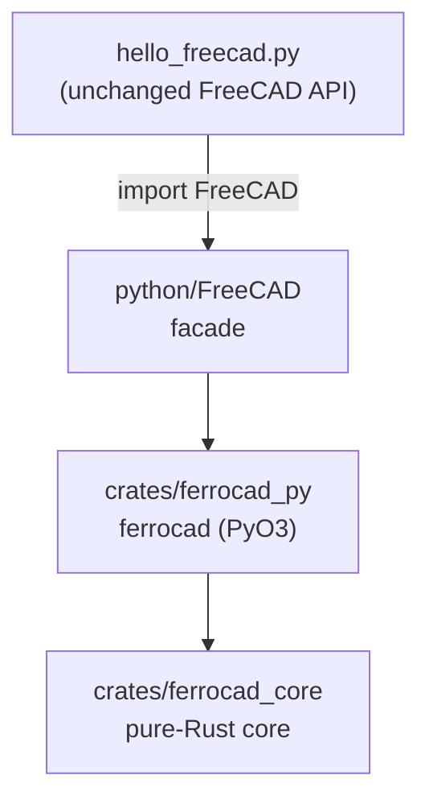

# FerroCAD

**FerroCAD** is the project formerly known as `freecad-rs-poc`: a Rust reimplementation of FreeCAD's
C++ `App` core, designed to be a **drop-in replacement for the `FreeCAD` Python package**. The
Python import namespace stays `FreeCAD`; the project/distribution is `ferrocad`.

**Milestones 0–4 (slice 16):** run a FreeCAD headless "hello world" Python script on a pure-Rust
core, with the C++ Python bindings replaced by Rust bindings.

* **M0** — hello world on a Rust object model, bridged to Python over a temporary C ABI + `ctypes`.
* **M1** — the bridge migrated to **PyO3** (`FreeCAD._core`); the temporary `ctypes` path stood in as a fallback until it was removed in favour of a hard dependency on the CPython headers.
* **M2** — the pure-Rust core (`ferrocad_core`): quantities, properties, a dependency-graph
  recompute order, transactions (open/commit/abort/undo/redo), observers, and an expression engine.
* **M3a** — inventory the upstream `.pyi` stubs (320 files → 329 classes / 2210 methods).
* **M3b** — PyO3 bindings over `ferrocad_core` (`ferrocad_py`, module `ferrocad`) became the
  **sole** backend of the `FreeCAD` facade; the legacy `ctypes` fallback was removed.
* **M3c** — generate PyO3 **skeleton** bindings (`ferrocad_gen`) from the `.pyi` model; behaviour
  stays in `ferrocad_core` (hand-written glue).
* **M3d** — a **conformance harness** that runs upstream `Mod/Test` files against our `FreeCAD`
  and reports the parity gap.
* **M4 (slice 1)** — the `FreeCAD.Base`/`Units`/`Console`/`ParamGet`/`StringHasher` surface.
* **M4 (slice 2)** — the full **`FreeCAD.Units` system** (`Unit`/`Quantity` + expression parser).
* **M4 (slice 3)** — `Base.Vector`/`Matrix`/`Placement`/`Rotation`/`TypeId` + `App::FeatureTest`.
* **M4 (slice 4)** — document `saveAs`/`save`/`open`/`copyObject` (JSON persistence).
* **M4 (slice 5)** — geometry tuple setters, `PlacementList`/`RotationList` properties, document
  metadata (`ActiveObject`/`findObjects`/`setAutoCreated`), `TypeId` classmethods, `addProperty`
  flags, `addDocumentObserver` (no-op) + `FreeCAD.PropertyType`.
* **M4 (slice 6)** — dynamic **extensions** (`addExtension`/`hasExtension` with
  `GroupExtensionPython`→`GroupExtension` inheritance), **groups** (`App::DocumentObjectGroup` +
  `App::Part` with `Group` link list, `addObject`/`hasObject`/`getObject`/`getParentGroup`/
  `getParentGeoFeatureGroup`/`OutList`/`InList`, single-group enforcement), and a console-mode
  **`FreeCADGui`** stub + `ViewObject` → `None`.
* **M4 (slice 7)** — `App::Origin.getSubObject` (axes/planes with the standard frames; FreeCAD's
  `retType` convention) + a **row-major `Matrix4` fix** (`transform`/`Placement.to_matrix` were
  inconsistent, inverting rotations).
* **M4 (slice 8)** — link properties read/write as `DocumentObject`s; arbitrary object attributes
  (`obj.Proxy`) via an instance `__dict__`; object `__hash__`; `abi3` minimum 3.10.
* **M4 (slice 9)** — `Document.Meta` + `Document.settings(namespace)` (typed get/set, validation),
  `Document.RootObjects`/`TopologicalSortedObjects`, `DocumentObject.ID`, id-aware `getObject`,
  `ColorList`.
* **M4 (slice 10)** — `PropertyLinkSub` (`(object, subnames)` round-trip); `listDocuments()` returns
  a dict (upstream shape) and `openDocument` is exposed.
* **M4 (slice 11)** — **document observers that fire**: a global observer registry + an object
  identity cache (so observer arguments satisfy `is`), pending/named transactions, and event
  emission at the exact FreeCAD points (document lifecycle, object create/change/delete/recompute,
  dynamic properties/extensions, transactions, save). All `DocumentObserverCases` pass.
* **M4 (slice 12)** — persistence/recovery: `Document.dumpContent`/`restoreContent`/`restore`,
  `DocumentObject.dumpContent`/`restoreContent`/`dumpPropertyContent`/`restorePropertyContent`,
  `canWriteRecoverySnapshot`/`TransientDir` and `writeRecoverySnapshotToTransientDir`.
* **M4 (slice 13)** — Python-object & `Proxy` persistence: `App::PropertyPythonObject` values and an
  object's `Proxy` (`dumps`/`loads` protocol) survive save/restore.
* **M4 (slice 14)** — expression engine: `int`→`Float` coercion, self-relative paths (`10mm`, `%`),
  cycle detection (`RuntimeError`), `ExpressionEngine`/`evalExpression`/`touch`, and
  `App::DocumentObjectFileIncluded`.
* **M4 (slice 15)** — widen the conformance harness to eight upstream files (`BaseTests`,
  `TestIntPairList`, `FreeCADInitTests` added); full `ParameterGrp` rewrite; a **matrix inverse
  transpose fix**; and a broad `Base` geometry surface (`Matrix`/`Rotation`/`Placement` helpers,
  `Vector2d`/`Material`/`BoundBox`, `IntPairList`).
* **M4 (slice 16)** — **matrix decomposition** (`Matrix.decompose()` / `hasScale()` / `ScaleType`)
  plus the rotation-numerics cluster: FreeCAD's verbatim **Gauss-Jordan inverse**, quaternion
  normalizing `to_matrix`, `decompose`-based `from_matrix`, angle wrapping, quaternion
  `yaw_pitch_roll`, and `Rotation.Axes`; conformance now **146 passing** (`BaseTests` 48/49).
* **MVP slice A1** — **object state, property status & touch**: per-property `PropertyType` status
  flags (`getPropertyStatus`/`setPropertyStatus`/`getTypeOfProperty`), touch-on-assign
  (`Prop_Output`/`Prop_NoRecompute` suppress it), `Prop_NoPersist` dropped on save, `purgeTouched`,
  `getStatusString`, and a full `State` (`Invalid`/`Touched`/`Up-to-date`).
* **MVP slice B1** — **object name/label semantics**: names are sanitized
  (`My Label` → `My_Label`) and made unique; labels are unique unless the `DuplicateLabels`
  document preference is set (then the requested label is kept verbatim), for both `addObject` and
  `copyObject`.
* **MVP slice A2** — **`PropertyEnumeration` + type validation**: an enumeration property
  (set-from-list, select by index/value, `enum_vals`), `addObject`/`addProperty`/`findObjects`
  reject extension / non-property types with `TypeError`. This continues the
  [MVP track](../docs/mvp-path.md).
* **MVP slice B2** — **the undo/redo engine**: transactions now record a general, reversible
  change set (property edits, object add/remove, expression set/remove) and expose
  `UndoNames`/`RedoNames`/`UndoCount`/`RedoCount`/`clearUndos`. Opening a second transaction
  commits the first on its next change, a new change drops the redo stack, and aborting leaves no
  entry. `ActiveObject` follows `addObject` and is cleared when that object is undone; removing an
  object records the group link-list edits so group membership is restored; `InList` is
  link-type-aware (any `Link`/`LinkList`/`LinkSub`, plus expression backlinks); and transactions
  carry process-unique ids (`getBookedTransactionID`, `getAvailableUndos`/`getAvailableRedos`),
  with `UndoMode` reported as `1` (assignment accepted and ignored). Conformance is now
  **160 passing** (`UndoRedoCases`, `MultiDocumentUndo` and `TestIntPairList` are fully green).

This is a proof of concept, not a product. It exists to validate the single
riskiest assumption of the rewrite plan: *that a Python script written against
FreeCAD's public `App` API can be served by a Rust implementation instead of the
C++ one, without changing the script.*

## The idea



* **`hello_freecad.py`** uses only the public FreeCAD API. The same file is
  intended to run against upstream FreeCAD.
* **`python/FreeCAD/`** is a drop-in module that speaks that API; it knows nothing
  about C++ or Coin. Since `ferrocad` is just a document-object model (no "application"),
  the facade adds the small App-level layer it lacks: a document registry,
  `ActiveDocument`, unique-name allocation, and `Version`.
* **`crates/ferrocad_py/`** exposes the model as real `#[pyclass]` types via PyO3
  (importable as `ferrocad`).
* **`crates/ferrocad_core/`** is the pure-Rust implementation behind `ferrocad_py`: no Python,
  no UI, just the object model.

## Workspace layout

FerroCAD is a Cargo workspace (edition 2024). Crate status:

| Crate | Role | Status |
| --- | --- | --- |
| `crates/ferrocad` | the base app: runs the general edition (`cargo run -p ferrocad`) | published (app binary) |
| `crates/ferrocad_core` | pure-Rust model: quantities, properties, documents, recompute DAG | primary |
| `crates/ferrocad_py` | PyO3 extension over `ferrocad_core` (module `ferrocad`) | primary |
| `crates/ferrocad_gen` | generated PyO3 skeleton bindings from the `.pyi` model (M3c) | useful — drives the codegen tests |
| `crates/ferrocad_widgets` | reusable `bite-gpui` widgets (window chrome, field, console) | published |
| `crates/ferrocad_gpui` | library: reusable app shell (`run`/`run_with` + `HostConfig`), boots CPython | primary |
| `crates/xtask` | build tasks: `cargo xtask bundle` stages a distribution | tool |

The GUI crates (`ferrocad_widgets`, `ferrocad_gpui`, `ferrocad`) are excluded from `default-members`
so `cargo build`/`cargo test` stay fast; `ferrocad_gpui` additionally carries the PyO3
`auto-initialize` feature, which conflicts with the `extension-module` feature of the extension crates.

## Build & run

```sh
./build.sh     # cargo build --release, then package the native libs into python/
./run.sh       # PYTHONPATH=python python3 hello_freecad.py
cargo run -p ferrocad   # the base app window (needs a display)
cargo install ferrocad  # a self-contained binary: payload embedded, unpacked on first run
cargo xtask mods               # fetch upstream workbench scripts (default: Draft) into mods/
cargo xtask bundle             # stage the payload into target/dist/ferrocad (--debug for speed)
packaging/linux/appimage.sh    # wrap it into an AppImage (needs appimagetool)
```

Expected output:

```
FreeCAD version : 0.1.0
Active document : HelloWorld
Document label  : HelloWorld
Object count    : 1
  - Box (App::FeaturePython) label='Hello, FreeCAD'
obj.Description : Created by the Rust core
Properties      : ['Description']
Documents       : ['HelloWorld']
Active after close: None
OK
```

Tests:

```sh
. ../.toolchain/env.sh && cargo test --manifest-path Cargo.toml   # ferrocad_core unit tests
PYTHONPATH=python python3 -m unittest discover -s tests -v        # facade parity (M0/M1) + M4
PYTHONPATH=python python3 tests/test_fc_core.py                    # ferrocad bindings (M3b)
PYTHONPATH=python python3 tests/test_codegen.py                    # generated skeleton surface (M3c)
python3 tools/test_inventory.py                                    # .pyi parser (M3a)
python3 tools/test_codegen.py                                      # codegen logic (M3c)
python3 tools/test_conformance.py                                  # harness helpers (M3d)
PYTHONPATH=python python3 examples/file_roundtrip.py               # save/open a document (file load)
. ../.toolchain/env.sh && cargo test -p ferrocad_gpui              # shell library tests (4)
```

Regenerate the M3c skeleton (`crates/ferrocad_gen/src/lib.rs`, committed):

```sh
python3 tools/codegen.py --root ../freecad-upstream --out crates/ferrocad_gen/src/lib.rs
```

Run upstream tests against our `FreeCAD` (conformance harness, M3d):

```sh
python3 tools/conformance.py --root ../freecad-upstream            # default curated files
python3 tools/conformance.py --root ../freecad-upstream --list     # list candidates
```

## Documentation

The Rust crates carry **Diátaxis-structured rustdoc** — a tutorial, how-to guides, an explanation of
the design, and the generated item reference:

```sh
cargo doc --no-deps --open                    # ferrocad_core + ferrocad_py
cargo doc --no-deps -p ferrocad_core          # one crate
cargo test --doc -p ferrocad_core             # the tutorial is a doc test
```

The crate page of `ferrocad_core` (`crates/ferrocad_core/src/lib.rs`) reads as a tutorial and an
explanation with `How-to`/`Reference` sections; it is rendered on docs.rs when published. The
per-module pages are the reference.

The **product surface is Python** (`import FreeCAD`) and deliberately mirrors upstream FreeCAD, so
its API reference *is* FreeCAD's own. FerroCAD-specific Python guidance therefore lives in the
`python/FreeCAD` facade docstrings and the repository `docs/` (milestones, MVP path, architecture,
app-shell vision, repackaging, rewrite strategy). A Sphinx/mkdocstrings site is the natural next step once a Python doc
build can run in CI; until then rustdoc is the verifiable source of truth.

## Packaging

`pyproject.toml` builds the distribution **`ferrocad`** with
[`maturin`](https://www.maturin.rs/): it compiles `crates/ferrocad_py` into the top-level module
`ferrocad` and ships the pure-Python `FreeCAD`/`FreeCADGui` packages from `python/`. A user still
writes `import FreeCAD`.

The Rust library crates (`ferrocad_core`, `ferrocad_py`, `ferrocad_widgets`, `ferrocad_gpui`) and the
app (`ferrocad`) publish to **crates.io**, and the wheel publishes to **PyPI**. A `v*` tag drives both
[`../.github/workflows/crates.yml`](.github/workflows/crates.yml) (publish order, payload staging) and
[`../.github/workflows/release.yml`](.github/workflows/release.yml) (the platform artifacts). The
`abi3`/`extension-module` notes, the publish order, and the staging commands are in
[`../docs/releasing.md`](../docs/releasing.md) and [`../docs/distribution.md`](../docs/distribution.md).

`cargo install ferrocad` produces a **self-contained** binary: `crates/ferrocad` embeds the workspace
`python/` (and, when published with workbenches, `mods/`) and unpacks it on first run, because Cargo has
no data-file install step. The publish staging (`cargo xtask stage-payload`) keeps those directories out
of the crate source; they are copied in only for `cargo publish` and removed after.

Application artifacts (AppImage, `.dmg`, Windows zip) are built by
[`../packaging`](../packaging) from the payload staged by `cargo xtask bundle`.
Tagging `v*` runs [`.github/workflows/release.yml`](.github/workflows/release.yml),
which verifies the tag against the workspace version, runs the tests, builds the
three artifacts with the pinned Python runtime, and publishes a GitHub Release.
The same tag runs [`.github/workflows/crates.yml`](.github/workflows/crates.yml),
which publishes the library crates to crates.io (needs a `CARGO_REGISTRY_TOKEN`
secret).

## Embedded Python (running scripts from Rust)

The **shell library** (`crates/ferrocad_gpui`) embeds CPython and drives it from Rust. It passes
four headless `#[gpui::test]`s, one of which embeds the interpreter, imports a Python module, and
round-trips a click through a Python callback back into a `bite-gpui` element
(`cargo test -p ferrocad_gpui`). The base app (`crates/ferrocad`) is a thin binary over it
(`cargo run -p ferrocad`). This is the Blender-style model the M5 UI track builds on: Python
declares the UI/workbench, Rust owns the process and renders.

Note the layering: `ferrocad_core` is **pure Rust and does not embed Python**; the embedding lives
in the shell library. Workbench Python is driven by the shell, while the `FreeCAD` facade talks to
the `ferrocad` extension the ordinary ways (import).

## Python-only scripts & file loading

A plain workbench-style script that uses only the public `FreeCAD` API runs today —
`hello_freecad.py` is one, and `examples/file_roundtrip.py` demonstrates the **file** path:
create a document, `doc.saveAs(path)`, `FreeCAD.open(path)`, and read the objects/`PropertyLength`
back. The on-disk format is FerroCAD's own JSON under a `.FCStd` name; it is not yet upstream's
`.FCStd`/`zip` and importing real `Part` geometry is still out of scope.

```sh
PYTHONPATH=python python3 examples/file_roundtrip.py
```

## The Python bridge

`crates/ferrocad_py` builds the PyO3 extension `ferrocad` (M3b). `ferrocad.Document` /
`ferrocad.DocumentObject` are native `#[pyclass]` types over
`Arc<Mutex<ferrocad_core::Document>>`, built with `abi3` and
`PYO3_USE_ABI3_FORWARD_COMPATIBILITY=1`, because this sandbox runs CPython 3.14, which is
newer than PyO3 0.25 officially targets. `FreeCAD/__init__.py` imports it unconditionally
and reports `FreeCAD.backend == "ferrocad"`.

PyO3 is a **hard build dependency on the CPython headers** (CI installs `python3-dev`).
An earlier M0 `ctypes`/C-ABI fallback was removed: it was not a second transport for the
same core but a second, narrower model, and every capability it had is available through
PyO3. See [`../docs/architecture.md`](../docs/architecture.md) for the call-path diagrams
and the decision.

See [`../docs/rewrite-strategy.md`](../docs/rewrite-strategy.md) for the direction and
[`../docs/coin-bridge-reuse-assessment.md`](../docs/coin-bridge-reuse-assessment.md)
for the underlying analysis.

## What is implemented vs. not

Implemented in **`ferrocad_core` / `ferrocad_py`** (the real model, not just a stub):

* a **full `Quantity`/`Unit` system**: 8-dimension signatures, an internal unit table
  (SI base + derived + imperial + prefixes), an expression parser (fractions, scientific
  notation, compound units, `pi`/`sin`/`cos`/`tan`, feet-inches `N'(expr)"`), arithmetic,
  `Value`/`UserString`/`getValueAs`/`toNumber`.
* `Property`/`PropertyContainer`, `StringHasher`/`StringID`.
* `Document`/`DocumentObject` with default naming, a `petgraph` dependency graph,
  topological recompute order, and `removeObject`.
* transactions (`open`/`commit`/`abort` + `undo`/`redo`), an `Observer` trait, and an
  expression parser/evaluator with `Object.Property` names and `recompute()`.

Exposed through the **`FreeCAD` facade** (enough for the hello world and a workbench-style script):

* documents: `newDocument`, `closeDocument`, `getDocument`, `listDocuments`,
  `ActiveDocument`, unique-name allocation, `Name`/`Label`.
* objects: `addObject` (default naming), `getObject`, `removeObject`, `Objects`,
  `CountObjects`, `Name`/`Label`/`TypeId`/`Document`, `recompute`.
* properties: `addProperty`, `get`/`setPropertyByName`, dynamic attribute
  mapping (`obj.Foo`), `PropertiesList`, `getTypeIdOfProperty`.
* a single Python bridge, reported as `FreeCAD.backend` (`"ferrocad"`).

Not implemented (deliberately out of scope for this milestone):

* the geometry kernel (`Part::Box` etc. produce no shape),
* upstream's `.FCStd` (zip) format — persistence is FerroCAD's own JSON,
* `App`/`Gui` split, Coin3D, Qt,
* `FeaturePython` scripting callbacks,
* thread-safety guarantees beyond a coarse global mutex.

## Next: the MVP app shell

The headless engine is the foundation; the next chunk is a **single interactive window**
that drives it — a developer tool with five pillars: **open/close/load/save**, **undo/redo**,
a **DOM-like inspector**, a **property editor**, and a **Python console**. It is one
`bite-gpui` window embedding CPython, calling the engine only through the public `FreeCAD`
API, so commands, console input and property edits all take the same path (and every edit is
one more undoable transaction). The `ferrocad_gpui` spike already proves the
Python-declared-UI ↔ `bite-gpui` round-trip headlessly.

The plan, architecture and slices (S1 shell skeleton → S2 lifecycle + commands → S3 inspector
→ S4 property editor → S5 console → S6 polish) are in
[`../docs/app-shell-vision.md`](../docs/app-shell-vision.md). The 3D viewport is a later
track that docks into the shell's placeholder pane.

**S1 is implemented** (`crates/ferrocad_gpui`): a titled `bite-gpui` window that boots an
embedded CPython interpreter, creates a sample document, and shows a model inspector, a
read-only property editor, a viewport placeholder, a Python console and a status bar — all
driven live through the `FreeCAD` API (`python/ferrocad_shell`). Run it with
`cargo run -p ferrocad` (needs a display); the headless `#[gpui::test]` is the CI-proof path.

## Repository layout

```
Cargo.toml                Cargo workspace (edition 2024)
LICENSE                   LGPL-2.1-or-later (the `license` field is the SPDX id)
pyproject.toml            maturin packaging (distribution `ferrocad`)
hello_freecad.py          the milestone script (public FreeCAD API only)
examples/file_roundtrip.py  saveAs / open a document (file loading)
run.sh / build.sh         convenience wrappers
python/FreeCAD/           drop-in module: __init__.py (facade)
    Base.py               core data types re-exported from ferrocad (Vector/Matrix/Rotation/…)
    Units.py              units facade (Quantity)
    Console.py            minimal Print* logging facade
python/ferrocad.abi3.so   built PyO3 bindings (module `ferrocad`, gitignored; for the wheel/`build.sh`, not the app)
python/ferrocad_gen.abi3.so generated skeleton bindings, M3c (gitignored)
python/FreeCADGui/        console-mode Gui stub
python/ferrocad_spike/    Python declarative UI spike module
crates/ferrocad_core/     pure Rust core: quantities, properties, DAG, tx/observers/expr
crates/ferrocad_py/       PyO3 bindings over ferrocad_core (module `ferrocad`)
crates/ferrocad_gen/      generated PyO3 skeleton bindings (module `ferrocad_gen`)
    src/lib.rs            GENERATED by tools/codegen.py (committed)
crates/ferrocad/          the base app binary (cargo run -p ferrocad)
    src/main.rs           entry: calls ferrocad_gpui::run()
    src/payload.rs        finds/unpacks the embedded Python payload (cargo install)
    build.rs              embeds python/ + mods/ when staged (embedded-payload feature)
crates/ferrocad_gpui/     library: FerroCAD's bite-gpui app shell (boots CPython)
    src/lib.rs            run/run_with + HostConfig + window options
    src/python.rs         embedded-CPython bridge (boot, model_tree, properties, evaluate)
    src/shell.rs          the Shell view: inspector / property editor / console / status bar
    src/spike.rs          kept feasibility spike (Python-declared UI, headless)
crates/ferrocad_widgets/  reusable bite-gpui widgets (window chrome, field, console)
crates/xtask/             cargo xtask tasks (bundle: stage a distribution)
    src/main.rs           `cargo xtask bundle [--debug]`
.cargo/config.toml        the `cargo xtask` alias
mods/                     workbenches (FreeCAD Mod/ equivalent); packaged into the dist
packaging/                per-platform packagers wrapping the staged payload
    linux/appimage.sh      AppImage (needs appimagetool)
    macos/app.sh           .app + .dmg
    windows/portable.ps1   portable folder + .zip
    icon/ferrocad.svg      icon source
python/ferrocad_shell/    Python side of the shell (sample document, console, model queries)
tools/inventory.py        M3a: parse upstream .pyi stubs into an API model (Python ast)
tools/test_inventory.py   M3a tests (hermetic fixtures + upstream integration guard)
tools/codegen.py          M3c: emit PyO3 skeleton bindings from the API model
tools/test_codegen.py     M3c tests (hermetic generator logic)
tools/conformance.py      M3d: run upstream Mod/Test files against our FreeCAD
tools/test_conformance.py M3d tests (hermetic harness helpers)
tests/test_parity.py      behavioural checks (M0/M1)
tests/test_base_surface.py  end-to-end FreeCAD surface smoke tests (M4)
tests/test_fc_core.py     ferrocad_core via Python (M3b)
tests/test_codegen.py     generated skeleton surface (M3c)
```
