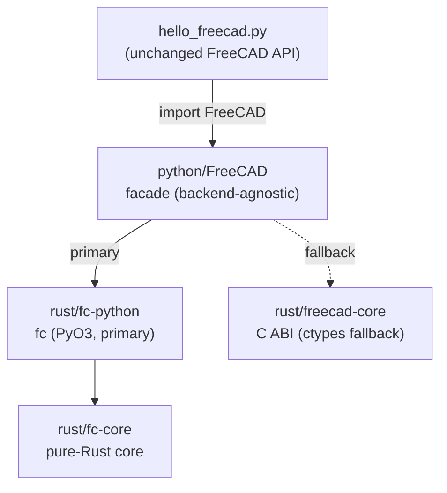

# freecad-rs-poc

**Milestones 0–4 (slice 13):** run a FreeCAD headless "hello world" Python script on a pure-Rust
core, with the C++ Python bindings replaced by Rust bindings.

* **M0** — hello world on a Rust object model, bridged to Python over a C ABI + `ctypes`.
* **M1** — the bridge migrated to **PyO3** (`FreeCAD._core`); the `ctypes` path kept as a fallback.
* **M2** — the pure-Rust core (`fc-core`): quantities, properties, a dependency-graph recompute
  order, transactions (open/commit/abort/undo/redo), observers, and an expression engine.
* **M3a** — inventory the upstream `.pyi` stubs (320 files → 329 classes / 2210 methods).
* **M3b** — PyO3 bindings over `fc-core` (`fc-python`, module `fc`) made the **primary** backend of
  the `FreeCAD` facade; `ctypes` remains the fallback.
* **M3c** — generate PyO3 **skeleton** bindings (`fc-gen`) from the `.pyi` model; behaviour stays
  in `fc-core` (hand-written glue).
* **M3d** — a **conformance harness** that runs upstream `Mod/Test` files against our `FreeCAD`
  and reports the parity gap.
* **M4 (slice 1)** — the `FreeCAD.Base`/`Units`/`Console`/`ParamGet`/`StringHasher` surface.
* **M4 (slice 2)** — the full **`FreeCAD.Units` system** (`Unit`/`Quantity` + expression parser).
* **M4 (slice 3)** — `Base.Vector`/`Matrix`/`Placement`/`Rotation`/`TypeId` + `App::FeatureTest`.
* **M4 (slice 4)** — document `saveAs`/`save`/`open`/`copyObject` (JSON persistence).
* **M4 (slice 5)** — geometry tuple setters, `PlacementList`/`RotationList` properties, document
  metadata (`ActiveObject`/`findObjects`/`setAutoCreated`), `TypeId` classmethods, `addProperty`
  flags, `addDocumentObserver` (no-op) + `FreeCAD.PropertyType`.
* **M4 (slice 6)** — dynamic **extensions** (`addExtension`/`hasExtension` with
  `GroupExtensionPython`→`GroupExtension` inheritance), **groups** (`App::DocumentObjectGroup` +
  `App::Part` with `Group` link list, `addObject`/`hasObject`/`getObject`/`getParentGroup`/
  `getParentGeoFeatureGroup`/`OutList`/`InList`, single-group enforcement), and a console-mode
  **`FreeCADGui`** stub + `ViewObject` → `None`.
* **M4 (slice 7)** — `App::Origin.getSubObject` (axes/planes with the standard frames; FreeCAD's
  `retType` convention) + a **row-major `Matrix4` fix** (`transform`/`Placement.to_matrix` were
  inconsistent, inverting rotations).
* **M4 (slice 8)** — link properties read/write as `DocumentObject`s; arbitrary object attributes
  (`obj.Proxy`) via an instance `__dict__`; object `__hash__`; `abi3` minimum 3.10.
* **M4 (slice 9)** — `Document.Meta` + `Document.settings(namespace)` (typed get/set, validation),
  `Document.RootObjects`/`TopologicalSortedObjects`, `DocumentObject.ID`, id-aware `getObject`,
  `ColorList`.
* **M4 (slice 10)** — `PropertyLinkSub` (`(object, subnames)` round-trip); `listDocuments()` returns
  a dict (upstream shape) and `openDocument` is exposed.
* **M4 (slice 11)** — **document observers that fire**: a global observer registry + an object
  identity cache (so observer arguments satisfy `is`), pending/named transactions, and event
  emission at the exact FreeCAD points (document lifecycle, object create/change/delete/recompute,
  dynamic properties/extensions, transactions, save). All `DocumentObserverCases` pass.
* **M4 (slice 12)** — persistence/recovery: `Document.dumpContent`/`restoreContent`/`restore`,
  `DocumentObject.dumpContent`/`restoreContent`/`dumpPropertyContent`/`restorePropertyContent`,
  `canWriteRecoverySnapshot`/`TransientDir` and `writeRecoverySnapshotToTransientDir`.
* **M4 (slice 13)** — Python-object & `Proxy` persistence: `App::PropertyPythonObject` values and an
  object's `Proxy` (`dumps`/`loads` protocol) survive save/restore; conformance now **87 passing**
  (`StringHasher.py` 4/4, `UnitTests.py` 12/12).

This is a proof of concept, not a product. It exists to validate the single
riskiest assumption of the rewrite plan: *that a Python script written against
FreeCAD's public `App` API can be served by a Rust implementation instead of the
C++ one, without changing the script.*

## The idea



* **`hello_freecad.py`** uses only the public FreeCAD API. The same file is
  intended to run against upstream FreeCAD.
* **`python/FreeCAD/`** is a drop-in module that speaks that API and selects a
  backend; it knows nothing about C++ or Coin. Since `fc` is just a document-object
  model (no "application"), the facade adds the small App-level layer it lacks:
  a document registry, `ActiveDocument`, unique-name allocation, and `Version`.
* **`rust/fc-python/`** exposes the model as real `#[pyclass]` types via PyO3
  (primary; importable as `fc`).
* **`rust/fc-core/`** is the pure-Rust implementation behind `fc-python`: no Python,
  no UI, just the object model.
* **`rust/freecad-core/`** implements the same model behind a flat C ABI, used as
  the `ctypes` fallback.

## Build & run

```sh
./build.sh     # cargo build --release, then package the .so into python/
./run.sh       # PYTHONPATH=python python3 hello_freecad.py
```

Expected output:

```
FreeCAD version : 0.1.0
Active document : HelloWorld
Document label  : HelloWorld
Object count    : 1
  - Box (App::FeaturePython) label='Hello, FreeCAD'
obj.Description : Created by the Rust core
Properties      : ['Description']
Documents       : ['HelloWorld']
Active after close: None
OK
```

Tests:

```sh
PYTHONPATH=python python3 -m unittest discover -s tests -v   # facade parity (M0/M1)
PYTHONPATH=python python3 tests/test_fc_core.py               # fc bindings over fc-core (M3b)
PYTHONPATH=python python3 tests/test_codegen.py               # generated skeleton surface (M3c)
python3 tools/test_inventory.py                                # .pyi parser (M3a)
python3 tools/test_codegen.py                                  # codegen logic (M3c)
python3 tools/test_conformance.py                              # harness helpers (M3d)
```

Regenerate the M3c skeleton (`rust/fc-gen/src/lib.rs`, committed):

```sh
python3 tools/codegen.py --root ../freecad-upstream --out rust/fc-gen/src/lib.rs
```

Run upstream tests against our `FreeCAD` (conformance harness, M3d):

```sh
python3 tools/conformance.py --root ../freecad-upstream            # default curated files
python3 tools/conformance.py --root ../freecad-upstream --list     # list candidates
```

## The two backends

* **PyO3 (`rust/fc-python` → `fc`)** — the destination (M3b). `fc.Document` /
  `fc.DocumentObject` are native `#[pyclass]` types over `Arc<Mutex<fc_core::Document>>`.
  Built with `abi3` and `PYO3_USE_ABI3_FORWARD_COMPATIBILITY=1`, because this sandbox
  runs CPython 3.14, which is newer than PyO3 0.25 officially targets.
* **C ABI + `ctypes` (`rust/freecad-core`)** — the M0 bootstrap, kept as a fallback.
  It needs no CPython headers, so it builds in the most restricted environments.

`FreeCAD/__init__.py` imports `fc` if present, otherwise `_ctypes_backend`, and
reports which via `FreeCAD.backend` (`"fc"` or `"ctypes"`). Both paths expose the
same document-object surface, so `hello_freecad.py` and the tests are backend-agnostic.

See [`../docs/rewrite-strategy.md`](../docs/rewrite-strategy.md) for the direction and
[`../docs/coin-bridge-reuse-assessment.md`](../docs/coin-bridge-reuse-assessment.md)
for the underlying analysis.

## What is implemented vs. not

Implemented in **`fc-core` / `fc-python`** (the real model, not just a stub):

* a **full `Quantity`/`Unit` system**: 8-dimension signatures, an internal unit table
  (SI base + derived + imperial + prefixes), an expression parser (fractions, scientific
  notation, compound units, `pi`/`sin`/`cos`/`tan`, feet-inches `N'(expr)"`), arithmetic,
  `Value`/`UserString`/`getValueAs`/`toNumber`.
* `Property`/`PropertyContainer`, `StringHasher`/`StringID`.
* `Document`/`DocumentObject` with default naming, a `petgraph` dependency graph,
  topological recompute order, and `removeObject`.
* transactions (`open`/`commit`/`abort` + `undo`/`redo`), an `Observer` trait, and an
  expression parser/evaluator with `Object.Property` names and `recompute()`.

Exposed through the **`FreeCAD` facade** (enough for the hello world and a workbench-style script):

* documents: `newDocument`, `closeDocument`, `getDocument`, `listDocuments`,
  `ActiveDocument`, unique-name allocation, `Name`/`Label`.
* objects: `addObject` (default naming), `getObject`, `removeObject`, `Objects`,
  `CountObjects`, `Name`/`Label`/`TypeId`/`Document`, `recompute`.
* properties: `addProperty`, `get`/`setPropertyByName`, dynamic attribute
  mapping (`obj.Foo`), `PropertiesList`, `getTypeIdOfProperty`.
* two interchangeable backends, selected automatically and reported as `FreeCAD.backend`.

Not implemented (deliberately out of scope for this milestone):

* the geometry kernel (`Part::Box` etc. produce no shape),
* persistence (`.FCStd`), `App`/`Gui` split, Coin3D, Qt,
* `FeaturePython` scripting callbacks,
* thread-safety guarantees beyond a coarse global mutex.

## Layout

```
hello_freecad.py          the milestone script (public FreeCAD API only)
run.sh / build.sh         convenience wrappers
python/FreeCAD/           drop-in module: __init__.py (facade + backend selector)
    Base.py              core data types (Quantity; Vector/Matrix later)
    Units.py             units facade (Quantity)
    Console.py           minimal Print* logging facade
    fc.abi3.so            built PyO3 bindings over fc-core (gitignored)
    fc_gen.abi3.so        generated skeleton bindings, M3c (gitignored)
    _core.abi3.so         M1 PyO3 extension (legacy; gitignored)
    _ctypes_backend.py    ctypes fallback backend
    _ffi.py               ctypes bindings for the fallback
rust/fc-core/             pure Rust core: quantities, properties, DAG, tx/observers/expr
rust/fc-python/           PyO3 bindings over fc-core (module `fc`)
rust/fc-gen/              generated PyO3 skeleton bindings (module `fc_gen`)
    src/lib.rs            GENERATED by tools/codegen.py (committed)
rust/freecad-py/          M1 PyO3 bindings (legacy `_core`)
rust/freecad-core/        Rust object model + flat C ABI (fallback)
rust/fc-host/             spike: Rust host embedding CPython + bite-gpui
    src/spike.rs          Python-declared UI -> bite-gpui element (headless)
python/fcspike/           Python declarative UI spike module
tools/inventory.py        M3a: parse upstream .pyi stubs into an API model (Python ast)
tools/test_inventory.py   M3a tests (hermetic fixtures + upstream integration guard)
tools/codegen.py          M3c: emit PyO3 skeleton bindings from the API model
tools/test_codegen.py     M3c tests (hermetic generator logic)
tools/conformance.py      M3d: run upstream Mod/Test files against our FreeCAD
tools/test_conformance.py M3d tests (hermetic harness helpers)
tests/test_parity.py      behavioural checks (M0/M1)
tests/test_fc_core.py     fc-core via Python (M3b)
tests/test_codegen.py     generated skeleton surface (M3c)
```
