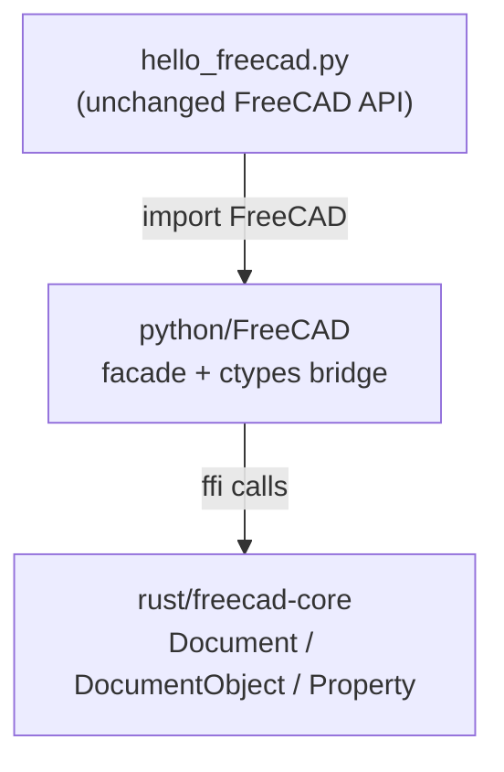

# freecad-rs-poc

**Milestone 0:** run a FreeCAD headless "hello world" Python script on a Rust core,
with the C++ Python bindings replaced by Rust bindings.

This is a proof of concept, not a product. It exists to validate the single
riskiest assumption of the rewrite plan: *that a Python script written against
FreeCAD's public `App` API can be served by a Rust implementation instead of the
C++ one, without changing the script.*

## The idea



* **`hello_freecad.py`** uses only the public FreeCAD API. The same file is
  intended to run against upstream FreeCAD.
* **`python/FreeCAD/`** is a drop-in module that speaks that API. It knows
  nothing about C++ or Coin; it forwards to Rust over a tiny C ABI.
* **`rust/freecad-core/`** implements the headless object model in Rust.

## Build & run

```sh
./build.sh     # cargo build --release, then package the .so into python/FreeCAD/
./run.sh       # PYTHONPATH=python python3 hello_freecad.py
```

Expected output:

```
FreeCAD version : 0.1.0
Active document : HelloWorld
Document label  : HelloWorld
Object count    : 1
  - Box (App::FeaturePython) label='Hello, FreeCAD'
obj.Description : Created by the Rust core
Properties      : ['Description']
Documents       : ['HelloWorld']
Active after close: None
OK
```

Tests:

```sh
PYTHONPATH=python python3 -m unittest discover -s tests -v
```

## Why a C ABI + `ctypes` (bootstrap) and not PyO3?

When this POC was first built the environment had **no CPython headers**, so PyO3
could not compile. A dependency-free `cdylib` loaded with `ctypes` needs neither
headers nor a package manager, which let the milestone land immediately.

**That constraint no longer holds.** The system now ships `python3.14-dev`
(`/usr/include/python3.14/Python.h`), so **PyO3 is the chosen path for M1** — see
[`../docs/rewrite-strategy.md`](../docs/rewrite-strategy.md). The `ctypes` bridge
here is a bootstrap, not the destination.

The seam is deliberately thin: `rust/freecad-core/src/lib.rs` is plain Rust with
a flat `extern "C"` surface. Swapping it for PyO3 `#[pyclass]` bindings means
rewriting `python/FreeCAD/_ffi.py` and adding `#[pymethods]` — the model itself
does not move. See [`../docs/rewrite-strategy.md`](../docs/rewrite-strategy.md) for the direction and
[`../docs/coin-bridge-reuse-assessment.md`](../docs/coin-bridge-reuse-assessment.md)
for the underlying analysis.

### Production path (PyO3)

```toml
# rust/freecad-core/Cargo.toml
[lib]
crate-type = ["cdylib"]
[dependencies]
pyo3 = { version = "0.2x", features = ["extension-module", "abi3-py311"] }
```

```rust
#[pyclass]
struct DocumentObject { /* ... */ }

#[pymodule]
fn FreeCAD(m: &Bound<'_, PyModule>) -> PyResult<()> {
    m.add_class::<Document>()?;
    m.add_class::<DocumentObject>()?;
    Ok(())
}
```

Built with `maturin` (extension mode) or embedded from the Rust host
(`Python::initialize()` + `Python::attach`).

## What is implemented vs. not

Implemented (enough for the hello world and a workbench-style script):

* documents: `newDocument`, `closeDocument`, `getDocument`, `listDocuments`,
  `ActiveDocument`, unique-name allocation, `Name`/`Label`.
* objects: `addObject` (default naming), `getObject`, `removeObject`, `Objects`,
  `CountObjects`, `Name`/`Label`/`TypeId`/`Document`, `recompute`.
* properties: `addProperty`, `get`/`setPropertyByName`, dynamic attribute
  mapping (`obj.Foo`), `PropertiesList`, `getTypeIdOfProperty`.

Not implemented (deliberately out of scope for this milestone):

* the geometry kernel (`Part::Box` etc. produce no shape),
* the dependency graph / real `recompute` semantics,
* expressions, transactions, observers, `FeaturePython` scripting callbacks,
* persistence (`.FCStd`), `App`/`Gui` split, Coin3D, Qt,
* thread-safety guarantees beyond a coarse global mutex.

## Layout

```
hello_freecad.py          the milestone script (public FreeCAD API only)
run.sh / build.sh         convenience wrappers
python/FreeCAD/           drop-in module: __init__.py (API) + _ffi.py (ctypes)
rust/freecad-core/        the Rust core (flat C ABI, zero dependencies)
tests/test_parity.py      behavioural checks
```
