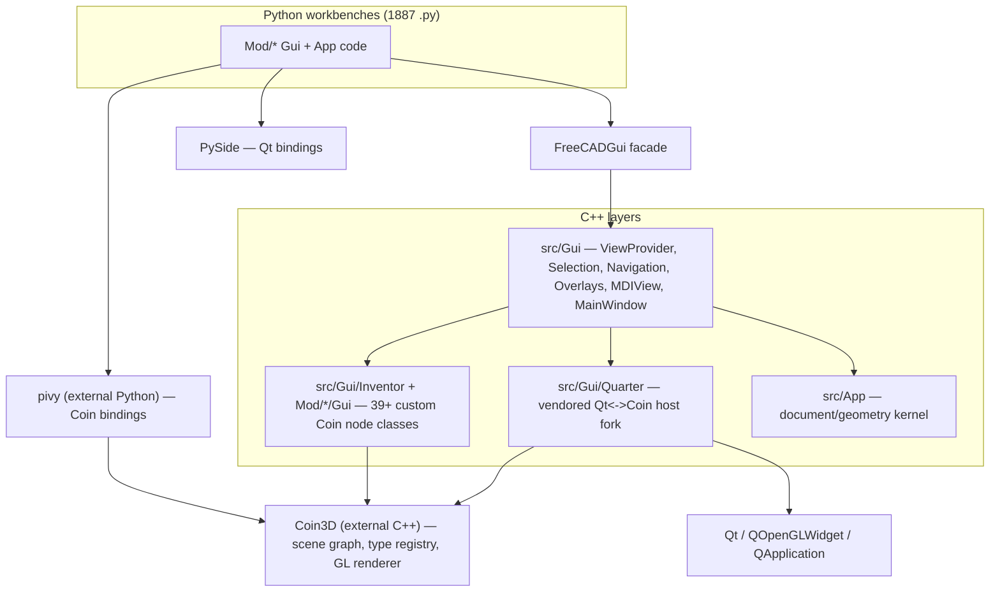
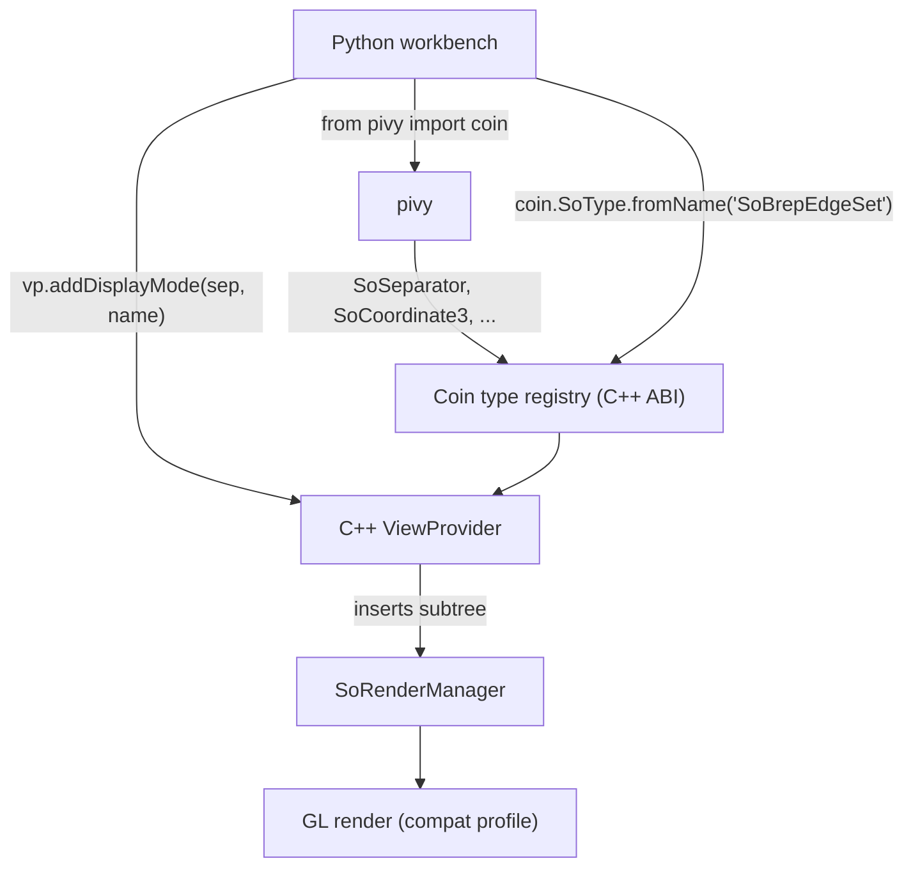
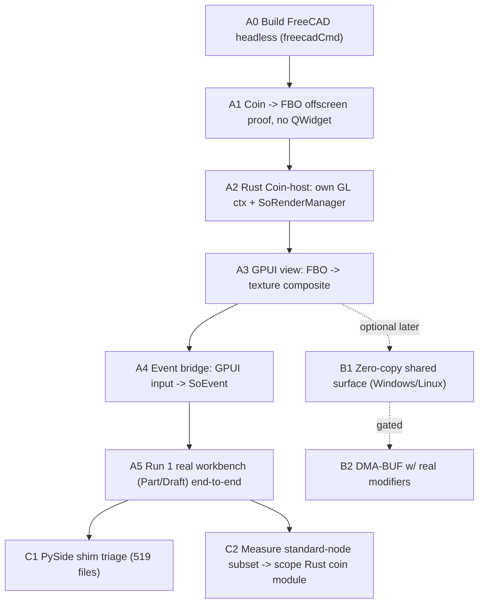

# Coin3D / Inventor Bridge — Reuse Assessment

Status: first pass, based on upstream source read at commit `99c5620` (FreeCAD `main`),
sparse-checked out into `freecad-upstream/` (reference only — see *Appendix: the reference tree*).

> **Superseded (2026-10-01).** The recommendation in this document (Option A: keep Coin3D
> and replace only the Qt host) has been **rejected** in favour of a clean-room Rust rewrite.
> See [`rewrite-strategy.md`](rewrite-strategy.md) for the authoritative direction. The
> measurements and risk analysis below are retained and carried into that plan as its risk
> register; only the *recommendation* (§0, §5 Option A) is obsolete.

Goal of the wider project: rebuild the FreeCAD 3D view on Rust/GPUI, and provide a path
whereby *existing FreeCAD workbenches* can be reused instead of rewritten — stripping/abstracting
the Qt (`PySide`) coupling and providing a `pivy`-compatible Coin bridge into the new Rust library.

This document answers one question first: **what is actually reusable, and where is the real seam?**

---

## 0. TL;DR — the recommendation

> **The Coin3D layer is not merely "the 3D viewer widget". It is a cross-language, extensible
> scene-graph *ABI* that spans three languages (C++, Python/`pivy`, and per-workbench custom C++
> node types). Treat it as the reuse foundation, not as the thing to replace first.**

The cheapest, highest-fidelity seam is **not** "replace Coin". It is:

1. **Keep Coin3D + the whole `Gui` C++ layer + `pivy` + all custom node types. Reuse unchanged.**
2. **Replace only the *host*: the vendored `Quarter` widget fork and the Qt `QOpenGLWidget`
   event/GL surface plumbing in `View3DInventorViewer`.** Everything above that line
   (`SoRenderManager`, `SoEventManager`, scene graphs, `ViewProvider`, Selection, Navigation,
   Overlays) stays.
3. Bridge to GPUI through the **offscreen path FreeCAD already has** (`Framebuffer` / `Image`
   render types → `SoOffscreenRenderer` → FBO), i.e. render Coin to a texture and composite it,
   **not** by sharing a live GL/D3D surface across APIs. This single choice neutralizes most of
   the driver-level risk raised in the interop research (see §7).
4. A pure Rust/`wgpu` scene-graph re-implementation ("rewrite Coin in Rust, publish a Rust
   `pivy`") remains a valid **long-term** track, but it is the *most* expensive option and it is
   gated on faithfully reproducing Coin's type registry — see §5.

Everything else in this document is the evidence for that recommendation.

---

## 1. Layer map (what exists today, and what it costs to reuse)



| Layer | Location | Depends on | Reuse verdict |
|---|---|---|---|
| Document/geometry kernel | `src/App` (99 cpp) | tiny Qt (2 bridge files) | **Reuse ~unchanged.** This is the crown jewel. |
| Gui C++ | `src/Gui` (~275k LOC) | Coin, Quarter/Qt, PySide | **Reuse**, except the Qt host plumbing. |
| Custom Coin nodes/actions/elements | `src/Gui/Inventor`, `src/Gui/SoFC*`, `src/Mod/*/Gui/SoBrep*` | Coin only | **Reuse unchanged** (pure Coin). |
| Quarter host (vendored fork) | `src/Gui/Quarter` (42 files) | Qt + Coin | **Replace** with a GPUI host. |
| Viewer/event surface | `View3DInventorViewer`, `MDIView`, `MainWindow` | Qt widgets | Partially replace (gesture/host), keep logic. |
| `pivy` | external (not vendored) | Coin | **Reuse**. 75+ Python files rely on it. |
| `PySide` | external | Qt | **Abstract/shim** long-term; 519 Python files use it. |

The important asymmetry: **the Coin coupling is deep but cleanly separated from Qt.** Coin code
compiles and runs with no widgets, no `QApplication`, no `QPainter`. The Qt coupling is what
blocks a GPUI host — and it is concentrated in `Quarter` + the widget/event parts of `View3DInventorViewer`
+ `MainWindow`/`MDIView`.

---

## 2. Evidence: how deep is the Coin coupling?

Measured on the checkout (`src/`):

| Metric | Value | Why it matters |
|---|---|---|
| C++ files including `<Inventor/...>` | **348** | Coin is pervasive, not a leaf dependency. |
| Headers declaring custom Coin node/kit/engine classes (`SO_NODE_HEADER`, `SO_KIT_HEADER`, …) | **39** | FreeCAD *extends* Coin's type system. |
| `.cpp` files calling some `initClass()` (Coin type registration) | **50** | FreeCAD *registers* those types at startup. |
| Python files importing `pivy` | **75** files (≈121 import statements: 106 × `from pivy import coin`, 15 × `import pivy.coin`) | Python workbenches build Coin scene graphs directly. |
| Python files importing `PySide` | **519** | The Qt coupling to abstract away. |
| Python files importing `FreeCADGui` | **512** | The facade that already fronts most GUI use. |
| `src/Gui` C++ LOC | **~275,671** | Scale of the layer to keep vs. replace. |
| Mod workbenches shipping a `Gui/` dir | **20** | Each may define its own Coin nodes (e.g. Part). |

### 2.1 The registry is a cross-language ABI (the crux)

`Gui::Application::initOpenInventor()` (`src/Gui/Application.cpp:2468`):

```cpp
SoDB::init();
SIM::Coin3D::Quarter::Quarter::init();
SoFCDB::init();          // registers every FreeCAD custom node/element/action
```

`SoFCDB::init()` (`src/Gui/SoFCDB.cpp:105`) calls `initClass()` on dozens of types:
`SoFCSelection`, `SoFCUnifiedSelection`, `SoFCColorBar`, `SoFCScreenSpaceGroup`,
`SoFCBackgroundGradient`, `SoFCBoundingBox`, `SoDevicePixelRatioElement`,
`SoGLRenderActionElement`, `SoFCInteractiveElement`, `SoGLWidgetElement`, the selection
*actions*, the draggers in `src/Gui/Inventor/Draggers`, etc.

Python code then instantiates those *same* C++ types **by name through Coin's type registry**:

```python
# recurring pattern across BIM, Draft, CAM, Assembly, Sketcher, Part …
coin.SoType.fromName("SoBrepEdgeSet").createInstance()
coin.SoType.fromName("SoDatumLabel").createInstance()
coin.SoType.fromName("SoFCPlacementIndicatorKit").createInstance()
coin.SoType.fromName("SoFCSelection").createInstance()
```

Examples: `Mod/BIM/ArchAxis.py`, `Mod/Draft/draftviewproviders/view_label.py`,
`Mod/CAM/Path/Main/Gui/Job.py`, `Mod/Assembly/SoSwitchMarker.py`, and the `SoBrep*`
nodes themselves live in `Mod/Part/Gui/SoBrepFaceSet.cpp` / `SoBrepEdgeSet.cpp` /
`SoBrepPointSet.cpp`.

> **Consequence:** the Coin type registry is a *runtime ABI shared between C++ and Python*. Any
> design that removes Coin must reimplement the registry **and** every custom type across all
> modules, or it silently breaks the 75 pivy-using Python files. This is the single strongest
> argument for keeping Coin at the foundation.

### 2.2 Coin uses legacy, fixed-function OpenGL

`src/Gui/Application.cpp:2625`:

```cpp
defaultFormat.setRenderableType(QSurfaceFormat::OpenGL);
defaultFormat.setProfile(QSurfaceFormat::CompatibilityProfile);
defaultFormat.setOption(QSurfaceFormat::DeprecatedFunctions, true);
```

Coin3D renders through a **compatibility-profile** GL context (fixed-function/immediate-mode in
places, `GL_*` deprecated entry points). `wgpu` exposes only core-profile/WebGPU semantics and
cannot host a Coin render directly. This is decisive for the bridge design in §6–§7: the Coin
side must be driven by a **GL context we own** (GLX/EGL/WGL), with the GPUI side consuming
*pixels or a texture*, not wgpu driving Coin.

### 2.3 The host is a vendored Quarter fork

`src/Gui/Quarter/QuarterWidget.h` — `class QuarterWidget : public QGraphicsView` (`Q_OBJECT`),
constructible from a `QOpenGLContext`/`QSurfaceFormat`, owning `SoRenderManager`/`SoEventManager`,
navigation state machines, device input filters, image reader, etc. This is the **entire
Qt↔Coin boundary**, and FreeCAD already strips and forks it (`namespace
SIM::Coin3D::Quarter`). That is good news: the boundary is *already isolated* enough to swap.

`View3DInventorViewer : public QuarterWidget` then adds the FreeCAD-specific rendering modes.

### 2.4 There is already an offscreen render path (the escape hatch)

`View3DInventorViewer::actualRedraw()` (`View3DInventorViewer.cpp:3244`):

```cpp
switch (renderType) {
    case Native:      renderScene();       break;   // straight to the widget's GL
    case Framebuffer: renderFramebuffer(); break;   // -> QOpenGLFramebufferObject
    case Image:       renderGLImage();     break;   // -> QImage
}
```

`renderToFramebuffer(...)` (`:3180`) binds an FBO, makes the widget's GL current, and renders the
scene into it. `SoFCOffscreenRenderer` (`src/Gui/SoFCOffscreenRenderer.cpp`) subclasses Coin's
`SoOffscreenRenderer` on top of `QOffscreenSurface` + `QOpenGLContext` + `QOpenGLFramebufferObject`
— i.e. **rendering Coin with no visible window is a supported, existing capability.** We are not
inventing the bridge; we are re-hosting it.

---

## 3. What we reuse, concretely

**Reuse as-is (no port):**

- `src/App` entirely — document objects, `Property` system, expressions, transactions, observers,
  `Base` (vectors, matrices, `Interpreter`/PyCXX). Only the two tiny Qt bridge files
  (`src/App/ConsoleQtBridge.cpp`, `src/App/TranslationQtBridge.cpp`) need a non-Qt backend.
- Coin3D itself.
- All custom Inventor nodes/actions/elements/draggers (39+ classes) and their type registration.
- `ViewProvider` and its dozens of subclasses (the workbench-facing 3D contract — see §4).
- `Selection` (`SoFCUnifiedSelection`, `SelectionFilter` grammar, `BoxSelection`).
- `Navigation` (all style state charts — note the SCXML dependency, §5.4).
- `pivy` and the 75 Python files using it, unchanged.
- Python `App`/`Gui` facade and the `Workbench`/`ViewProvider` Python subclassing contract.

**Replace / re-host:**

- `Quarter` → a Rust "Coin host" that owns a GL context, a `SoRenderManager`, and a
  `SoEventManager`, and pumps frames/events.
- Qt widget integration in `View3DInventorViewer` (`makeCurrent`, `viewport()`, `getGLWidget()`,
  `SoGLWidgetElement`) → a GPUI view.
- `MainWindow` / `MDIView` / dock/task panels / menus → GPUI. (Large, but *not* Coin-related;
  it is plain Qt UI.)
- Eventually the `PySide` surface used by 519 Python files → see §6.

---

## 4. The workbench-facing contract (why "reuse workbenches" is realistic)

A workbench's 3D behavior is expressed almost entirely through `Gui::ViewProvider` and its
Python subclassing. The reusable contract is the virtual/override set in
`src/Gui/ViewProvider.h` (and `ViewProviderDocumentObject.h`):

- Scene assembly: `getRoot()`, `getModeSwitch()`, `getTransformNode()`, `getAnnotation()`,
  `getChildRoot()`, `getFrontRoot()`/`getBackRoot()`, `canAddToSceneGraph()`.
- Display modes: `attach`/`setDisplayMode`, `getDefaultDisplayMode`, `getDisplayModes`,
  `addDisplayMaskMode`, `setDisplayMaskMode`, `getDisplayMaskMode`, `setDefaultMode`.
- Data sync: `updateData(const App::Property*)`, `onChanged`, `onBeforeChange`, `update()`.
- Interaction: `doubleClicked`, `mouseMove`, `mouseButtonPressed`, `mouseWheelEvent`,
  `keyPressed`, `setupContextMenu`, `setEdit`/`unsetEdit`, dragger hooks.
- Tree/UI metadata: `claimChildren`, `claimChildren3D`, `getIcon`, `getToolTip`, drag/drop
  (`canDragObject`, `dropObjectEx`, …), `signalChangeIcon`, etc.

Crucially, most of these methods either (a) build/tweak a Coin subtree, or (b) return plain
data. **They do not require Qt except for `QIcon`/`QMenu`/`QString` on a handful of methods.**
So the workbench contract survives a host swap with a thin compatibility layer; it does *not*
survive a Coin removal without reimplementing every scene-node call the providers make.

---

## 5. Options, ranked

### Option A — Keep Coin + reuse the Gui C++ layer; replace only the host **(superseded)**

- **Reuse:** App 100%, Coin 100%, custom nodes 100%, `ViewProvider` 100%, Selection/Navigation 100%, pivy 100%.
- **Build:** a Rust/GPUI "Coin host" (GL context + `SoRenderManager`/`SoEventManager` driver),
  compositing path into GPUI, and an event translator (GPUI input → `SoEvent`).
- **Risk:** medium-low; concentrated in GL-context management and the compositing path (§7).
- **Cost:** weeks, not years. Unlocks running real workbenches early.

### Option B — Reimplement the scene graph + renderer in Rust/`wgpu`, publish a Rust `pivy`

- **Reuse:** App 100%; the *semantics* of Coin (node model, fields, sensors, traversal).
- **Build:** Coin's type registry, fields/sensors/engines, `SoSeparator`/`SoSwitch`/VRML nodes,
  actions (GL render, ray pick, bounding box, search, write), *and* the 39+ FreeCAD node classes,
  plus Part's `SoBrep*`, plus a Python `coin` module exposing `SoType.fromName` semantics.
- **Risk:** very high; effectively a multi-year re-implementation of a 30-year-old library, and
  it must be bug-compatible enough that Python workbenches don't notice.
- **Verdict:** legitimate north star; do **not** start here.

### Option C — Hybrid: Option A now, migrate subsystems to B incrementally

- Start with A to get workbenches live and to instrument the *actual* scene-graph subset used.
- Use that telemetry to scope B: e.g. reimplement only the standard nodes that dominate usage
  (`SoSeparator`, `SoCoordinate3/4`, `SoMaterial`, `SoBaseColor`, `SoTransform`, `SoDrawStyle`,
  `SoSwitch`, `SoLineSet`, `SoIndexedLineSet`/`FaceSet`, `SoText2`/`SoAsciiText`, `SoFont`,
  `SoPickStyle`, `SoShapeHints`, `SoPolygonOffset`, `SoTexture2`, `SoMarkerSet`, `SoSearchAction`).
- Keep Coin as the fallback/host for anything not yet ported.
- **Verdict:** the pragmatic long-term shape. The measurement in §2 already tells us the Python
  side is overwhelmingly **standard Coin node construction**, not exotic features — a favorable
  signal for a future Rust node layer.

---

## 6. The `pivy` bridge, precisely

Current Python→scene-graph flow:



Two viable bridge shapes:

1. **Keep pivy (Option A).** No bridge needed: pivy already talks to Coin, and Coin's host is
   what we changed. The Python-side boundary is an `SoSeparator` subtree handed to a C++
   `ViewProvider`; that contract is untouched. **This is the zero-effort pivot and it is why
   Option A is recommended.**
2. **Rust `coin` module (Option B/C).** A pyo3/C-API extension exposing a `coin` namespace whose
   objects are backed by a Rust scene graph, plus a Rust-side `SoType.fromName` registry. The
   hard part is not the geometry nodes (well understood) — it is (a) `SoType` semantics and
   user-defined Python node types, and (b) the FreeCAD/Part custom types that Python looks up by
   name. Budget for a compatibility test suite derived from the 75 pivy-using files.

**Do not** attempt (2) before (1) is running; you would be boiling the ocean without a working
oracle to test against.

---

## 7. Connecting to the GPU-interop research (probes, host/guest mode)

The preliminary research is about GPUI's GPU backends and embedding *external GPU producers*
(D3D11, video, DMA-BUF) into a GPUI window. Its four corrections apply here as follows.

**The key architectural lever:** there are two ways to get Coin into GPUI —

- **Shared-surface path** ("host mode"): Coin renders in a GL context; we share that surface/texture
  with GPUI's compositor (on Windows: GL→D3D12/wgpu; on Linux: GL→Vulkan/DMA-BUF). This is where
  the research's warnings bite.
- **Offscreen-copy path** (recommended first): Coin renders to an FBO (already supported), we read
  it back / hand over a GL texture, and upload it to GPUI as a texture. Costs one copy; removes
  all cross-API handle sharing.

Mapping the four research points:

1. **Uncouple P4 (video formats) from the primary PR.** Agreed, and it barely touches this bridge:
   Coin emits plain RGBA, not NV12/YUV. Whatever ships first for surfaces should stay
   RGBA/BGRA-only. Video is an orthogonal, later feature.
2. **Scope the reverse bridge (P1) to Guest mode only.** Agreed, and reinforced here: because Coin
   is **legacy GL**, the only realistic direction is *Coin-GL producer → GPUI consumer*, never
   "wgpu producer → Coin consumer". So the reverse bridge is irrelevant to the Coin host entirely;
   it is a Guest-runner concern.
3. **Linux DMA-BUF must be tested with real (NV12/tiled) buffers, not flat RGBA.** True — but if we
   take the **offscreen-copy path**, we never pass DMA-BUFs to GPUI; we pass a normal texture. This
   *sidesteps* the modifier/NV12 trap for the initial bridge. Only adopt DMA-BUF zero-copy if/when
   the copy shows up as a bottleneck, and then test with real tiled modifiers via
   `EGL_LINUX_DMA_BUF_EXT`.
4. **Device loss / driver reset teardown.** Still applies. A GL context can be lost (TDR, sleep,
   monitor hot-plug, DPI change). Because Coin caches GL objects by context id
   (`SoGLCacheContextElement`, `getCacheContextId()`), on context loss we must: stop the host,
   drop the GL context + FBO + all `SoGLRenderAction` caches, recreate, and re-negotiate the
   texture with GPUI. FreeCAD's `recoverFromRenderMemoryException()` and
   `aboutToDestroyGLContext()` are existing partial precedents to study. Treat this as a **test
   case in the host**, not an afterthought.

Refined dependency sketch for *this* project:



---

## 8. Stripping/abstracting the Qt (`PySide`) coupling

Terminology correction to carry forward: FreeCAD uses **PySide** (Qt for Python), not PyQt. They
are sibling bindings; the abstraction work is the same but the shim must target the `PySide`
namespace and its `QtCore/QtGui/QtWidgets` split (including the `PySide6` module layout).

Reality check from the data: **519 Python files import `PySide` directly**, while **512 import
`FreeCADGui`**. Many do both. So:

- The `FreeCADGui` facade is *not* yet a sufficient abstraction barrier — workbenches reach around
  it straight into `QtWidgets` (dialogs, `QFileDialog`, `QMessageBox`, layouts, icons).
- A GPUI-hosted shell therefore needs **either** (short term) a real Qt runtime kept alive *only*
  for dialog/panel widgets while the 3D view is GPUI, **or** (long term) a `PySide`-compatible
  shim namespace backed by GPUI widgets. The former is dramatically cheaper and lets workbenches
  keep working during the transition; the 3D view is decoupled from it entirely.
- `src/App` has only two Qt-touching files (`ConsoleQtBridge.cpp`, `TranslationQtBridge.cpp`), so
  the *kernel* can be made fully Qt-free cheaply.

Recommended posture: **decouple the 3D view from Qt first; defer the widget toolkit decision.**
They are independent problems, and coupling them would stall the 3D work behind a UI-toolkit project.

---

## 9. Suggested first milestones (validation-first)

- **M0 — headless build + render.** Build FreeCAD in console mode; confirm Coin can render a
  scene to an FBO with no `QWidget`. (`SoFCOffscreenRenderer` / `View3DInventorViewer::renderToFramebuffer`
  are the references.) *Exit:* a PNG from Coin with no window, driven by our own code.
- **M1 — Rust Coin-host skeleton.** A Rust crate that creates a GL context, constructs
  `SoRenderManager` + root `SoSeparator` (via the C++ `Gui` lib or a thin C API), renders on
  demand, and exports a texture/CVPixelBuffer-like handle.
- **M2 — GPUI composite.** A GPUI element that samples the Coin output texture; resize/DPI handled.
- **M3 — events.** Translate GPUI mouse/key/spacemouse input into `SoEvent` and feed
  `SoEventManager`; verify navigation styles (SCXML state charts) behave.
- **M4 — one workbench.** Load `FreeCADGui` + Part/Draft, open a document, show a real 3D view.
- **M5 — pivy conformance snapshot.** Freeze the set of `coin.*` types/fields/methods actually used
  (there is even a `Mod/Test/TestCoinNodeSnapshots.py` to mine) as the acceptance spec for any
  future Rust `coin` module.

---

## 10. Risks & watch-items

| Risk | Notes / mitigation |
|---|---|
| Legacy-GL coupling | Coin needs a compatibility-profile GL context; `wgpu` can't host it. Own the GL context; composite via texture. (§2.2) |
| Coin context/cache lifetime | GL objects are cached per context id. Context loss (TDR, sleep, DPI) must tear down + re-negotiate. (§7.4) |
| `SoType` ABI across C++/Python | 35 `coin.SoType` sites, cross-module custom types. Blocking for Option B; irrelevant for Option A. (§2.1) |
| SCXML navigation | Navigation styles are Coin SCXML state machines (`coin:///scxml/navigation/examiner.xml`, `Gui/Navigation/NavigationStateChart.*`); the host must pump them. (§2.3, §9/M3) |
| 519 PySide call sites | Don't couple the 3D-view work to a toolkit rewrite. Keep Qt for widgets initially. (§8) |
| Headless offscreen currently Qt-based | `SoFCOffscreenRenderer` uses `QOffscreenSurface`; a pure Rust host needs EGL/WGL/GLX instead. (§2.4) |
| Overlays/rubberband/graphics items | `GLGraphicsItem`, `RubberbandOverlay`, FPS label, NaviCube are painted in the widget — must be re-hosted or reimplemented. |

---

## 11. Open questions / decisions needed

1. **Confirm Option A as the first track** (keep Coin, replace host) vs. committing to Option B now.
2. **Compositing strategy:** start with offscreen-copy (simple, portable) or go straight to a
   shared-surface host path (faster, riskier)? Recommendation: offscreen-copy first.
3. **Widget toolkit:** keep a Qt runtime for panels/dialogs during transition, or invest early in a
   PySide-compatible GPUI shim?
4. **Python binding toolchain for the new Rust layer:** `pyo3` vs. C-API, and how to coexist with the
   existing PyCXX (`src/3rdParty/PyCXX`) bindings without two interpreters.
5. **Where the new Rust code lives:** a separate downstream crate per the plan, or in-tree?

---

## Appendix: the reference tree

Upstream FreeCAD was sparse-cloned to `freecad-upstream/` (`--depth 1 --filter=blob:none`,
`src/` checked out, ~409 MB) purely as read-only reference for this assessment. It is not part of
the new project and should be excluded from version control / removed once citations here are
frozen.
