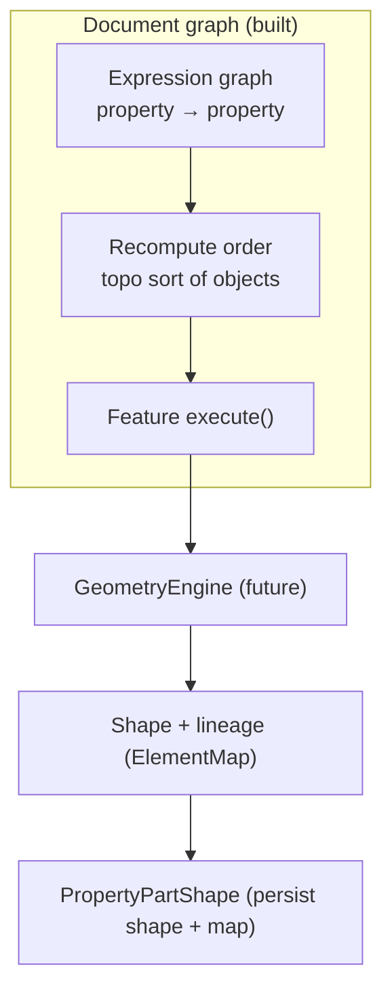
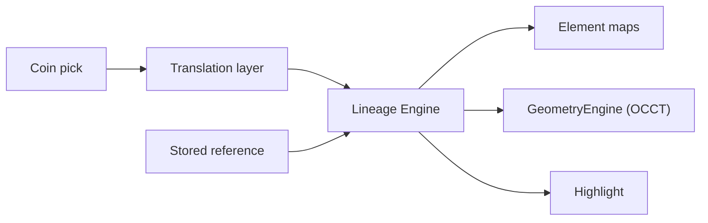

# Geometry, topology, and the naming problem

Status: research/planning (2026-10-06). Companion to
[`rewrite-strategy.md`](rewrite-strategy.md) (direction),
[`mvp-path.md`](mvp-path.md) (the geometry-free headless MVP),
[`architecture.md`](architecture.md) (crates and call paths), and
[`distribution.md`](distribution.md) (payload and packaging).

This note exists because a design conversation mixed up three separate things that
share vocabulary: **topological sorting**, **topological naming**, and the
**geometry engine**. It records what is already decided and built, where the future
geometry kernel plugs in, and what the seam should look like so that the headless
engine we are building now does not have to be rewritten when geometry arrives.

The short version:

- Topological **sorting** is a pure graph problem. It needs no geometry, and we
  already have it.
- Topological **naming** (stable sub-shape identity across rebuilds) is a shape
  lineage problem. It needs a geometry kernel, OCCT shape history, and a persistent
  element map.
- They are not the same problem, and the sort is not a step toward solving naming.
- The geometry kernel should arrive **behind a trait**, so `ferrocad_core` stays
  kernel-free and testable without OCCT.

---

## 1. Three words, three problems

| Term | Domain | Question it answers | Status here |
| --- | --- | --- | --- |
| Topological **sort** | The document object graph | In what order do features execute? | **Built.** `Document::recompute_order` (dependency-first), `topological_sorted_objects` (dependents-first). |
| Topological **naming** | Shape sub-element identity | Which *face/edge/vertex* does this stored reference mean, after a rebuild? | **Not started.** Needs the geometry kernel. |
| **Geometry engine** | Shape construction | Given parameters and inputs, produce an output shape. | **Not started.** Out of MVP scope ([`mvp-path.md`](mvp-path.md) §1). |

The confusion is understandable because both "topological" terms are about graphs
and both use the word "dependency". But the nodes are different:

- The **sort** graph has *document objects* as nodes and *links/expressions* as
  edges. A node is "recompute object A before object B".
- The **naming** graph has *sub-shapes* (faces, edges, vertices) as nodes and
  *operation history* as edges. A node is "this output face was generated from
  that input edge by this fillet".

The first is a scheduling concern and belongs to the document model we are building
now. The second is a shape-identity concern and belongs to the geometry kernel we
are deliberately not building yet. Treating them as one thing produces the wrong
sequencing rule ("no sorting before geometry"), which is what this note corrects.

---

## 2. What already exists (and what is derived vs persisted)

The document layer is real and independent of geometry:

- **Object graph.** `Document` owns a `petgraph` graph. `dependency_edges()` derives
  edges from `Link`/`LinkList`/`LinkSub` properties and from cross-object expression
  references; `add_dependency` adds explicit ones. `recompute_order()` topo-sorts it
  and `recompute()` executes dirty objects in that order.
- **Recompute state.** `DocumentObject` carries FreeCAD's `touched` (dirty, so
  dependents re-run) and `must_execute` (Enforce) flags, plus a per-property
  `property_versions` counter used by the Python geometry handles.
- **Expressions.** A small AST (`expr.rs`) with nested-path resolution
  (`resolve_path`/`assign_path`), evaluated during recompute.
- **Persistence.** `SavedObject` stores property values, expression sources and the
  opaque `python_state` blob. Links are stored **by object name**.

The important architectural fact for persistence:

> **The graph is derived; the links are the source of truth.** We persist names and
> links, and rebuild the graph on load and after every edit. We do not (and should
> not) serialize the dependency graph.

That decision is already implied by the code and does not need a geometry kernel to
hold. Step 3 of the user's question ("for persistence we need to decide topology and
graph updates") is therefore mostly answered already: persist *links*, derive the
*graph*. The one place persistence genuinely touches the naming problem is
**sub-element references** (the `Vec<String>` inside `LinkSub`, and the sub-shape
names a sketch stores). Those are stable-name questions, covered in §4.

---

## 3. Evaluation: trees, order, and where geometry plugs in

FreeCAD has no single "evaluation tree". It has three layers that are often lumped
together:

1. **Expression graph.** Per-object, property-to-property edges. `set_expression`
   builds it and rejects cycles (`graph_reaches`); `eval_expressions` evaluates it in
   object-dependency order.
2. **Feature dependency graph.** The object graph. `recompute()` walks it, runs a
   feature's `execute` when it is dirty, and propagates dirtiness to dependents.
3. **Sub-shape lineage.** The output of a geometry operation, and how its
   faces/edges map back to inputs. This is the layer that does not exist yet.

Layers 1 and 2 are built. Layer 3 is where a geometry feature will do its work:
`execute()` becomes the hook that calls the kernel, writes the resulting shape into a
`Property` (FreeCAD's `Part::PropertyPartShape`), and records the lineage.



So "we need evaluation trees" is true, and layers 1 and 2 already are them. Geometry
does not change the order; it changes what an `execute()` step *does*.

---

## 4. The naming problem, concretely

A parametric model stores references by name. A sketch stores `Edge3`; a fillet
stores the two edges it rounds; an external link stores `Box.Face6`. When an earlier
feature is edited, the kernel rebuilds downstream shapes. Faces and edges are not
named intrinsically; their names come from their position or from their history.
A rebuild that adds or removes a face can renumber the rest, so `Face6` silently
refers to a different face, or to nothing.

This is the classic **topological naming problem**. It is not a bug in the sort, and
the sort cannot fix it. Solving it needs four things:

1. **Stable element identity.** A way to name a sub-shape that survives edits, not a
   positional index.
2. **Operation history.** For each kernel operation, which output elements were
   `Generated` by, were `Modified` from, or had no relation to each input element,
   and which inputs were `Deleted`.
3. **A persistent element map.** A registry carried with the shape, mapping stable
   names to current sub-shape geometry.
4. **Resolution.** Turning a *stored* name into a *current* sub-shape at query time,
   with a well-defined fallback when the element no longer exists.

How FreeCAD does it today (the modern, post-Realthunder mechanism) is instructive
and is the model to study:

| Piece | Where | Role |
| --- | --- | --- |
| `Data::ElementMap` | `src/App/ElementMap.h` (+ `.cpp`) | The stable-name registry attached to geometry data. |
| `TopoShape` | `src/Mod/Part/App/TopoShape.{h,cpp}` | Wraps the OCCT shape and owns its `ElementMap`; `mapSubElement`, `makeShapeWithElementMap`. |
| `TopoShapeMapper` | `src/Mod/Part/App/TopoShapeMapper.h` | Folds per-operation history into mapped element names. |
| `TopoShapeCache` | `src/Mod/Part/App/TopoShapeCache.{h,cpp}` | Caches sub-shape lookups and the pending element map. |
| `PropertyPartShape` | `src/Mod/Part/App/PropertyTopoShape.{h,cpp}` | Persists the shape together with its element map. |
| `ElementMapPolicy` | `TopoShape.h` | Whether a rebuild propagates or drops mapped names (trace through a type change or stop). |

The history that feeds the mapper comes from OCCT's own operation APIs, for example
`BRepBuilderAPI_MakeShape::Generated`, `Modified`, `IsDeleted`, and the
`BRepAlgoAPI_*` history plumbing. FreeCAD's header comment at
`TopoShape.h` ("Shape history information is extracted using OCCT APIs") is the
precise statement of the dependency: **stable naming is impossible without the
kernel's history output.**

Historical note, to avoid reproducing a dead end: older FreeCAD and other kernels
used OCCT's `TNaming` framework for the same purpose. This checkout has no
`TNaming` references in `Mod/Part/App`; the `ElementMap` mechanism replaced it.
If a future interoperability goal requires reading old files, that is a migration
question, not an architecture one.

---

## 5. Parent-child structures: what a geometry operation returns

The user's phrase "parent-child data structures that encapsulate the output of
geometry operations" is the right mental model, and it is the `ElementMap` plus a
per-operation history record. A proposed Rust shape (names are placeholders, to be
settled with the kernel in hand):

```rust
/// A kernel shape handle (opaque, cheap to clone; OCCT `TopoDS_Shape` is
/// already a reference-counted handle, so this wraps it, not copies it).
pub struct Shape(/* kernel handle */);

/// A reference to one sub-element of a shape, e.g. a face or an edge, by a
/// stable name rather than a positional index.
pub struct ElementRef {
    pub shape: Shape,
    pub name: String, // "Face6", ";FUSED;...", an encoded lineage token
}

/// What one operation did, in the kernel's own terms.
pub struct History {
    pub generated: Vec<(ElementRef /*in*/, ElementRef /*out*/)>,
    pub modified: Vec<(ElementRef, ElementRef)>,
    pub deleted: Vec<ElementRef>,
}

/// The persistent, stable-name registry carried with a shape.
pub struct ElementMap {
    // stable name → current sub-shape
}

// One operation: inputs + parameters -> output shape + history.
fn fuse(a: &Shape, b: &Shape, engine: &dyn GeometryEngine) -> (Shape, History);
```

Two design rules keep this honest:

- **The map is a side table, not the name.** Stable names should be re-derivable
  from history where possible; the map is a cache and a persistence format, not the
  identity itself. This is what lets old files be migrated.
- **History is produced by the kernel, not invented by us.** The mapper can only be
  as good as the `Generated`/`Modified`/`Deleted` data the kernel reports. This is
  why an OCCT smoke test must precede any trait design (§7).

---

## 6. The `GeometryEngine` seam

The goal of the seam is not abstraction for its own sake. It is to let the document,
persistence, expression and recompute layers be written and tested **now**, without
OCCT, and to add the kernel later without touching them.

A minimal trait (shape-first, document-blind):

```rust
pub trait GeometryEngine {
    type Shape;                      // opaque kernel handle
    type Error;

    fn make_box(&self, l: f64, w: f64, h: f64) -> Result<Self::Shape, Self::Error>;
    fn fuse(&self, a: &Self::Shape, b: &Self::Shape) -> Result<(Self::Shape, History), Self::Error>;
    fn fillet(&self, s: &Self::Shape, edges: &[ElementRef], r: f64)
        -> Result<(Self::Shape, History), Self::Error>;
    // ...one method per operation the workbenches actually call.
    fn resolve(&self, s: &Self::Shape, name: &str) -> Option<Self::Shape>;
}
```

Two implementations matter:

- a **null/headless engine** that returns placeholder shapes and empty maps, so the
  document layer and its tests do not need OCCT; and
- an **OCCT engine** behind a feature flag and its own crate.

Crate placement is a real decision, not a formality:

| Option | `ferrocad_core` depends on | Consequence |
| --- | --- | --- |
| Trait in `ferrocad_core` | the trait only | Simple; core gains a `Shape` type it cannot use headlessly. |
| Trait in a new `ferrocad_geom` crate | `ferrocad_geom` (trait + types), not OCCT | Cleanest boundary; core stays "data and scheduling", geometry is a peer. |
| Trait in the feature crate (`Part::*`) | the trait | Defers the question, but scatters the seam. |

The middle option matches the existing dependency rules in
[`architecture.md`](architecture.md) §6: `ferrocad_core` is a leaf, and OCCT must
never be a transitive dependency of the pure engine. A geometry feature type lives
above the seam; `ferrocad_core` only needs to let a `Property` hold an opaque shape
handle and to persist it.

**Decided (2026-10-06): the middle option, with a narrow type extraction.** The trait
and its vocabulary live in a new `ferrocad_geom` leaf; the real engine is a new
`ferrocad_occt` crate; `ferrocad_core` depends only on `ferrocad_geom`. The value types
the seam needs (`Quantity`, `Placement`, `Vector3`) move to a `ferrocad_types` leaf so
the backend does not pull the document model. The Part workbench is `ferrocad_part`
(depends on core, not on OCCT) with `ferrocad_part_py` wiring the backend; the backend
backend is installed on the core `Application` singleton at startup. Details in
[`occt-integration.md`](occt-integration.md).

---

## 7. OCCT FFI: cost, licensing, and what to verify first

A first spike ([`occt-history-spike.md`](occt-history-spike.md)) already settled one
point: FreeCAD does **not** use stock OCCT booleans. It wraps every boolean in
`FCBRepAlgoAPI_*` to add auto-fuzzy (scaled to the model bounds), non-destructive
mode, and recursive compound handling, because stock behaviour yields a worse
element map. Any engine we build must port that behaviour, or accept degraded naming.

Rust-to-OCCT means FFI over a large, old C++ library. The practical concerns, in the
order they bite:

1. **Binding source.** There are community Rust bindings (`opencascade-rs`,
   `occt-sys`, and others). **Resolved:** use `opencascade-sys` 0.3 for geometry and a
   *sibling* `#[cxx::bridge]` for history — no fork, no patch. Verified against OCCT
   7.8.1 in [`occt-history-spike.md`](occt-history-spike.md) §7.
2. **The smoking gun is history, not geometry.** Building a box and a fuse is easy;
   the make-or-break question is whether the bindings expose `Generated`/`Modified`/
   `IsDeleted` and the `BRepAlgoAPI_*` history cleanly enough to build an element map.
   The trait cannot be finalized before that is known.
3. **Build and distribution cost.** OCCT is large and slow to build. Static vs
   dynamic linking changes the AppImage/dmg/zip payload, and bundling it is a
   [`distribution.md`](distribution.md) concern, not a footnote. It also affects CI
   build times. Measured and planned in [`occt-bundling.md`](occt-bundling.md).
4. **License.** OCCT is LGPL-2.1-or-later **with an exception**, which is compatible
   with FerroCAD's LGPL-3.0-or-later (see [`rewrite-strategy.md`](rewrite-strategy.md)).
   Confirm the exact exception text at adoption time.
5. **Safety and ownership.** `TopoDS_Shape` is an OCCT handle with copy-on-write and
   its own reference counting. Wrap it in a single newtype and let one owner (Rust)
   manage it; do not let Rust and OCCT both "own" the same shape.
6. **Threading.** Kernel operations are CPU-heavy. Recompute is synchronous and
   keeps the GIL for Python-backed features; parallel or async recompute is a later
   problem (FreeCAD has the same constraint and locks around it).

The sequencing consequence: **do the OCCT history spike before freezing the trait.**

---

## 8. Evaluation and lineage query resolution

Two "resolution" paths meet at the seam:

- **Expression/value resolution** (built): `resolve_path` turns `Obj.Prop.Sub` into a
  number by walking `Placement`/`Rotation`/`Vector`.
- **Lineage resolution** (future): `getSubObject("Face6")` and a `LinkSub`'s stored
  subnames must resolve to a *current* sub-shape via the element map. Today
  `getSubObject` in the bindings does a trivial name lookup (and returns a
  placement); with geometry it becomes map-aware and needs a defined fallback when a
  name is gone.

This is the sense in which the user's instinct is fully correct: once sub-shape
references exist, the persistence layer and the lineage graph are entangled. A
`.FCStd` file is not just object links; it is object links **plus** the element maps
that make those links meaningful after a rebuild.

---

## 9. The Lineage Engine and the selection translation layer (future)

There is a second consumer of lineage that only appears once there is a GUI:
**selection**. A user clicks a face in the viewport, and a command must turn that
geometric pick into a named, storable reference, then into the OCCT sub-shape the
operation runs on. Scripts do not need this step, which is exactly why the engine
can ship before it.

### Why scripts bypass it

The Python path never picks; it *names*. A script writes `obj.Axis = (ref, ["Face6"])`
or calls `Part.makeFillet(shape, ["Edge3"])`; the name is supplied by the developer,
and our current API stores and resolves it directly (`LinkSub`, `getSubObject`).
That direct wiring is correct for the headless engine and should stay: the `FreeCAD`
API is the contract, and routing scripts through a GUI-oriented layer would be
inversion for no benefit.

### Why GUI clicks need a translation layer

A pick carries geometry, not a name. In FreeCAD the view provider closes the gap:

| Direction | Function | Meaning |
| --- | --- | --- |
| pick → name | `ViewProviderPartExt::getElement(const SoDetail*)` | Coin `SoFaceDetail`/`SoLineDetail`/`SoPointDetail` → `"FaceN"`/`"EdgeN"`/`"VertexN"` |
| name → pick | `ViewProviderPartExt::getDetail(const char*)` | inverse, used to highlight a named element |
| name → shape | `TopoShape::getSubShape(name)` | resolve a name to the OCCT sub-shape |
| name → operation input | `Part::Feature::getShape(obj, ShapeOption::NeedSubElement \| ResolveLink, name)` | feed a sub-shape to a command |

The mapping is not a trivial index. Edges with no polyline are omitted from the
line set, so the render index and the topological edge index differ
(`SoBrepEdgeSet::edgeIndexFromLine`). That is the kind of detail that must live in
one place rather than be rediscovered per workbench.

### The proposed component

A **Lineage Engine**: a document-level service that owns the element maps and
answers both directions consistently across rebuilds.

- **name → shape**: resolve a stored reference to a current sub-shape.
- **pick → name**: turn a hit (an object plus a sub-shape or a render index) into a
  stable reference, the string a script *would* have written.
- **keep them consistent**: update the maps when a feature rebuilds, so a reference
  recorded before an edit still resolves after it.

It must be Coin-agnostic and OCCT-agnostic. The viewport hands it an opaque "hit"
and gets back a reference; the kernel is reached through the `GeometryEngine` seam
(§6), not called directly. The scene graph (M6) needs the same map to draw a
selection, so the translation layer is shared between *selecting* and *highlighting*,
not owned by either.



This component is deliberately deferred: it is wanted eventually, to translate GUI
clicks into kernel references through a translation layer, while scripts keep wiring
those references directly today.

---

## 10. What to freeze now, and what to defer

Do now (unaffected by geometry, and mostly already done):

- Keep `ferrocad_core` a leaf with no kernel dependency.
- Keep the graph derived and links persisted.
- Keep `execute()` as the feature hook, with the `App::FeatureTest` behavior as the
  template for a kernel-backed feature.
- Version tag anything persisted that could later hold an element map, so shape
  persistence can be added without a format break.

Do next, deliberately, when geometry is scheduled:

1. `ferrocad_geom` with the trait, `Shape`/`ElementRef`/`History`/`ElementMap` types,
   and a null engine. No OCCT. Add a placeholder `PropertyPartShape`.
2. OCCT smoke spike: build/fuse, inspect history, confirm the bindings.
3. OCCT engine behind a feature flag + a first real feature (box, maybe fuse) and its
   element map; conformance against upstream `Part` tests.
4. Lineage-aware `getSubObject` and `LinkSub` resolution.
5. The **Lineage Engine** and its selection translation layer (§9), once a viewport
   exists and clicks have to become references.

Do **not** do yet:

- Do not design the trait in detail before the OCCT history spike.
- Do not add OCCT as a dependency of `ferrocad_core`.
- Do not bake positional names (`Face1`) into persisted data as if stable; label them
  as provisional until the element map exists.
- Do not attempt `.FCStd` interop before the element-map format is decided.

---

## 11. Premises, checked

| Premise from the discussion | Verdict |
| --- | --- |
| "Topological sorting sounds like core design support to solve topological naming." | Half right. The *sort* is core scheduling support; it does **not** solve *naming*. They are different graphs (§1). |
| "We can't introduce topological sorting before a geometry engine." | False. The sort is pure graph and is already built; it needed no geometry. |
| "For persistence we need to decide topology and graph updates." | Largely decided: persist links, derive the graph. The open part is sub-element names, not the object graph (§2, §4). |
| "We need evaluation trees and lineage query resolution." | Evaluation trees exist (expression graph + feature graph). Lineage resolution is future and kernel-dependent (§3, §8). |
| "We need Rust-to-OCCT FFI and a `GeometryEngine` trait boundary." | Yes, and behind a trait so core stays kernel-free. Do the OCCT history spike before freezing the trait (§6, §7). |
| "Parent-child structures encapsulating geometry operation output." | Yes: a shape plus a per-operation `History` folded into a persistent `ElementMap` (§5). |

---

## 12. Open questions

- Which OCCT Rust binding, and which OCCT version. Verify before committing.
- Static or dynamic OCCT, and how it lands in each packaging artifact.
- Adopt FreeCAD's element-map encoding, or design a cleaner one. Compatibility with
  upstream `.FCStd` files pushes toward adopting it; a clean design pushes away. This
  is the same "JSON vs zip `.FCStd`" fork noted in
  [`mvp-path.md`](mvp-path.md) §8.
- Fine-grained recompute (per-property depletion of the dirty set, OCCT/FreeCAD's
  `isFineGrainedRecomputeEnabled`) versus the current coarse whole-object flags. This
  interacts with geometry because a fillet touches a specific edge, not the whole
  object.
- Whether the first geometry feature ships before or after the scene graph (M6). The
  naming work has no dependency on rendering, so geometry can precede the viewport.
- Where the Lineage Engine lives: a document-level service in `ferrocad_core` (which
  would then know about shape handles) or a crate beside `ferrocad_geom`. This is the
  same leaf-boundary question as the `GeometryEngine` trait placement (§6).
- Whether the selection translation layer is part of M6 (scene graph) or of the
  geometry track. It is shared by both, which is an argument for putting it with the
  Lineage Engine rather than with either consumer.
