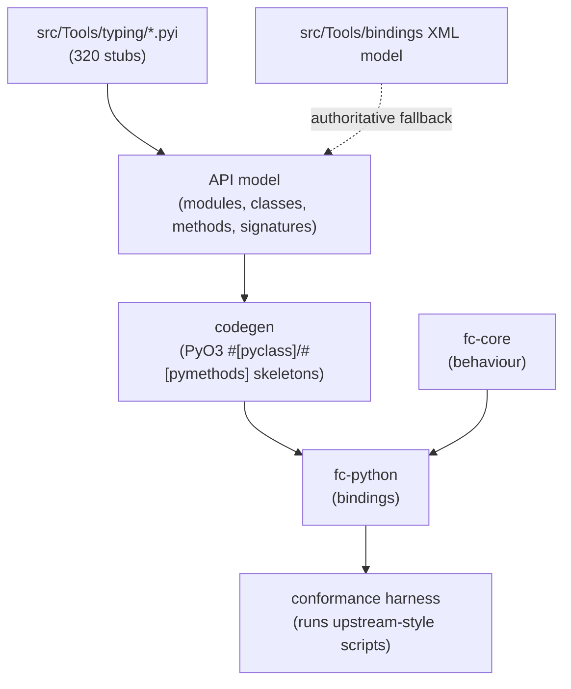

# Milestones, decisions & the M3 plan

Status: living record (2026-10-02). Complements [`rewrite-strategy.md`](rewrite-strategy.md)
(direction) and [`python-ui-research.md`](python-ui-research.md) (evidence). The code lives in the
[repository](..).

**Current state:** M0–M3 complete; **M4 in progress** (sixteen slices done) and the MVP slices
(A1, A2, B1, B2, C1, D1, D2, B4) landing. The pure-Rust `ferrocad_core` + PyO3 `ferrocad` extension
serve the FreeCAD Python surface behind the `python/FreeCAD` facade, with a conformance harness
tracking **169 upstream tests passing** across eight `Mod/Test` files (`StringHasher.py` 4/4,
`UnitTests.py` 12/12, `BaseTests.py` 48/49).
Next MVP slices: B3 (containers/links) and B5 (extension lifecycle); then the `FreeCAD`
package-init shim.

> **Naming note (FerroCAD restructure).** The repo `freecad-rs-poc` was renamed to `ferrocad` and
the flat `rust/` tree became a Cargo workspace under `crates/`. Crate names below use the
pre-restructure identifiers: `fc-core` → `crates/ferrocad_core`, `fc-python` →
`crates/ferrocad_py` (module `ferrocad`), `fc-gen` → `crates/ferrocad_gen`,
`freecad-core` → `crates/ferrocad_ctypes`, `fc-host` → `crates/ferrocad_gpui`. The M1
`freecad-py` crate (`FreeCAD._core`) was **removed** as dead code (superseded by `ferrocad_py`;
nothing imported it). The Python namespace is still `FreeCAD`.

---

## 1. Milestone record

### M0 — headless "hello world" on a Rust core (C ABI + ctypes) ✅

**Goal:** prove a script written against FreeCAD's public `App` API can be served by Rust.

**Built:**
- `rust/freecad-core` — a zero-dependency `cdylib` implementing `Document` / `DocumentObject` /
  `Property` behind a flat C ABI (27 symbols).
- `python/FreeCAD/` — a drop-in facade (`__init__.py` + `_ffi.py`) speaking the FreeCAD API via
  `ctypes`.
- `hello_freecad.py` — the milestone script (public API only).

**Key findings:** the seam can be a plain C ABI with no Python headers (builds anywhere a Rust
toolchain does). Commit `0edae9f`. 11 tests (`tests/test_parity.py`).

### M1 — replace the bridge with PyO3 ✅

**Goal:** make the Rust core a native CPython extension.

**Built:**
- `rust/freecad-py` — a `_core` PyO3 extension exposing `Document`/`DocumentObject` as
  `#[pyclass]` types over an `Arc<Mutex<Model>>`.
- Backend-agnostic `python/FreeCAD/__init__.py` selecting `_core` (PyO3) or `_ctypes_backend`
  (fallback), reported via `FreeCAD.backend`.
- Built with `abi3` + `PYO3_USE_ABI3_FORWARD_COMPATIBILITY=1` for CPython **3.14**.

**Key findings:** the environment has `python3.14-dev` (not 3.12); PyO3 0.25 builds against it via
the abi3 escape hatch. Same script + 11 tests pass on **both** backends. Commit `97078a3`.

### Spike — Python-declared UI on `bite-gpui`, headless ✅

**Goal:** answer "is a fully Python-built UI possible?" — i.e. can a Rust host embed CPython and
render UI declared by Python.

**Built** (`rust/fc-host`, `python/fcspike/declarative.py`):
- `WireNode` (serde) ← JSON from Python; `wire_to_element` → a `bite-gpui` element tree.
- A `#[gpui::test]` that embeds CPython on the dispatcher thread, renders headlessly, simulates a
  real click → Python `dispatch_event` → re-render, and isolates a raising handler.
- A diffed patch stream: `Patch::{insert,remove,update}` (insert carries `parent`+`index`).

**Key findings (each is now a locked-in fact):**
- `bite-gpui` **1.21.0** builds on Linux (709 crates); the headless `#[gpui::test]` harness runs
  with **no display server and no GPU** — the validation path for CI/sandbox.
- `use gpui::*` glob-imports the `test` macro and **shadows the builtin `#[test]`** → infinite
  recursion. Use explicit imports + `prelude::*`.
- `debug_bounds()` returns `None` in 1.21.0; use `window.root::<V>()` for mount assertions.
- PyO3 0.25 API: `Python::with_gil` (not `attach`), and `Bound` methods need
  `use pyo3::types::PyAnyMethods;`.
- Rust tests run in parallel but share one embedded CPython + module-global state → **Python-
  embedding tests must be serialized**.
- A real window needs a display server (the sandbox has none: Wayland `NoCompositor`, X11
  `Unknown connection error`), but software Vulkan (`lavapipe`) and Mesa are present.

Commits: `f6a2edd`, `f956b26`, `f798e58`, `7657eac`, `168f5d0`. 3 tests in `fc-host`.

### M2 — `fc-core` ✅

**Goal:** the pure-Rust document/object core.

**Built** (`rust/fc-core`):
- `Quantity`/`Unit` (parse + convert, mm-internal), `Property`/`PropertyContainer`.
- `Document`/`DocumentObject` with a `petgraph` dependency graph → topological recompute order.
- `TransactionManager` (open/commit/abort + undo/redo), `Observer` trait, and an expression
  parser/evaluator with `Object.Property` qualified names and `recompute()`.

10 tests. `.github/workflows/ci.yml` (headless + a real-window smoke under `xvfb-run`+`lavapipe`).
Commits `6d28642`, `3016cb3`.

### M3a — `.pyi` surface inventory ✅

**Goal:** size the upstream Python API so the remaining parity work is scoped, not guessed.

**Built** (`tools/inventory.py`, `tools/test_inventory.py`): a zero-dependency walker that parses
all 320 source-adjacent `.pyi` stubs with the stdlib `ast` module into an API model
(module/class/method/signature/attribute) and prints a per-area report.

**Surface:** 320 files → **329 classes**, **2210 methods** (140 overloaded), **2542 signatures**,
**1190 class attributes**, **421 module functions**, **123 module attributes**. By area:
`App` 26 files/53 cls/243 methods · `Base` 21/20/188 · `Gui` 27/36/377 · `Mod.*` 237/183/1331
(`Part` alone is 108/108/775) · `PySide` 9 overlay files (0 classes — the pure-Python shim tier).

**Source format:** FreeCAD's Python bindings were historically declared in a legacy
`<Class>Py.xml` format; upstream is migrating those declarations to the source-adjacent `.pyi`
stubs. On the pinned checkout (`main` @ `99c5620`) the migration is effectively complete: **no
`*Py.xml` remain**, and every `*PyImp.cpp` has a matching `.pyi`. The `.pyi` set is therefore the
authoritative *target* surface. Older/released trees still carry `*Py.xml`; `discover()` detects a
pre-migration checkout and warns, since classes defined only there would be invisible to a `.pyi`-only
walk. (Behaviour/parity is always validated against the upstream Python *tests*, never inferred from
the declaration format.)

**Decisions made here:**
- **Parser = Python `ast`** (not a Rust parser): stdlib handles the full stub grammar
  (pos-only/kw-only params, `X | None` unions, `@overload`) with zero deps and no drift from
  upstream's own `generate_stubs.py`. The JSON model (2.4 MB, regenerable) is the M3c input.
- Normalize the model to the *callable* surface: strip the implicit `self`/`cls` receiver.
- Turn off `type_comments` — some upstream `# type:` comments are malformed (e.g. an unbalanced
  `]` in `CosmeticVertex.pyi`) and would otherwise raise `SyntaxError`.

`tools/test_inventory.py` (hermetic fixtures + an upstream integration guard) is the test.

### M3b — `fc-python` bindings over `fc-core` + facade re-point ✅

**Goal:** bind the pure-Rust core to Python and make it the primary `FreeCAD` backend.

**Built** (`rust/fc-python`, module `fc`):
- `Quantity`, `Document`, `DocumentObject` as `#[pyclass]` over an `Arc<Mutex<fc_core::Document>>`.
- Document surface: `Name`/`Label`, `addObject` (default naming), `getObject`, `Objects`,
  `CountObjects`, `removeObject`, `recompute`, transactions (open/commit/abort/undo/redo).
- Object surface: `Name`/`Label`/`TypeId`/`Document` back-ref, `PropertiesList`,
  `get`/`setPropertyByName`, `getTypeIdOfProperty`, `addProperty` (typed default by type id),
  `setExpression`, and dynamic `obj.Foo` get/set via `__getattr__`/`__setattr__` (`Label`
  special-cased so it stays independent of `Name`).
- `python/FreeCAD/__init__.py` now selects `fc` as the **primary** backend and adds the small
  App-level layer `fc` lacks (document registry, `ActiveDocument`, unique-name allocation,
  `Version`) in Python; `_ctypes_backend` remains the fallback. `FreeCAD.backend` reports
  `"fc"`/`"ctypes"`.

`hello_freecad.py` output is unchanged; 11 parity tests + 8 `fc` tests pass.

### M3c — generated PyO3 skeleton bindings (`fc-gen`) ✅

**Goal:** prove the `.pyi` surface can be *generated* (not hand-written) into compiling PyO3 code.

**Built** (`tools/codegen.py`, `rust/fc-gen`): a generator that emits `#[pyclass]`/`#[pymethods]`
**skeletons** for `Document`/`DocumentObject`/`PropertyContainer` (slice from `src/App`) as module
`fc_gen`. It maps annotations to a small always-compiling type set (`&str`/`i64`/`f64`/`bool`/
`Vec<PyObject>`/`PyObject`), emits `#[pyo3(signature = (...))]` with literal defaults (string
literals, `0`, `false`, …), generates attribute getters/setters (`Final` → read-only), and
`sanitize`s Rust-keyword param names (`type` → `type_`). Bodies are `todo!()` — decision 2 was
**skeleton + hand-written behaviour glue over `fc-core`**.

**Exit met:** the crate compiles; `tests/test_codegen.py` proves every method/attribute in the
`.pyi` model is present on the generated class and signatures introspect faithfully
(`checkOwner=0`, `name=''`). `tools/test_codegen.py` (hermetic) tests the mapping/default logic.

### M3d — conformance harness ✅ (harness built; parity gap now measurable)

**Goal:** run upstream headless tests against our `FreeCAD` and make the parity gap measurable.

**Built** (`tools/conformance.py`, `tools/test_conformance.py`): a runner that loads a curated set
of `src/Mod/Test` files (as modules) against our `FreeCAD`, runs their `unittest` cases, and
reports per-test pass/fail/error plus a *classified* load error (e.g. ``missing 'FreeCAD.Base'``)
for files that can't even import. It distinguishes "file failed to load" from "test ran and
failed", so the report names the missing surface directly.

**First result** (5 curated files, honest — not green):
- ✅ **1 upstream test passes unchanged** — `UnicodeBasicCases.testUnicodeLabel` (document →
  `addObject` → Unicode `Label` round-trip → close).
- 17 errored: `StringHasher.py` needs `FreeCAD.StringHasher`; `UnitTests.py` needs
  `FreeCAD.ParamGet`/`FreeCAD.Units`; `UnicodeTests.py` needs `FreeCAD.Console`.
- 1 file (`Document.py`) fails to load: needs `FreeCAD.Base`.

**Finding:** the gating surface is the **`FreeCAD.Base`/`FreeCAD.Units`/`FreeCAD.Console`/
`ParamGet`** modules and the `App::FeatureTest` type — i.e. the M4 `Base`/`App` wiring, not the
document object model itself (which already passes the Unicode label test). The harness turns
"N upstream scripts pass" into a number we can watch grow.

### M4 (slice 1) — `Base`/`Units`/`Console`/`ParamGet`/`StringHasher` ✅

**Goal:** start the `FreeCAD.Base`/`FreeCAD.Units`/`FreeCAD.Console`/`ParamGet` surface so the
upstream test modules actually *load and run* (not just fail on import).

**Built:**
- `fc-core`: a `StringHasher`/`StringId` (interned-string table; 1-based values so `getID(0)` →
  not-found). `fc-python`: `StringHasher`/`StringID` `#[pyclass]` with `getID`/`isSame`
  type-checking (TypeError/ValueError), `Value`/`Data` getters.
- `python/FreeCAD/Base.py` (`Quantity`), `Units.py` (`Quantity`), `Console.py` (`Print*`),
  and `ParamGet`/`ParameterGrp` (in-memory config) in the facade; `StringHasher`/`StringID`
  re-exported at the top level.
- `fc-python`: `openTransaction(name="")` accepts the upstream name argument; property setters
  now accept plain `int` (→ `Float`).

**Conformance after this slice:** **13 passed** (was 1) · 9 failed · 136 errored · **0 files fail to
load** (was 1). `StringHasher.py` is **4/4**; `Document.py` now loads and runs (8/140 pass);
`UnicodeTests.py` 1/2; `UnitTests.py` 0/12 (needs the full units system).

**Remaining gap (drives the next slices):** `App::FeatureTest` properties, `Base.Vector`/`Matrix`/
`Placement`/`Rotation`/`TypeId`, `FreeCAD.GuiUp`/`PropertyType`/`Placement`/`addDocumentObserver`,
the full `Units` parser (`parseQuantity`/`listSchemas`/`Quantity.Value`/`getValueAs`), and document
`saveAs`/`open`/`copyObject`/groups/extensions.

### M4 (slice 2) — the `FreeCAD.Units` system ✅

**Goal:** implement the full `Quantity`/`Unit` + units parser so `UnitTests.py` passes.

**Built** (`fc-core/src/unit.rs`, `fc-core/src/quantity.rs`):
- `Unit` = 8-dimension `Signature` + `scale`, with an internal unit table (base + derived SI +
  imperial: N, Pa/MPa/kPa, psi/ksi, J, W, V, C, F, Ohm, Hz, T, Wb, H, eV, in/ft/yd/mi, lb/oz,
  l, rad/deg/gon, …) plus SI prefixes.
- `Quantity` = value + unit, normalized to the canonical internal unit (mm/kg/s/A/K/mol/cd/deg),
  with a recursive-descent expression parser (fractions, scientific notation, prefixes, `*`/`/`/`^`,
  parentheses, `pi`, `sin`/`cos`/`tan`, and the feet-inches `N'(expr)"` building notation),
  arithmetic, `user_string`, and `parse_unit` for compound units like `F/m`.
- `fc-python`: `Quantity` (0/1/2-arg constructor, `Value`/`UserString`/`Unit`/`Format`, `getValueAs`,
  arithmetic/`__float__`/`__eq__`) and a `Unit` pyclass.
- `python/FreeCAD/Units.py`: `parseQuantity`/`translateUnit`/`toNumber`/`listSchemas`/
  `schemaTranslate` (minimal "Standard"), `NumberFormat`, predefined unit constants (`Length`,
  `Mass`, …) and `Radian`.

**Conformance:** **25 passed** (was 13) · 9 failed · 124 errored. **`UnitTests.py` is 12/12**.

### M4 (slice 3) — `Base` geometry types + `App::FeatureTest` ✅

**Goal:** add `Vector`/`Matrix`/`Rotation`/`Placement`/`TypeId` and the `App::FeatureTest` test
object so the bulk of `Document.py` stops failing on missing geometry/attribute surface.

**Built:**
- `fc-core`: `Vector3`/`Matrix4`/`Rotation`/`Placement`/`TypeId` (`geometry.rs`); `Property` extended
  with `Integer`/`FloatList`/`IntegerList`/`StringList`/`BoolList`/`Vector`/`VectorList`/`Placement`/
  `Matrix`/`Link`; a `typeregistry` that gives known types (`App::FeatureTest` + its derived test
  types) their default properties on `addObject`.
- `fc-python`: `Vector`/`Matrix`/`Rotation`/`Placement`/`TypeId` pyclasses (arithmetic, sequence
  protocol, `Axis`); property conversion for the new types (incl. list/tuple); `Document.__getattr__`
  (objects by name), undo/redo metadata getters, `DocumentObject.recompute`/`removeProperty`/
  `supportedProperties`; top-level `FreeCAD.Vector`/`Matrix`/`Placement`/`Rotation`/`TypeId`/`GuiUp`.

**Conformance:** **36 passed** (was 25) · 42 failed · 80 errored. `Document.py` 19/140 (was 8), with
tests now running to *assertions* rather than attribute errors. The remaining wall is document
`saveAs`/`open`/`copyObject`, extensions/groups/origin/links, observers, and the `FeatureTest`
`execute()` recompute behaviour (the `0 != 26`-style failures).

### M4 (slice 4) — document `saveAs`/`save`/`open`/`copyObject` ✅

**Goal:** add document persistence so save/restore round-trips and cross-document copy work.

**Built:**
- `fc-core`: `serde`/`serde_json`; `SavedDocument`/`SavedObject` and `Document::to_saved`/`from_saved`/
  `save_to_file`/`load_from_file` (objects + name + label + type + properties + expressions as JSON).
- `fc-python`: `Document.saveAs`/`save`/`load` (tracks a file name), `copyObject` (single object or
  sequence, with name-uniquification), and a module-level `openDocument`.
- facade: `FreeCAD.open(path)` re-opens a saved file and registers the document.

**Conformance:** **41 passed** (was 36) · 44 failed · 73 errored. `Document.py` 24/140 (was 19);
`DocumentSaveRestoreCases` and the `DocumentDuplicateLabelCases` start to pass. Remaining wall:
extensions/groups/origin/links, observers, `FeatureTest.execute()`, and recovery/metadata
(`restore`/`canWriteRecoverySnapshot`/`settings`/`Meta`/`ActiveObject`).

### M4 (slice 5) — geometry setters, placement/rotation list properties, document metadata ✅

**Goal:** widen the geometry/attribute surface and document metadata so more `Document.py`
assertions reach the *value* stage instead of failing on signature or attribute errors.

**Built:**
- `fc-core`: `Property::PlacementList`/`RotationList` (default, `type_name`, py↔property round-trip).
- `fc-python`: `Rotation(axis, angle)` constructor; `Placement.Base`/`Placement.Rotation`/`Rotation.Axis`
  setters accept a tuple or 3/4-sequence (not only a `Vector`/`Rotation`); `Rotation.RawAxis`;
  `Document.ActiveObject`/`setAutoCreated`/`isAutoCreated`/`getBookedTransactionID`/`UndoRedoMemSize`/
  `findObjects(Type/Name/Label)`; `TypeId.fromName`/`Name`/`getAllDerivedFrom`/`createInstance`;
  `DocumentObject.hasExtension` (stub) + `addProperty` accepts `attr`/`read_only`/`hidden`/`locked`
  and `getTypeOfProperty` alias; module-level `addDocumentObserver`/`removeDocumentObserver` (no-op).
- facade: `setActiveDocument`, `FreeCAD.PropertyType` flag class.

**Conformance:** **46 passed** (was 41) · 52 failed · 58 errored. Remaining wall: extensions/groups/
origin/links (`addExtension`/`DocumentObjectGroup`/`getSubObject`), observers actually firing
(`DocumentObserverCases` still index-error on the un-wired signal), `FeatureTest.execute()`
(out of scope), and recovery/metadata (`restore`/`canWriteRecoverySnapshot`/`settings`/`Meta`).

### M4 (slice 6) — extensions, groups, and a console-mode `FreeCADGui` stub ✅

**Goal:** add dynamic extensions and the group/part container model so the `testExtension*` and
`testGroup`/`testDuplicateLinks` cases run, plus a real `import FreeCADGui` path for console mode.

**Built:**
- `fc-core`: `Property::LinkList` (group membership by name); `DocumentObject.extensions`
  (`BTreeSet<String>`); `add_extension`/`has_extension`/`remove_extension` with a small inheritance
  table (`App::GroupExtensionPython` → `App::GroupExtension`); `is_group_like`/`unlink_from_groups`;
  `remove_object` now drops the object from any `Group`; extensions persist through save/restore.
- `fc-python`: `addExtension`/`hasExtension`/`removeExtension`; `DocumentObject.__eq__` (same id in
  same document) so `obj in grp.Group` works; `Group` get/set as a list of `DocumentObject`s
  (single-group enforcement); `addObject`/`hasObject`/`getObject`/`getParentGroup`/
  `getParentGeoFeatureGroup`/`OutList`/`InList`; `ViewObject` → `None` (headless); `App::Part`
  default properties.
- facade: `python/FreeCADGui/__init__.py` console-mode stub (no `getDocument`).

**Conformance:** **51 passed** (was 46) · 52 failed · 53 errored. `Document.py` 34/140 (was 29);
`testExtensions`, `testExtensionBug0002785`, `testExtensionGroup`, `testGroup`,
`testDuplicateLinks` pass. Remaining wall: origin (`getSubObject`), observers firing, and
recovery/metadata (`restore`/`canWriteRecoverySnapshot`/`settings`/`Meta`).

### M4 (slice 7) — `App::Origin.getSubObject` + row-major matrix fix ✅

**Goal:** implement the `getSubObject` return convention and the Origin geometry it exposes.

**Built:**
- `fc-core`: fixed a latent convention bug — `Matrix4::transform` read column-major while
  `Rotation::to_matrix` wrote row-major, so rotations were inverted. `transform` is now row-major
  and `Placement::to_matrix` puts translation in the 4th column (m[3]/m[7]/m[11]). Added a
  right-hand-rule regression test.
- `fc-python`: `App::Origin` spawns its 6 datum children (X/Y/Z axes, XY/XZ/YZ planes) with the
  standard frames linked into `Group`; `getSubObject(subname, retType=)` implements FreeCAD's
  convention (1→object, 2→(object, Matrix, proxy), 3→Placement, 4→Matrix; string or sequence);
  `Matrix.multVec`/`Placement.multVec`.

**Conformance:** **52 passed** (was 51) · 52 failed · 52 errored. `testSubObject` passes.

### M4 (slice 8) — link properties, `Proxy`, object identity ✅

**Goal:** stop the most common `TypeError`/attribute failures in `Document.py` — link assignment
and the ubiquitous `obj.Proxy = self` pattern.

**Built:**
- `fc-core`: `App::FeatureTest` `LinkList` is now a real `LinkList` property; added
  `Property::ColorList`.
- `fc-python`: `Link`/`LinkList` setters accept `DocumentObject`s (and read back as objects);
  `PyDocumentObject` gained an instance `__dict__` (`#[pyclass(dict)]`) so arbitrary attributes
  (`Proxy`, …) round-trip, and `__hash__`. `abi3` minimum raised to **3.10** (needed by
  `#[pyclass(dict)]`). Our parity test for unknown attributes was corrected: upstream allows
  arbitrary attributes; only *reading* an unset attribute raises.

**Conformance:** **60 passed** (was 52) · 56 failed · 40 errored.

### M4 (slice 9) — `Document.Meta`/`settings`, topology, ids, colors ✅

**Goal:** implement the namespaced document-settings API and the object-topology/identity helpers.

**Built:**
- `fc-core`: `Property::ColorList`.
- `fc-python`: `Document.Meta` (a string→string dict) + `Document.settings(namespace)` returning a
  `DocumentSettings` view with validated namespaces/keys, typed `get*`/`set*` (canonical string
  storage, defaults on invalid values), `keys()` and `remove()`. `DocumentObject.ID` + `getObject`
  accepting an id as well as a name; `ColorList` accepts `(r,g,b[,a])` tuples (alpha defaults to 1).
  `Document.RootObjects` (objects not referenced by any link), `Document.TopologicalSortedObjects`,
  and `DocumentObject.MustExecute` (POC: always `false`).

**Conformance:** **70 passed** (was 60) · 58 failed · 28 errored. `Document.py` 53/140 (was 34).
`DocumentSettingsTests` (7) pass. Remaining wall: observers firing (`addDocumentObserver` is still a
no-op → `DocumentObserverCases` index-error), `PropertyLinkSub`, persistence metadata
(`restore`/`canWriteRecoverySnapshot`/`Content`/`File`), and `FeatureTest.execute()` (out of scope).

### M4 (slice 10) — `PropertyLinkSub`, document-listing/opening surface ✅

**Built:**
- `fc-core`: `Property::LinkSub(String, Vec<String>)` (link + sub-element names).
- `fc-python`: `LinkSub` properties coerce `(object_or_None, subnames)` tuples and read back as
  `(object_or_None, [names])` (or `None` when empty), with the FreeCAD `TypeError` guards for a
  non-object first element / non-string subnames.
- facade: `FreeCAD.listDocuments()` now returns a **dict** (name → document), matching upstream;
  added the `FreeCAD.openDocument(path)` alias. `hello_freecad.py` sorts the names for stable output.

**Conformance:** **75 passed** (was 70) · 57 failed · 23 errored. `Document.py` 58/140.
`testNullLinkSubPythonRoundTrip`/`testNullLinkSubSaveRestore` and the 3 `DocumentAutoCreatedCases`
tests pass.

### M4 (slice 11) — document observers that fire ✅

**Goal:** make `FreeCAD.addDocumentObserver` actually deliver events, so `DocumentObserverCases`
stops index-erroring on `signal.pop()`.

**Built:**
- `fc-core`: transactions are now *pending* until the first change (`open_named`/`begin`, named),
  `commit_transaction`/`abort_transaction` return whether a transaction existed, plus
  `has_undo`/`has_redo`; `DocumentObject.must_execute` with `enforce_recompute`/`take_must_execute`.
- `fc-python`: a global `OBSERVERS` registry and a **global object cache** keyed by
  `(document pointer, object id)` so the same object is always the *same* Python object — the tests
  compare observer arguments with `is`. Event emission (`fire_doc`/`fire_obj`) is wired to the exact
  FreeCAD points: `newDocument` → Created/BeforeChange(Label)/Changed(Label)/Relabled; facade
  `closeDocument`/`setActiveDocument` → Deleted/Activated; `addObject` → (OpenTransaction) + Created;
  property/Label writes → BeforeChange/Changed; `removeObject` → Deleted; `recompute` →
  RecomputedObject(s) + RecomputedDocument; `addProperty`/`removeProperty`/`setEditorMode`/
  `addExtension` → their dynamic-property/editor/extension slots; `saveAs`/`save` → Start/FinishSave;
  transaction/undo/redo → their document slots. `Document.Comment`/`FileName` added.

**Conformance:** **78 passed** (was 75) · 56 failed · 21 errored. All 5 `DocumentObserverCases`
tests pass (0 errors).

### M4 (slice 12) — persistence & recovery snapshot surface ✅

**Goal:** implement FreeCAD's `dumpContent`/`restoreContent` family, `restore`, and the recovery
snapshot API.

**Built:**
- `fc-core`: `is_in_transaction`; `dump`/`restore_from_bytes` (document), `dump_object`/
  `restore_object`, `dump_property`/`restore_property` (JSON payloads over the existing
  `SavedDocument`/`SavedObject`/`Property` serde model).
- `fc-python`: `Document.canWriteRecoverySnapshot()` (false during a transaction), `TransientDir`,
  `restore()`, `dumpContent()`/`restoreContent()`; `DocumentObject.dumpContent()`/
  `restoreContent()`/`dumpPropertyContent()`/`restorePropertyContent()`.
- facade: `FreeCAD.writeRecoverySnapshotToTransientDir(doc, compressed=True)` writes
  `fc_recovery_file.xml` (`<AutoRecovery>` with escaped `<Label>`/`<FileName>`) and either a
  zip `fc_recovery_file.fcstd` (with `Document.xml`) or `fc_recovery_files/Document.xml`; raises
  `RuntimeError` during a transaction. (Note: the facade defines `open()`, so the builtin is used as
  `_builtins.open`.)

**Conformance:** **84 passed** (was 78) · 56 failed · 15 errored. `Document.py` 67/137. `testRestore`,
`testPersistenceContentDump`, and all 4 `DocumentRecoveryCases` pass. `testExtensionSaveRestore`
still needs Python-object `Proxy` persistence (see next action).

### M4 (slice 13) — Python-object & `Proxy` persistence ✅

**Goal:** persist arbitrary Python state across save/restore: `App::PropertyPythonObject` values and
an object's `Proxy` (the FreeCAD `dumps`/`loads` protocol).

**Built:**
- `fc-core`: `Property::PythonObject(String)` (base64 pickle); `DocumentObject.python_state` +
  `SavedObject.python_state` (carried through `to_saved`/`from_saved`/`object_mut`).
- `fc-python`: `pickle`/`base64` helpers; `PropertyPythonObject` reads/writes as the live Python
  object; `DocumentObject` instance `__dict__` + `Proxy` captured on save (proxy stored as
  `{module, class, data}`, where `data = proxy.dumps()` or `proxy.__dict__`) and re-applied on open/
  `restore`/`load`/`restoreContent` (recreated via `cls.__new__` – bypassing `__init__` – then
  `loads(data)` or the dict).

**Conformance:** **87 passed** (was 84) · 56 failed · 12 errored. `Document.py` 70/137. `testNoProxy`,
`testWithProxy`, and `testExtensionSaveRestore` pass.

### M4 (slice 14) — expression engine: type coercion, paths, cycles, `ExpressionEngine` ✅

**Goal:** fix the expression surface behind the `document.py` expression tests.

**Built:**
- Correctness: assigning an `int` to a `PropertyFloat` stored an `Integer` (so `A.x` expressions could
  not read it) — `__setattr__` now coerces Float/Integer/Bool by the existing property's type.
- `fc-core`: the expression parser accepts a leading `.` (self-relative paths), unit-suffixed numbers
  (`10mm`), and `%`; `set_expression` builds a per-object property dependency graph and returns a
  cycle error for self-referential expressions; added `remove_expression`, `expressions`,
  `eval_expression`.
- `fc-python`: `setExpression(prop, None)` clears; cyclic errors surface as `RuntimeError`;
  `ExpressionEngine` (`(property, source)` pairs), `evalExpression(source)`, `touch(prop="")`;
  `MustExecute` reflects the flag. Added `App::DocumentObjectFileIncluded` /
  `Property::FileIncluded` (a `(source, name)` assignment copies into the document's transient dir)
  plus `Document.getTempFileName`.

**Conformance:** **90 passed** (was 87) · 58 failed · 7 errored. `Document.py` 73/137.
`testRemovePropertyExpression`, `testCyclicDependencyOnPlacement`, `testBinarySaveRestore` pass.
Not done (deliberately): `testExpression` (needs nested-path *evaluation* + `recompute()` object-count
semantics), `testIssue4649` (transactional expressions + proxy `onChanged`), and `testApplyFiles`
(undo/redo of file assignments + name persistence).

### M4 (slice 15) — widen the conformance harness + `Base` type surface ✅

**Goal:** add more upstream `Mod/Test` App-level files to the oracle (the explicit "next action"
from slice 14) and fill the resulting `Base`-surface gaps.

**Built:**
- **Harness:** `tools/conformance.py` now also runs `BaseTests`, `TestIntPairList` and
  `FreeCADInitTests` (plus the original `Document`, `StringHasher`, `UnitTests`, `UnicodeTests`,
  `TestApp`).
- **Facade `ParameterGrp` rewritten:** nested groups, `HasGroup`/`RemGroup`/`Clear`/`Rem*`,
  `Export`/`Import`, typed values (`GetInt`/`GetFloat`/`GetBool`/`GetString`/`GetUnsigned`),
  `GetGroupName`, and the matching `Set*` counterparts.
- **`fc-core`:**
  - fixed a **matrix inverse transpose bug**;
  - `Matrix4` helpers: `determinant`/`inverse`/`is_unity`/`is_null`/`unity`/`nullify`,
    `row`/`set_row`/`col`/`set_col`/`diagonal`, `pre_move`/`pre_scale`/`pre_rotate`/`transpose`;
  - `Rotation` helpers: `axis`/`set_angle`/`multiply`/`inverse`/`is_same`/`from_euler_deg`/
    `from_yaw_pitch_roll`/`yaw_pitch_roll`/`from_matrix`; `Vector3::angle` now returns `NaN` for
    zero vectors; `Placement::inverse`/`is_same`;
  - properties `IntPairList` + `FileIncluded`; `FeatureTestAttribute.Object` changed to `Link`.
- **`fc-python`:** full `PyMatrix`/`PyRotation` surface — `A11..A44` (via `__getattr__`/`__setattr__`),
  `move`/`scale`/`rotateX/Y/Z`, `isUnity`/`isNull`/`unity`/`nullify`/`determinant`/`inverse`/`transpose`,
  `setRow`/`setCol`/`row`/`col`/`diagonal`, operator protocol; `Rotation(axis, degree)` (**degrees**),
  `Rotation(yaw,pitch,roll)`, `Rotation(x,y,z,w)`, `Rotation(Matrix)`, settable `Angle`/`Q`/`Matrix`,
  `setYawPitchRoll`/`getYawPitchRoll`/`isSame`/`invert`/`inverse`/`multiply`/`toMatrix`; new
  pyclasses `Vector2d`/`Material`/`BoundBox`; `Placement(matrix)`/`inverse`/`isSame`/`toMatrix`;
  `PropertyIntPairList` coercion (list + indexed-dict, `TypeError`/`OverflowError` semantics);
  `DocumentObject.State`.

**Semantics note (confirmed against the upstream checkout):** `Placement.Rotation`, `.Base`, and
property sub-objects are returned **by value** — the C++ getters copy
(`ComplexGeoDataPy::getPlacement`, `PropertyPlacement::getPyObject`, `PlacementPy::getRotation` all
construct from a value). So `obj.Placement.Rotation.Angle = ...` mutates a temporary and does **not**
propagate; the whole placement/rotation must be reassigned. Our bindings match this.

**Conformance:** **135 passed** (was 90) · 64 failed · 16 errored · 0 files failed to load.

**Remaining gaps surfaced by the wider harness** (next-slice candidates):
- `BaseTests.MatrixTestCase`: `Matrix.decompose()` / `hasScale()` / `ScaleType` (4 errors) — needs
  matrix decomposition into shear/scale/rotation/move.
- `BaseTests.AlgebraTestCase`: `testRotationFromMatrix`, `testYawPitchRoll`, `testAngleWithNullVector`
  (numeric/rotation issues).
- `TestIntPairList`: `test_changes_touch_the_object` (`Touched` state), `test_undo_redo`
  (`Document.UndoMode`).
- `FreeCADInitTests`: needs a package-init shim (`FreeCAD.Logger`, `__cmake__`, bootstrap attrs).
- `Recompute.py` / `AutoSaverStress.py` still fail to load (need `Part` / `PySide6`).

---

### M4 (slice 16) — matrix decomposition + rotation numerics ✅

**Goal:** clear the `BaseTests.MatrixTestCase` cluster (`decompose`/`hasScale`/`ScaleType`) and the
adjacent `AlgebraTestCase` rotation numerics.

**Built:**
- **`fc-core`:**
  - `Matrix4::has_scale(tol) -> ScaleType` (column/row norm + `det3` classification, distinguishing
    left- from right-applied scaling) and `Matrix4::decompose()` returning
    `[shear, scale, rotation, move]` with `self == move * rotation * scale * shear`;
  - helpers `determinant3`, `set_diagonal`, and `inverse_gauss` — a **verbatim port of FreeCAD's
    `Matrix_gauss`** (Gauss-Jordan with partial pivoting, incl. the GL transpose in/out) so the
    decomposition reproduces upstream bit-for-bit;
  - `Rotation::to_matrix` now **normalizes the quaternion** (upstream `getValue`);
    `Rotation::from_matrix` mirrors `setValue(Matrix4D)` — decompose, take `[2]`, then read the
    quaternion;
  - `Rotation::from_vectors` (`Axes`); `from_yaw_pitch_roll` uses the **direct half-angle formula**
    (not `from_axis_angle`); `yaw_pitch_roll` is quaternion-based with the OCC gimbal tolerance;
    `from_axis_angle` wraps the angle into `[0, 2π)`; `angle()`/`axis()` return `0`/`Z` when
    `|w| >= 1` (upstream `evaluateVector`).
- **`fc-python`:** `Matrix.hasScale(tol)` returning a `FreeCAD.ScaleType` member (via
  `FreeCAD.ScaleType(int)`, like upstream), `Matrix.decompose()` → 4-tuple; `Matrix.__eq__` uses the
  upstream `epsilon()` tolerance; `Rotation.Axes`/`Yaw`/`Pitch`/`Roll` setters; `Axis`/`Angle` now
  **persist the axis** across a set (FreeCAD stores `_axis`/`_angle`; a bare quaternion can't encode
  "axis X, angle 0").
- **facade:** `FreeCAD.ScaleType` / `Base.ScaleType` as an `IntEnum` (also the shape
  `FreeCADInitTests` will assert).

**Conformance:** **146 passed** (was 135) · 61 failed · 8 errored. `BaseTests` **48/49** (only the
C++ `App::FeatureTestPlacement` fixture remains). Errored tests dropped 16 → 8.

---

### FerroCAD restructure — workspace, edition 2024, packaging ✅

**Goal:** start moving the POC out of `freecad-rs-poc` toward deliverable shape, without changing the
Python surface.

**Built:**
- Repo renamed `freecad-rs-poc` → **`ferrocad`**; the flat `rust/` tree became a Cargo **workspace**
  under `crates/` (see the naming note at the top).
- **Edition 2024** across the workspace (`resolver = "3"`); the legacy ctypes C ABI needed
  `#[unsafe(no_mangle)]`. `[workspace.package]`/`[workspace.dependencies]` centralise version,
  edition, license and the shared deps.
- The primary extension is now the module **`ferrocad`** (imported by the `FreeCAD` facade); the
  distribution is **`ferrocad`** via a maturin **`pyproject.toml`** (`python-source = "python"`,
  `module-name = "ferrocad"`). The exported namespace stays **`FreeCAD`**.
- `python/fcspike` → `python/ferrocad_spike`; a single root `Cargo.lock` replaces the per-crate ones;
  `build.sh`, `.gitignore`, the CI workflow and the README were updated.

**Validated:** `cargo test` 32/32, 78 Python tests, tools 7/10/5, conformance **146 passed**,
`run.sh` OK; `cargo check` green for every member.

**Deliverable direction:** this is the first step toward a standalone **`ferrocad`** distribution that
is a **drop-in replacement for the `FreeCAD` Python package** — the maturin/`pyproject` build and the
`crates/` split are the seams along which packaging (wheel) and the eventual `Part`/geometry work
will land.

**Follow-up: crate triage & capability check.**
- *Crate triage.* `ferrocad_core`/`ferrocad_py` are primary; `ferrocad_gen` is useful (drives the
  codegen tests); `ferrocad_ctypes` is **useful** — a genuinely working `ctypes` fallback (fixed a
  stale `rust/freecad-core/target` search path in `_ffi.py`; verified `hello_freecad.py` runs with
  `backend = "ctypes"`) — **since removed**, see the latest milestone; `ferrocad_gpui` is a **spike, kept** (not yet production). The M1
  `ferrocad_bootstrap` (`FreeCAD._core`) crate was **deleted** — orphaned, nothing imported it.
- *Embedded Python works.* `cargo test -p ferrocad_gpui` → **3 passed**, including
  `python_declares_ui_and_click_round_trips`: the Rust host embeds CPython, imports a Python module,
  and round-trips a click through a Python callback into a `bite-gpui` element. Layering:
  `ferrocad_core` is pure Rust (no embedding); the *host* embeds the interpreter.
- *Python-only script + file loading.* `hello_freecad.py` runs end-to-end on the public API, and
  `examples/file_roundtrip.py` demonstrates loading a file: `doc.saveAs(path)` → `FreeCAD.open(path)`
  → read `Objects`/`Label`/`PropertyLength` back. The on-disk format is FerroCAD's own JSON under a
  `.FCStd` name; upstream's zip `.FCStd` and `Part` import remain out of scope.

---

### MVP slice A1 — object state, property status & touch ✅

**Goal:** the model foundations the MVP needs (see [`mvp-path.md`](mvp-path.md) §6):
`DocumentObject.State`, per-property status flags, and touch-on-assign.

**Built:**
- **`ferrocad_core`:** `PropertyContainer` now carries a per-property `PropertyType` status
  mask (`prop_status` bits + `status_names`/`status_from_name`); `Document::add_property(value,
  status)` (does **not** touch) vs `set_property` (touches unless `Prop_Output`/`Prop_NoRecompute`);
  `property_status`/`set_property_status`/`purge_touched`; `DocumentObject.invalid`; recompute marks
  an object invalid on an expression failure.
- **Persistence:** `SavedObject.property_status`; `Prop_NoPersist` is dropped on save while
  dynamically-added transient properties are still saved — mirroring upstream
  `PropertyContainer::Save`.
- **`ferrocad_py`:** `addProperty` full signature (attr flags + `read_only`/`hidden`/`enum_vals`);
  `getTypeOfProperty` (flag names, `AttributeError` when missing);
  `getPropertyStatus`/`setPropertyStatus` (text names, leading `-` clears); `purgeTouched`;
  `getStatusString`; `State` reports `Invalid`/`Touched`/`Up-to-date`.

**Conformance:** **149 passed** (was 146) · 58 failed · 8 errored. Newly green:
`TestIntPairList.test_changes_touch_the_object`, `Document.testProp_NonePropertyLink`,
`Document.testAttributeOfDynamicProperty`. Tests: 35 Rust (+3), 80 Python (+2).
`testWrongTypes` (type-registry validation) moves to slice A2.

---

### MVP slice B1 — object name/label semantics ✅

**Goal:** `Name` vs `Label` semantics (mvp-path §6 B1).

**Built:**
- **`ferrocad_core`:** `sanitize_name` (a `Base::Tools::getIdentifier` approximation — keep
  identifier characters, replace others with `_`, prefix `_` when the first character is not a valid
  identifier start); `Document::unique_name`/`unique_label` (`base`, `base001`, …, stripping a
  trailing digit run so `Label001` shares the `Label` stem); `add_object_with(name, type_id,
  duplicate_labels)` — names are always sanitized + made unique, labels are unique unless duplicate
  labels are allowed (then the sanitized requested label is kept).
- **`ferrocad_py`:** `addObject` reads the `DuplicateLabels` document preference through the facade
  (`ParamGet("User parameter:BaseApp/Preferences/Document").GetBool`) and applies the policy;
  `copyObject` keeps the source label when duplicates are allowed, otherwise makes it unique;
  `create_origin_children` uses the core namer.

**Conformance:** **153 passed** (was 149) · 54 failed · 8 errored. `DocumentDuplicateLabelCases` is
now **6/6**. Tests: 36 Rust (+1), 83 Python (+3).

---

### MVP slice A2 — `PropertyEnumeration` + type-registry validation ✅

**Goal:** the enumeration property type and assignment/type validation (mvp-path §6 A2).

**Built:**
- **`ferrocad_core`:** a new `Property::Enumeration(choices, index)` variant
  (`App::PropertyEnumeration`, serde round-trips).
- **`ferrocad_py`:** `addProperty` handles `enum_vals`; the type must be a property type
  (rejecting object/extension ids with `TypeError`); `addObject` takes the upstream signature
  (`type`, `name`, `objProxy`, `viewProxy`, `attach`, `viewType`) and rejects extension types;
  `findObjects(Type=…)` raises `TypeError` for a non-object type; `__setattr__` handles
  `Enumeration` (list sets the choices, int selects by index, str selects a value — `ValueError`
  when not offered or when no choices exist).

**Conformance:** **155 passed** (was 153) · 52 failed · 8 errored. Newly green:
`Document.testEnum`, `Document.testWrongTypes`. Tests: 37 Rust (+1), 85 Python (+2).

---

### MVP slice B2 — undo/redo engine ✅

**Goal:** a real, reversible undo stack covering property changes, object add/remove and
expressions, with FreeCAD's transaction/undo lifecycle (mvp-path §6 B2).

**Built:**
- **`ferrocad_core` (`document/transaction.rs`):** transactions collect a general `Change` enum
  (`Property`, `AddObject`, `RemoveObject`, `AddExpression`, `RemoveExpression`), each carrying
  enough saved state to revert *and* re-apply. `TransactionManager` now keeps *named*
  `Transaction`s: `open_named` books a name; the first change activates it (committing any
  previously-active transaction and **clearing redo**); `undo`/`redo` move whole transactions
  between stacks.
- **`ferrocad_core` (`document/mod.rs`):** `add_object_with` records `AddObject` and sets
  `active_object`; `remove_object` splits into a recording public path plus a raw path, and
  records the group link-list edits so group membership is restorable; `insert_saved_object`
  re-inserts an object with its **original id** (so object identity survives undo/redo);
  `set_expression`/`remove_expression` record their changes; `apply`/`revert` handle every
  `Change`. New accessors `undo_names`/`redo_names`/`clear_undos`/`active_object`/
  `booked_transaction_id`.
- **`ferrocad_core` (`document/transaction.rs`):** transactions carry a **process-unique id**
  (`Transaction::getNewID` equivalent); `open_named` books a fresh id immediately, and
  `booked_transaction_id`/`available_undos(id)`/`available_redos(id)` mirror FreeCAD's
  `getBookedTransactionID`/`getAvailableUndos`/`getAvailableRedos` (id 0 → count; otherwise the
  1-based depth from the top, 0 if unknown).
- **`ferrocad_py`:** real `UndoNames`/`RedoNames`/`UndoCount`/`RedoCount` (an in-progress
  transaction is the newest name), `clearUndos`, `getBookedTransactionID`,
  `getAvailableUndos`/`getAvailableRedos`, `UndoMode` (reports `1`; assignment accepted and
  ignored, like upstream's no-op setter), `ActiveObject` from `active_object`, and a
  link-type-aware `InList` (any `Link`/`LinkList`/`LinkSub` plus expression backlinks guarded
  against identifier substrings).
- **Restructure:** the transaction engine now lives in `document/transaction.rs` as a submodule
  of `document` (a second `impl Document`), with `document/mod.rs` owning the object store; the
  crate's public-surface tests are sliced into `src/tests/{documents,properties,quantities,
  transactions}.rs`.

**Conformance:** **160 passed** (was 155) · 48 failed · 7 errored; `Document.py` 87/137. Newly
green: `UndoRedoCases.testUndo`, `UndoRedoCases.testUndoClear`, `UndoRedoCases.testUndoInList`,
`MultiDocumentUndo.testAddObjects`, and `TestIntPairList.test_undo_redo` (now 8/8) —
`testUndoProperties` and `testUndoIssue0003150Part1` already passed. Tests: 42 Rust (+5),
95 Python (+10).

---

### App shell S1 — skeleton window ✅

**Goal:** first step of the MVP app shell ([`app-shell-vision.md`](app-shell-vision.md) §5 S1): a
window with a title bar over the live document, with the interpreter wired up.

**Built:**
- **`python/ferrocad_shell`** — the shell's Python side: `bootstrap` creates the sample document
  (`Params` with `Length`/`Mode`, `Derived` wired to it by an expression, and a `Group`),
  `hello` proves the interpreter is live, `model_tree`/`properties` read the model for the
  panes, and `evaluate` runs a console line capturing stdout/stderr and tracebacks.
- **`crates/ferrocad_gpui/src/python.rs`** — the embedded-CPython bridge: locate `python/`, put
  it on `sys.path`, boot, and marshal small JSON payloads.
- **`crates/ferrocad_gpui/src/shell.rs`** — the `Shell` view: an in-window header, a **model
  inspector** (documents → objects, selectable), a **property editor** (rows for the selection),
  a **viewport placeholder**, a **Python console** (log + runnable snippets) and a **status bar**,
  all driven by the shell model.
- **Client-side decorations (`crates/ferrocad_gpui/src/chrome.rs`).** A reusable `window_frame`
  wraps view content: it returns the content unchanged where the platform draws the frame, and
  otherwise prepends a title bar (drag to move, right-click for the window menu, min/max/close
  controls) and turns the border into resize grips. The window asks for
  `WindowDecorations::Client` with `app_owns_titlebar_drag`, which is what GNOME/Wayland requires
  since it does not implement the server-decoration protocol. The frame **insets the content by the
  grip width** on each edge the compositor is not managing, so the border band belongs to the grips;
  without that inset a full-width title bar covers the top band and the top edge and top corners
  cannot be grabbed. Hit-testing is split into pure functions (`resize_edge` → `ResizeEdge`,
  `cursor_for` → `CursorStyle`) so it is unit-testable without a window.
- **`crates/ferrocad_gpui/src/main.rs`** — the app entry point (boot, then open the window with the
  client-decoration `WindowOptions`); the `ferrocad_gpui` spike is retained and its Python test now
  shares the test lock.

**Validation:** `cargo test -p ferrocad_gpui` **5/5** (the headless `#[gpui::test]` boots the
interpreter, asserts the sample-document tree the inspector shows, reads `Length` for the property
editor, round-trips `len(doc.Objects)` through the console, and renders the shell with no
display/GPU; the resize-grip geometry and cursor tests now live in `chrome.rs`).
`cargo build --workspace --all-targets` is warning-free. Not yet: menus/shortcuts, file commands
(S2+); real console text input landed as the S5 preview below.

### App shell S1+ — editable console input (S5 preview) ✅

**Goal:** the first real text input, which the Python console (S5) needs: a single-line editable
field wired to the interpreter.

**Built:**
- **`crates/ferrocad_gpui/src/input.rs`** — a reusable single-line `TextInput` component built from
  `EntityInputHandler` (platform text and IME arrive through `replace_text_in_range` and
  `replace_and_mark_text_in_range`) plus a custom `Element` that shapes the line and registers the
  handler with `window.handle_input` each paint. Control keys (`Enter`, `Backspace`, arrows,
  `Home`/`End`, `Cmd`/`Ctrl` `A`/`C`/`X`/`V`) are handled in `on_key_down`, which calls
  `cx.stop_propagation()` for the keys it consumes so the platform does not also insert their
  character. Content and selection are UTF-8 internally; conversion to the platform's UTF-16 happens
  only at the boundary. Pressing `Enter` emits a `SubmitEvent`.
- **`crates/ferrocad_gpui/src/shell.rs`** — the console pane now ends in a live input line. The shell
  subscribes to the input's `SubmitEvent`, runs the line through the embedded interpreter, appends the
  echoed line and its output to the log, and clears the field. The window focuses the field at boot.
- **`unicode-segmentation`** — added for grapheme-aware caret movement.

**Validation:** `cargo test -p ferrocad_gpui` **8/8**. New headless tests
(`typing_backspace_and_caret_movement_edit_the_content`, `select_all_then_type_replaces_the_line`,
`enter_emits_a_submit_event_without_inserting_a_newline`) drive the field with
`simulate_input`/`simulate_keystrokes`; the shell test now types `len(doc.Objects)`, presses `Enter`,
and asserts the log gained the echoed line and `3`. `cargo build --workspace --all-targets` is
warning-free.

**Also in the book:** Chapter 9 ("Editable Text") teaches this control, with the compile-verified
example `ch9_editable_text.rs` and two headless tests. The client-side-decoration work updated
Chapter 1.

### App shell S1++ — scrollable panels, title-bar contrast, shared text core (WIP) ✅

**Built:**
- **Scrollable panels** (`shell.rs`): the model tree and the property editor keep their header fixed
  and put their rows in a `flex_1().min_h_0().overflow_y_scroll()` body; the console log is tracked by
  a `ScrollHandle` and pinned to the bottom on every run. This is the fix for content that used to
  overflow its panel.
- **Title-bar contrast** (`chrome.rs`, book `window_chrome.rs`): the control glyphs now carry an
  explicit light color and a stronger hover, with a red hover on close.
- **`crates/ferrocad_gpui/src/text.rs`** (WIP foundation): `TextBuffer`, the shared editing model
  (text, selection, IME marked range, UTF-16 conversion, and a **read-only prefix** boundary), with
  five unit tests. It is not yet wired into the components; the next slice moves `input` onto it and
  adds a `textarea` component whose read-only prefix is the console transcript and whose editable
  tail is the current line.

**Validation:** `cargo test -p ferrocad_gpui` **13/13** (5 new `text::tests`).
`cargo build --workspace --all-targets` is warning-free.

**Also in the book:** Chapter 10 ("Scrolling and Long Lists") with the compile-verified example
`ch10_scrolling.rs`; the planned chapters after it renumbered (console → 11, commands → 12, testing →
13, packaging → 14).

### App shell S1+++ — the console as a text area; the `Edit` component ✅

**Built** (slices B–D of [`input-components.md`](input-components.md)):
- **`crates/ferrocad_gpui/src/textarea.rs`** — `TextAreaState`, a scrollable text area with a
  read-only prefix and an editable tail over one `TextBuffer`. Every line but the last renders as a
  muted read-only run; the last line is a muted prefix run plus a normal editable run, with the
  caret and selection only in the tail. Edits, the caret and the selection are clamped to the
  editable region, so the transcript cannot be altered. `Enter` emits `SubmitEvent` with the tail.
- **Console is now one text area.** `ShellModel.console` stays the logical log; `run()` rebuilds the
  transcript (`log + "\n>>> "`) after each command, which clears the editable tail and scrolls to it.
  The old log-plus-input split is gone.
- **`crates/ferrocad_gpui/src/input.rs`** — the single-line field is restructured into
  `TextInputState` (state) plus `Edit` (an ephemeral `View` carrying `placeholder`), the pattern from
  `astrimid/gpui_book2`. It is unused by the shell for now; the property editor (S4) is its first
  consumer, so the module is `#[allow(dead_code)]` until then.

**Validation:** `cargo test -p ferrocad_gpui` **16/16** (3 new `textarea::tests`, plus the shell test
now types into the text area and submits). `cargo build --workspace --all-targets` is warning-free.

### App shell S1++++ — editable properties in one transaction ✅

**Built** (slice E of [`input-components.md`](input-components.md)):
- **`python/ferrocad_shell.set_property`** — sets one property from its editor string inside
  `openTransaction` / `commitTransaction`, then `recompute()`; returns `{ok, error}`. It refuses
  properties that are not editable and those driven by an expression, and coerces the text by the
  property's type id (`float`, `int`, `bool`, `Quantity` for length/angle/distance, string for
  enumeration). `properties()` now reports `editable` and `kind` per row.
- **Property editor** — one uncontrolled `Edit` per editable property, keyed by `object.property` and
  seeded from the model only when the value changed and the field is not focused. `Enter` calls
  `set_property`; the shell then re-reads the tree and the selected object's rows. Commit is on
  `Enter` (blur commit is deferred until the component emits a blur event).
- **`crates/ferrocad_gpui/src/input.rs`** is now in use, so its temporary `allow(dead_code)` is gone.

**Validation:** `cargo test -p ferrocad_gpui` **17/17**. The new
`editing_a_property_commits_in_a_transaction` selects `Params`, types `25 mm` into its `Length`
field, presses `Enter`, and asserts the row reflects `25` and the expression-driven `Derived.Result`
recomputed to `50`. `cargo build --workspace --all-targets` is warning-free.

**Also in the book:** Chapter 11 ("Controlled and Uncontrolled Components"), with the
compile-verified `ch11_controlled.rs` and a shared field (`src/text_field.rs`) that emits both a
`ChangeEvent` and a `SubmitEvent`. Chapter 12 ("A Python Console in a Native Window") teaches the
read-only-prefix text area; the book carries `src/text_buffer.rs` and `src/text_area.rs` (ports of
`text.rs`/`textarea.rs`) with their 8 tests, and the compile-verified `ch12_console.rs` runs a
stand-in interpreter. Chapters after it stay numbered commands → 13, testing → 14, packaging → 15.

### Widgets extraction + multi-line console ✅

**Built:**
- **`crates/ferrocad_widgets`** — a new workspace crate holding the reusable `bite-gpui` widgets:
  `window_frame`, `TextBuffer`, `TextInput` (single-line; emits `ChangeEvent`/`SubmitEvent`) and
  `TextAreaState` (the console text area). The host and `bite-gpui-book` both depend on it, so the
  two copies of each widget are gone. `TextInput` is one entity; the earlier separate `Edit` `View`
  wrapper was dropped (its only prop was the placeholder, which belongs in the entity).
- **Multi-line console** (`ferrocad_widgets::TextAreaState`): `Shift+Enter` inserts a newline and paste
  keeps newlines, so a snippet can be pasted and edited before it is run; `Enter` submits the whole
  tail. The element renders the read-only and editable runs per line and draws multi-line selections.

**Validation:** `cargo test -p ferrocad_widgets` **12/12** (new
`shift_enter_inserts_a_newline_in_the_snippet` and `enter_emits_the_whole_multiline_tail`);
`cargo test -p ferrocad_gpui` **4/4** (component tests moved into the crate).
`cargo build --workspace --all-targets` is warning-free. Book: `cargo build --examples` clean;
`cargo test --examples` ch7 3, ch8 4, ch9 2.

**Book:** all 16 chapters are written. Chapter 13 ("Commands, Undo/Redo and Menus") adds the
compile-verified `ch13_commands.rs`: actions exposed through a menu bar and shortcuts, with an
undo/redo stack whose depth drives the menu enablement. Chapter 14 ("The Rust/Python Boundary")
fills the gap that made packaging abrupt: it covers the extension-vs-embedding split, PyO3 vs the
raw C-API vs a C ABI loaded with `ctypes` (a trade-off table), the primary/fallback backend design,
`extension-module` linking, `abi3`, and errors/panics/GIL. It has no program, because the code it
describes is `ferrocad_py`/`ferrocad_ctypes`; the longer version is the new
[`python-bindings.md`](python-bindings.md). Chapters 15–16 renumber accordingly: Chapter 15
("Testing Without a Display") is `ch15_testing.rs`, whose 7 tests exercise the harness. Chapter 16
("Packaging and Distribution") has no program, by design: its artifacts are configuration (a
release profile, a `.desktop` entry, and FerroCAD's real `pyproject.toml`/maturin setup and CI,
which the chapter uses as the worked example for the Python half; the desktop app's packaging is
named as not yet built).

### Remove the `ctypes`/C-ABI fallback; hard-depend on the CPython headers ✅

**Decision.** `crates/ferrocad_ctypes`, `python/FreeCAD/_ctypes_backend.py` and
`python/FreeCAD/_ffi.py` were deleted. `python/FreeCAD/__init__.py` now imports the `ferrocad`
PyO3 extension unconditionally (`FreeCAD.backend == "ferrocad"`).

**Why.** The fallback was not a second transport over `ferrocad_core`; it re-implemented its own
smaller document model, so `FreeCAD.backend` selected a *different implementation*, not a
different bridge. PyO3 covers every capability it had (and more), `abi3` already removes the
per-CPython-version coupling, and "no Python headers" is a build-environment constraint, not a
deployment requirement: FreeCAD is a Python application, so a CPython and its headers are always
present (CI installs `python3-dev`). The call-path diagrams and the full argument are in the new
[`architecture.md`](architecture.md).

**Touched.** `Cargo.toml` (workspace members), `build.sh`, `.github/workflows/ci.yml`,
`README.md`, `python-bindings.md`, `mvp-path.md` (criterion 4 dropped), `rewrite-strategy.md`,
and book Chapter 14 ("What FerroCAD uses") and Chapter 16.

---

### MVP slice C1 — full property round-trip ✅

**Goal:** save and restore every property type, including the `SaveRestoreSpecialGroup` fixture,
so `DocumentSaveRestoreCases.testSaveAndRestore` passes (mvp-path §6 C1).

**Built:**
- **`ferrocad_core` (`typeregistry.rs`):** `default_properties` now yields
  `(name, default, status)` and mirrors the upstream `src/App/FeatureTest.cpp` constructor
  (`Integer`=4711, `Float`/`Distance`=47.11, `Angle`=3.0, `String`="4711", `Enum` seeded,
  `ConstraintInt/Float`=5, `Vector`=(1,2,3), `ExecResult`="empty", the `Type*` status flags, …);
  `PropertyLinkSub`/`LinkSubList` are now real properties.
- **`ferrocad_core` (`property.rs`):** new internal `prop_status::DYNAMIC` bit (upstream
  `PropDynamic`). It is stored in the raw status, but `PropertyContainer::status` masks it out
  (public `PropertyType` mask stays clean), with `raw_status`/`is_dynamic` for persistence.
  `add_property` sets it.
- **`ferrocad_core` (`document/mod.rs`):** `SavedObject::from_object` skips `NoPersist` values and,
  for *static* transient properties, persists only the status (value omitted), matching
  `PropertyContainer::Save`; dynamic transient properties keep their value. `from_saved` and
  `restore_object` overlay the persisted values on the constructor defaults instead of clearing,
  so static transient properties revert to their default after a restore.
- **`tools/conformance.py`:** the loader now registers each test module in `sys.modules` before its
  body runs (as a normal import would), so proxy classes referenced by module name resolve. This
  is behavior-neutral for the harness (its `main` already puts the test dir on `sys.path`) but
  makes `run_file` self-contained.

**Conformance:** **161 passed** (was 160) · 46 failed · 8 errored; `Document.py` 88/137. Newly green:
`DocumentSaveRestoreCases.testSaveAndRestore` (and, with the loader fix,
`testExtensionSaveRestore`, `testWithProxy`). `testObjects` moved from an early assertion failure
(wrong stub defaults) to a later missing-method error (`getDocumentationOfProperty`, a D2 gap),
so it is not a regression. Tests: 42 Rust (unchanged; the existing
`no_persist_properties_are_dropped_but_dynamic_transients_saved` now passes with the `DYNAMIC`
bit), 98 Python (+2 round-trip cases).

---

### MVP slice D2 — the remaining `DocumentBasicCases` ✅

**Goal:** clear the six remaining `DocumentBasicCases` (mvp-path §6 D2), including the two that
hinge on property sub-object reference semantics (§8.1).

**Built:**
- **`ferrocad_core` recompute engine** (`document/mod.rs`): split FreeCAD's `Touch`/`Enforce`
  flags (`DocumentObject::touched` alongside `must_execute`); derive dependencies from link
  properties and cross-object expression references (`dependency_edges`, `dependents`) instead of
  only the manual graph; `recompute()` now executes dirty objects in dependency order, propagates
  to dependents, runs a type-specific `execute` (`App::FeatureTest*` bumps `ExecCount`/`ExecResult`),
  and returns the executed ids (`objectCount`). `touch(no_recompute)`, `purge_touched` and
  expression set/remove updated to match.
- **Property metadata** (`property.rs`, `typeregistry.rs`): `PropertyContainer` carries a group and
  documentation per property; `property_meta` mirrors `FeatureTest.cpp`. New
  `App::PropertyIntegerConstraint`/`App::PropertyFloatConstraint` value kinds with `[min,max]`
  clamping (4-tuple assignment sets the range); the `Enum` default is `["Zero"…"Four"]` at index 4.
- **Object lifecycle** (`ferrocad_py`): a removed object's handle raises `ReferenceError` on
  attribute access.
- **Geometry write-through** (`ferrocad_py`): `Placement`/`Rotation`/`Vector` handles returned from
  a document object carry a `GeometryView` (property location + version); sub-object writes
  (`obj.Placement.Base.x = 5`, `obj.Rotation.Axis = …`) propagate, while reassigning the property
  invalidates previously captured handles via a new per-property version counter
  (`DocumentObject::property_versions`). Core `Rotation` retains the raw axis
  (`#[serde(default)] raw_axis`) so `RawAxis` survives a save/restore; `PartialEq` still compares
  the quaternion only.

**Conformance:** **167 passed** (was 161) · 41 failed · 7 errored; `Document.py` **94/137**. Newly
green: `testAddRemove`, `testObjects`, `testNoRecomputeParent`, `testIssue24571`,
`testNotification_Issue2902Part2`, `testRawAxis`. Tests: 45 Rust (+3 recompute/touch) and 104
Python (+6: metadata, constraints, lifecycle, placement write-through, raw axis).

---

### MVP slice B4 — expressions v2 ✅

**Goal:** nested-path expressions and real recompute counting (mvp-path §6 B4).

**Built:**
- **`ferrocad_core` (`document/mod.rs`):** expressions resolve and assign through nested property
  paths. `resolve` handles self-relative (`.Placement.Base.x`), object-qualified
  (`Test.Placement.Rotation.Angle`) and bare self paths; new `resolve_path`/`sub_value` walk
  `Placement`→`Base`/`Rotation`→`Angle`/`Axis` and `Vector.x/y/z`. `eval_expressions` writes the
  result back through `assign_path`/`assign_nested`, descending into `Placement`/`Rotation`/`Vector`
  while keeping whole-property kinds (a `PropertyLength` stays a length).
- **Topology:** `Document::root_objects` (no dependents) and `topological_sorted_objects`
  (dependents-first), exposed as `Doc.RootObjects` / `Doc.TopologicalSortedObjects`.

**Conformance:** **169 passed** (was 167) · 40 failed · 6 errored; `Document.py` **96/137**. Newly
green: `DocumentExpressionCases.testExpression`, `DocumentRecomputeCases.testRecompute` (the
`ExecCount`/object-count progression follows from D2's recompute engine). Tests: 47 Rust (+2 nested
paths, RootObjects/topological sort) and 107 Python (+3).

---

## 2. Decisions now unlocked by the spike work

These are no longer open questions — the spike produced evidence:

1. **Python ↔ Rust mechanism = PyO3** (extension + embedding), with a hard dependency on the
   CPython headers. The temporary C ABI + `ctypes` fallback was removed (see the latest milestone
   and [`architecture.md`](architecture.md)). *Evidence:* M1 and the spike run both directions.
2. **UI toolkit = `bite-gpui` 1.21.0.** Modular tiers (`bite-gp-types/-engine/-platform/-authoring/
   -runtime`) and a headless test harness are both confirmed.
3. **UI architecture = Python-declarative, Rust-rendered (Blender-style), retained tree + diffed
   patch stream.** *Evidence:* the spike's click → Python → `Patch` → re-render loop works end-to-end.
4. **Code convention: never `use gpui::*`.** Explicit imports + `prelude::*` only.
5. **License = LGPL-3.0-or-later** to combine with `bite-gpui`'s Apache-2.0 (and `scenix`).
6. **Core model:** `petgraph` DAG for recompute; expression engine with qualified
   `Object.Property` names; transactions with undo/redo; observers. (M2 shape is the reference.)
7. **Workspace layout:** `fc-core` (pure), `fc-python` (bindings), `fc-ui` (bite-gpui + diff
   applier), `fc-render` (wgpu), `fc-coin-compat` (scenix), `fc-app` (host). (Currently `rust/*`
   in the POC; rename/move into a cargo workspace when we add `fc-python`.)
8. **Test strategy:** headless `#[gpui::test]` is primary; pure-Rust tests parallel, Python-
   embedding tests serialized; real-window via CI `xvfb-run`+`lavapipe`.
9. **Verified versions:** `bite-gpui` 1.21.0 · `pyo3` 0.25 · `wgpu` 30 · `scenix` 1.5 ·
   `rustc` 1.99.

Still open (for later, not blocking M3): Python target range for distribution (3.12–3.14), and
`abi3` vs per-version binaries.

---

## 3. M3 plan — Python API parity from the upstream IDL

**Goal.** Make the Rust core's Python surface match upstream FreeCAD's `App` (and eventually
`Gui`) closely enough that upstream-style scripts run unchanged — not by hand-transcribing, but by
deriving the surface from FreeCAD's own interface descriptions.

### 3.1 Inputs (already in `freecad-upstream`)

- `src/Tools/bindings/` — the **XML interface model** + `generate.py` + templates; this is what
  produces the 261 generated `*PyImp.cpp`. It is the most authoritative description of the C++
  API surface.
- `src/Tools/typing/` — 320 generated **`.pyi` stubs** (`generate_stubs.py`); these are the
  *Python-visible* signature contract.
- `src/Mod/Test/` — upstream test scripts (e.g. `TestCoinNodeSnapshots.py`) usable as a
  conformance oracle (App-level, headless).

### 3.2 Approach

**Derive, don't transcribe.** Build a small toolchain that turns the `.pyi` (and, where needed, the
XML model) into (a) an API model and (b) generated PyO3 bindings whose behaviour is implemented in
`fc-core`/`fc-python`.

### 3.3 Phases

- **M3a ✅ — surface inventory.** Parse the `.pyi` stubs into an API model (module/class/method/
  signature), report the surface: how many classes, methods, properties; categorize by module
  (`App`, `Gui`, `Part`, …). *Exit:* a machine-readable API model + a size/complexity report that
  scopes the remaining work. *(Done: `tools/inventory.py`; 320 files → 329 classes / 2210 methods / 2542 signatures.)*
- **M3b ✅ — `fc-python` binding of `fc-core`.** `rust/fc-python` exposes `Document`/
  `DocumentObject`/`Property`/`Quantity` and the transaction/expression/recompute API through PyO3
  (module `fc`) over an `Arc<Mutex<fc_core::Document>>`; exercised by `tests/test_fc_core.py`
  (quantities, expressions+recompute, transactions, lookup, default naming, label/name split,
  dynamic properties, remove). The `FreeCAD` facade now selects `fc` as its primary backend (with
  a small Python-side document registry) and `_ctypes_backend` as the fallback; `hello_freecad.py`
  and the parity tests pass unchanged.
- **M3c ✅ — codegen (skeleton).** `tools/codegen.py` emits PyO3 `#[pyclass]`/`#[pymethods]`
  **skeletons** from the M3a API model for a slice (`Document`, `DocumentObject`,
  `PropertyContainer` from `src/App`) into `rust/fc-gen` (module `fc_gen`). Decision 2 resolved as
  **skeleton + hand-written glue**: the generator reproduces the *signature surface* (class names,
  method/attribute names, `#[pyo3(signature)]` defaults incl. `str`/`int`/`bool`), with `todo!()`
  bodies; behaviour stays in `fc-core`. *Exit met:* the generated crate compiles, and
  `tests/test_codegen.py` proves every method/attribute in the `.pyi` model is present on the
  generated class and that signatures introspect correctly (`checkOwner=0`, `name=''`).
- **M3d ✅ — conformance harness (built; parity gap measurable).** `tools/conformance.py` runs a
  curated set of upstream `Mod/Test` files against our `FreeCAD` and reports per-test pass/fail/
  error plus a classified load error. *First result:* **1 upstream test passes unchanged**
  (`UnicodeBasicCases.testUnicodeLabel`); 17 error and 1 file fails to load, gated on the missing
  `FreeCAD.Base`/`FreeCAD.Units`/`FreeCAD.Console`/`ParamGet` surface (M4). The "N pass" number is
  now tracked, not guessed.

### 3.4 Acceptance — ✅ met

- ✅ `hello_freecad.py` (M0) and the M1 parity tests still pass, now on `fc-core`.
- ✅ A generated (not hand-written) binding for `Document`/`DocumentObject` builds and passes its
  tests (M3c, `fc-gen`).
- ✅ ≥ a handful of upstream `Mod/Test` App-level scripts run against our `FreeCAD` and pass
  (M3d/M4: 41 tests, incl. `StringHasher.py` 4/4 and `UnitTests.py` 12/12).

### 3.5 Risks & mitigations

| Risk | Mitigation |
|---|---|
| `.pyi` stubs may lag or be imprecise | Treat the XML bindings model as the authoritative fallback; verify against the generated `*PyImp.cpp` |
| Behaviour ≠ signatures (expressions/tx/observers semantics) | Conformance harness + upstream tests, not just signature matching |
| Surface is large (261 `*PyImp.cpp`, 320 `.pyi`) | Slice by module; start with `App` document/object core only |
| Codegen emits wrong PyO3 | Keep generated code thin (skeleton) with behaviour in `fc-core`, test the generator's output |

### 3.6 Decisions to make during M3

1. ~~Parse `.pyi` with a Rust parser (`ruff_python_parser`/`rustpython-parser`) vs. a Python AST
   (`ast` module) in the generator.~~ **Decided (M3a): Python `ast`** — stdlib, zero deps, no drift.
2. ~~Generate *full* bindings vs. *skeleton* bindings + hand-written behaviour glue.~~ **Decided
   (M3c): skeleton** — the generator emits signatures; behaviour is hand-written glue over `fc-core`.
3. ~~Which upstream test files to adopt first as the conformance oracle.~~ **Started (M3d):**
   `Document`, `StringHasher`, `UnitTests`, `UnicodeTests`, `TestApp`; the harness is the mechanism
   for expanding this set.

---

## 4. Next action

The MVP is now defined: see **[`mvp-path.md`](mvp-path.md)** — *a headless, geometry-free parametric
document engine exposed as the drop-in `FreeCAD` package*, measured by taking upstream
`Mod/Test/Document.py` to parity **excluding** the C++ `App::FeatureTest` fixture (~32 tests).
Conformance is **169 passed** (was 146) · 40 failed · 6 errored; `Document.py` 96/137, of whose 39
failures most are the C++ `App::FeatureTest*` fixture (§7).

MVP slices, in order (details and test yields in [`mvp-path.md`](mvp-path.md) §6):

1. **A1 · object state & property status** — ✅ **done** (slice A1): `State`, property status flags,
   `getPropertyStatus`/`setPropertyStatus`/`getTypeOfProperty`, touch-on-assign, `Prop_NoPersist`.
2. **B1 · label semantics** — ✅ **done** (slice B1): unique names/labels, sanitization, the
   `DuplicateLabels` preference, for `addObject` and `copyObject`.
3. **A2 · `PropertyEnumeration` + assignment type-checking** — ✅ **done** (slice A2), incl.
   `testWrongTypes`.
4. **B2 · undo/redo engine** — ✅ **done** (slice B2): general reversible change set, named
   transactions with process-unique ids, `UndoNames`/`RedoNames`/`Count`/`clearUndos`, `UndoMode`,
   `getBookedTransactionID`/`getAvailableUndos`/`getAvailableRedos`, `ActiveObject`, transactional
   expressions, link-aware `InList`.
5. **C1 · full property round-trip** — ✅ **done** (slice C1): fixture defaults/statuses,
   `PropertyLinkSub`, static-vs-dynamic transient persistence, proxy round-trip.
6. **D1 · `examples/mvp_workflow.py` + CI** — ✅ **done** (slice D1): the acceptance demo, wired
   into CI.
7. **D2 · remaining `DocumentBasicCases`** — ✅ **done** (slice D2): recompute Touch/Enforce +
   dependency propagation, property metadata, constraints, object invalidation, and write-through
   geometry handles.
8. **B4 · expressions v2** — ✅ **done** (slice B4): nested-path expression read/write and real
   recompute counting + `RootObjects`/`TopologicalSortedObjects`.
9. **B3 · containers/links** and **B5 · extension lifecycle** — the remaining Track-B items; then
   **C2/C3** and **D3**.

**After the headless MVP — the app shell.** The next major chunk turns the engine into an
interactive window: see **[`app-shell-vision.md`](app-shell-vision.md)**. A single `bite-gpui`
window that embeds CPython and drives the engine through the `FreeCAD` API, with five pillars —
**open/close/load/save**, **undo/redo**, a **DOM-like inspector**, a **property editor**, and a
**Python console** — sliced S1 (shell skeleton) → S2 (document lifecycle + commands, built on the
B2 undo engine) → S3 (inspector) → S4 (property editor) → S5 (console) → S6 (polish). The
`ferrocad_gpui` spike already proved the Python-declared-UI ↔ `bite-gpui` round-trip headlessly.

Candidate parallel work while the above proceeds: `BaseTests.testAngleWithNullVector` (small),
and the `FreeCADInitTests` package-init shim (stretch).
