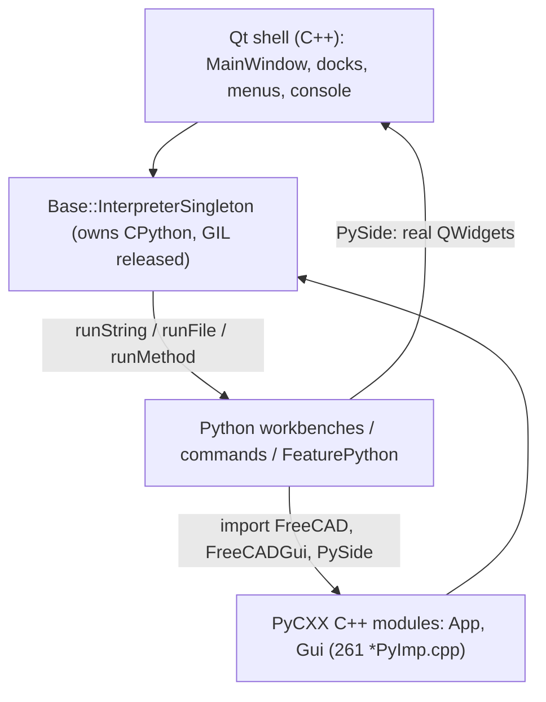
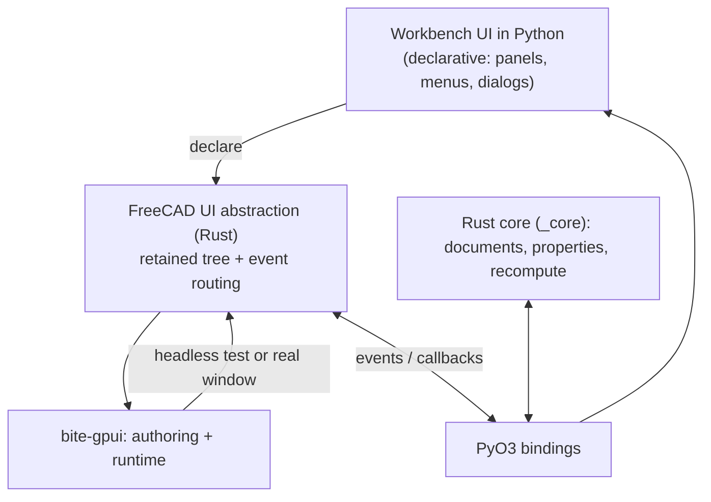

# Python scripting & a Python-built UI — research

Status: research note (2026-10-01). Answers two questions:

1. **How does FreeCAD run Python "inside the window" today?** (grounded in the source under
   `freecad-upstream/src`)
2. **What would a Blender-style, fully Python-built UI cost us**, and how does it map onto the
   Rust core + `bite-gpui` direction?

Supporting context: [`rewrite-strategy.md`](rewrite-strategy.md).

---

## Part A — How FreeCAD hosts Python and exposes scripting in-window

### A1. The app owns an embedded CPython

`Base::InterpreterSingleton` (`src/Base/Interpreter.h:269`) is the single owner of the
interpreter. Initialization (`src/Base/Interpreter.cpp:649`) uses the modern config path:

```cpp
PyConfig_InitIsolatedConfig(&config);
config.isolated = 0; config.user_site_directory = 1;
Py_InitializeFromConfig(&config);          // CPython 3.11+ path
```

Immediately after init, the GIL is **released** (`PyEval_SaveThread`), so *no* thread holds it and
every crossing takes a lock explicitly. FreeCAD provides two RAII guards for that
(`src/Base/Interpreter.h:204`, `:241`): `PyGILStateLocker` (ensure/release) and
`PyGILStateRelease` (drop/restore for long C++ work). **This is the single most important
detail to copy**: the interpreter is owned by the app process, not by a `python` launcher.

### A2. C++ drives Python through one small API

`InterpreterSingleton` exposes the execution surface
(`src/Base/Interpreter.h:280`): `runString`, `runStringObject`, `runInteractiveString`,
`runFile`, `runStringArg`, `runMethod`, `runMethodVoid`, `runMethodObject`, plus
`loadModule`/`addPythonPath`. Every C++→Python call in the GUI goes through these.

Real call sites:

| Where | File:line | What it runs |
|---|---|---|
| GUI init script | `Gui/Application.cpp:2476` | `runString(ProduceScript("FreeCADGuiInit"))` |
| Macro execution | `Gui/Macro.cpp:398` | `runFile(name, localEnv)` |
| Command dispatch | `Gui/Command.cpp:854` | `runString(cmd)` |
| Active-document scripts | `Gui/Application.cpp:1638` | `runString(nameApp/nameGui)` |
| Workbench activation | `Gui/Application.cpp:1862` | guarded by `PyGILStateLocker` |
| Gestures, preference packs | `Navigation/GestureNavigationStyle.cpp`, `PreferencePackManager.cpp` | `runString` / `runFile` |

### A3. Python extends a native Qt shell

The main window is **C++/Qt**. `MainWindow::setupDockWindows()`
(`Gui/MainWindow.cpp:698`) constructs the docks in C++: Report view, **Python console**
(`setupPythonConsole`, `:779`), Selection, Task, Tree, Property, Combo and DAG views. The main
loop is `QApplication::exec()` — Python does not own an event loop; it runs as callbacks *within*
Qt's loop.

Python workbenches shape this shell through a mix of two mechanisms:

- **C++-managed declarations** — `Gui.PythonWorkbench` (`src/Gui/PythonWorkbench.pyi`) exposes
  `appendMenu`, `appendToolbar`, `appendCommandbar`, `appendContextMenu` (the C++ twins own the
  actual `QMenu`/`QToolBar`).
- **Direct Qt access** — workbenches `import PySide` and build real widgets themselves
  (task panels, dialogs, custom editors). **519 Python files import `PySide`.**

### A4. Three concrete "scripting in the window" bridges

1. **Commands.** `Gui.addCommand("X", obj)` wraps the Python object in a C++ `PythonCommand`
   (`Gui/Command.cpp:1454`). On invoke, `PythonCommand::activated()` calls
   `runMethodVoid(_pcPyCommand, "Activated")` / `runMethod(..., "(i)", iMsg)` (`:1528`);
   `isActive()` calls Python `IsActive()`; menu text/tooltips/icons come from Python
   `GetResources()`. So command **behaviour and metadata** are Python; the toolbar/menu **chrome**
   is Qt.

2. **Workbenches.** `Gui::Application::activateWorkbench` (`:1862`) instantiates the Python
   workbench class and calls `Activated()`/`Deactivated()`, holding the GIL.

3. **Scripted document objects.** `App::FeaturePython` is a C++ `DocumentObject` that owns a
   Python class. `FeaturePythonImp::execute()` (`App/FeaturePython.cpp:74`) calls the Python
   `execute()` under a `PyGILStateLocker`; `mustExecute()` (`:105`) likewise. `PropertyPythonObject`
   stores an arbitrary Python object inside a C++ property. **This is the canonical two-way loop:
   C++ recompute → Python `execute()` → Python touches C++ properties → back into C++.**

Plus **observers**: `DocumentObserverPython` (in `App/` and `Gui/`) forwards C++ document signals
to Python observer objects.



**Answer to "is it even possible?": yes — it is exactly what FreeCAD does.** The interpreter is
embedded, GIL is centrally managed, and Python both drives the UI (via PySide) and is driven by the
core (via `runMethod`, e.g. `execute()`).

---

## Part B — A "fully Python-built UI" (Blender style)

### B1. The distinction that matters

| | FreeCAD today | Blender | Target |
|---|---|---|---|
| UI **definition** | partly Python, partly C++ | Python (operators/panels/headers) | Python |
| UI **rendering** | Qt (native toolkit) | Blender's own GPU toolkit (GHOST) | `bite-gpui` (Rust) |
| Python reaches the toolkit | via `PySide` (real Qt objects) | via `bpy.types` (no native widgets) | via our Rust UI abstraction |

Blender's model is **"declare in Python, draw in the app's own toolkit"**. Adopting it means we
build a small UI DSL/abstraction in Rust, expose it to Python, and render it with GPUI.

### B2. The catch: it does *not* by itself reuse workbench UI code

The 519 `PySide` importers build **real Qt widgets**. A Python-declarative UI toolkit is a
*different* API, so those call sites need either (a) a `PySide`-compatible shim over our toolkit,
or (b) a port. This is the same risk the strategy doc already flags — going "fully Python" does not
remove the PySide surface, it gives us a cleaner place to *put* a shim. Be explicit about this;
it is the main cost.

### B3. Performance trade-off (real, but bounded)

The cost is not "Python draws pixels" — it is **crossing the boundary per event/redraw**:

- GIL + FFI on every callback;
- the UI cannot render before the interpreter is up (startup ordering);
- a Python exception in a UI callback must not take down the UI;
- animation cadence suffers if Python is in the frame path.

Mitigations that keep it viable:

- **Python declares, Rust renders.** Build a cached declarative tree; only cross into Python on
  state change or explicit callbacks — never per frame.
- Keep hot paths native: the 3D viewport, text editing, tree/table scrolling, layout, hit-testing.
- Batch/spread events; coalesce redraws.
- Isolate exceptions at the boundary (Python handler error → log + continue).
- Decide whether the UI DSL is *retained* (diffed, like a widget tree) or *immediate* (rebuilt per
  frame, Blender-ish). For a complex CAD UI, retained with a diff is the safer default.

---

## Part C — Mapping onto Rust + `bite-gpui`

`bite-gpui` is a modular re-architecture of upstream GPUI, published on crates.io as a
drop-in facade (Apache-2.0, "not affiliated with upstream GPUI or Zed"). Relevant properties:

- **Layered**: `bite-gp-types` (geometry) → `bite-gp-engine` (scene IR, text layout, renderer
  traits) → `bite-gp-platform` (OS/platform SPI, one of macOS/Linux/Windows/Web via
  `cfg(target_os)`) → `bite-gp-authoring` (the `div()` DSL) + `bite-gp-runtime` (app harness).
  The facade `bite-gpui` re-exports authoring + runtime, so `use gpui::*;` compiles unchanged.
- **Pluggable seams**: SPI traits and a pluggable `FramePipeline` — useful for instrumenting and
  for slotting a FreeCAD-specific render/overlay layer in without forking the engine.
- **Headless testing**: `#[gpui::test]` / `VisualTestContext` draw a window **in-process with no
  display server and no GPU**, and expose `debug_bounds(...)` for assertions.

That last point is decisive for us: it means the Python↔UI contract can be developed and asserted
**in this sandbox**, without a GPU or display, before we ever open a real window.

Naming caution: the facade is `bite-gpui` but the tiers use `bite-gp-*`
(`bite-gp-platform`, `bite-gp-engine`, `bite-gp-types`, `bite-gp-authoring`, `bite-gp-runtime`),
and add-ons like `bite-gp-parley` (text) exist. Pin exact versions from `bite-distribution`'s
`targets.toml` rather than guessing. Also verify license compatibility (Apache-2.0 vs FreeCAD's
LGPL-2.1-or-later) before vendoring.

Target shape:



---

## Part D — The feasibility spike (what actually answers the question)

Extends the two-way-interop milestone into the UI question. Acceptance criteria, in order:

1. **Host owns Python.** A Rust binary initializes CPython, puts `python/` on `sys.path`, imports
   `FreeCAD`, and runs a Python module. (Reuses M1's `_core`.)
2. **Python declares, Rust renders — headless.** Python builds a tiny UI (a label + a button) via
   our abstraction; Rust constructs a `bite-gpui` element tree and renders it under
   `#[gpui::test]`; assert bounds/text with `debug_bounds`. *No display, no GPU.*
3. **Event round-trip.** A synthetic click is routed to a Python handler; the handler mutates
   state; Rust re-renders; assert the new label. Measures the GIL+FFI cost per event.
4. **Exception isolation.** A deliberately raising Python handler is logged and the UI continues.
5. **Real window.** The same tree in an actual `open_window` on a real backend (may be deferred if
   the sandbox has no display).

Latency budget to measure: handler dispatch (cross into Python + run + return) should be ~µs–low-ms;
the frame path must stay in Rust.

Risks this retires: interpreter-owned-by-Rust, Python-declarative UI expressiveness, event routing,
GIL contention on the UI thread, and whether `bite-gpui`'s headless harness can underpin our tests.

Open questions:

- Linux backend of `bite-gpui` (X11/Wayland) and its behavior headless.
- Exact crate names/versions and the Apache-2.0/LGPL compatibility check.
- Retained vs immediate UI model (recommended: retained + diff).
- How much of the 519-file PySide surface we shim vs. port.

---

## Part E — Spike results (`ferrocad/crates/ferrocad_gpui`)

Verified in this sandbox (2026-10-01), against `bite-gpui` v1.21.0:

- **`bite-gpui` builds on Linux** — 709 transitive crates (wgpu, wayland/x11, font-kit, …),
  compiled with only the already-present system libs. No fork required; `use gpui::*` resolves
  through the facade.
- **The headless test harness works** — a `#[gpui::test]` compiled and ran with **no display
  server and no GPU**, mounting a view and asserting its root. This is the enabler for developing
  and CI-testing the Python↔UI contract in a sandbox.
- **Footgun (important):** `use gpui::*;` glob-imports the `test` *attribute macro* (the facade
  does `pub use gpui_authoring::*`), which **shadows the builtin `#[test]`**. The `#[gpui::test]`
  proc-macro emits `#[test]`; under the glob it re-resolves to `gpui::test` and **recurses
  infinitely** — surfacing as "recursion limit reached while expanding `#[test]`" and OOM under
  `-Zmacro-backtrace`. **Fix: import explicitly** (`use gpui::{…}; use gpui::prelude::*;`), never
  the bare glob.
- **Follow-up:** `VisualTestContext::debug_bounds("id")` returned `None` in 1.21.0 (the
  `rendered_frame.debug_bounds` map is not committed by read time). The official example avoids it;
  use `window.root::<V>(&mut cx)` for mount assertions. Investigate before relying on
  `debug_bounds` for layout assertions.

---

## Part F — Spike results: Python-declared UI, headless (all four criteria)

Implemented and green in `ferrocad` (`crates/ferrocad_gpui/src/spike.rs`,
`python/ferrocad_spike/declarative.py`); `cargo test` in `crates/ferrocad_gpui` → **3 passed**:

- **Criterion 1 — host embeds CPython.** `Host::initialize_python_runtime()` adds `python/` to
  `sys.path` and imports `ferrocad_spike.declarative` from inside a `#[gpui::test]` (i.e. on the
  dispatcher thread, not `main`). Links `libpython3.14.so`.
- **Criterion 2 — Python declares → `bite-gpui` renders, headless.** `render_ui()` returns JSON;
  `WireNode` (serde) is parsed and `wire_to_element` maps `container/label/button` → a `div()`
  tree; a `WireView` renders it and mounts in a headless window (`window.root::<WireView>()`).
- **Criterion 3 — real click round-trip.** A `button` node's `click` event is wired to a
  `bite-gpui` `on_click(cx.listener(...))`; `VisualTestContext::simulate_click` on `btn_inc` →
  Python `dispatch_event` → `AppState.increment()` → fresh JSON → tree updated and re-rendered
  (asserted "Total Operations: 1").
- **Criterion 4 — exception isolation.** Clicking `btn_err` raises in Python; the `PyErr` is caught
  at the Rust boundary, logged `[FAULT ISOLATED]`, and the previous tree kept.
- **Diffed patch stream.** On dispatch, Python diffs the new tree against the previous one and
  returns only changes — a serde-tagged `Patch::{insert,remove,update}` list — which Rust applies
  via `apply_patches` (update by id, remove by id, insert at `parent`+`index`). Increment emits one
  `update`; adding/removing a row emits one `insert`/`remove` (all three exercised end-to-end).

**PyO3 0.25 notes:** use `Python::with_gil` (not `attach`, which lands in 0.26); `Bound` methods
(`getattr`, `call0`, `call1`, `call_method1`, `extract`) live on `pyo3::types::PyAnyMethods`, which
must be imported.

**Verified external versions (2026-10-01):** `bite-gpui` **1.21.0**, `pyo3` **0.25**, `wgpu` **30**
(pin to `bite-gp-wgpu`), `scenix` **1.5** (`scenix-scene` = GPU-free scene graph).

**Test isolation:** Rust runs tests in parallel, but they share one embedded CPython and its
module-global state. A single `#[gpui::test]` therefore drives the interpreter (with a
`reset_state()` helper); production tests will need per-test isolation or serialization.

**Real-window (step 3) outcome:** `cargo run` fails here because `DISPLAY`/`WAYLAND_DISPLAY` are set
but **no display server is running** — Wayland returns `NoCompositor`, X11 `Unknown connection
error`. Software Vulkan (`lavapipe`) and Mesa *are* installed, so the path should work on a machine
with a display server; the sandbox (non-root, no `Xvfb`/compositor) can't host one. **The headless
`#[gpui::test]` harness is therefore the supported validation path in this environment.**

**Next:** bind `fc-core` from `fc-python` (expose the document/object model to Python), then M3
(generate bindings from the upstream IDL). Real-window CI is captured in
`ferrocad/.github/workflows/ci.yml` (`xvfb-run` + `lavapipe`), untested here (no display server).
