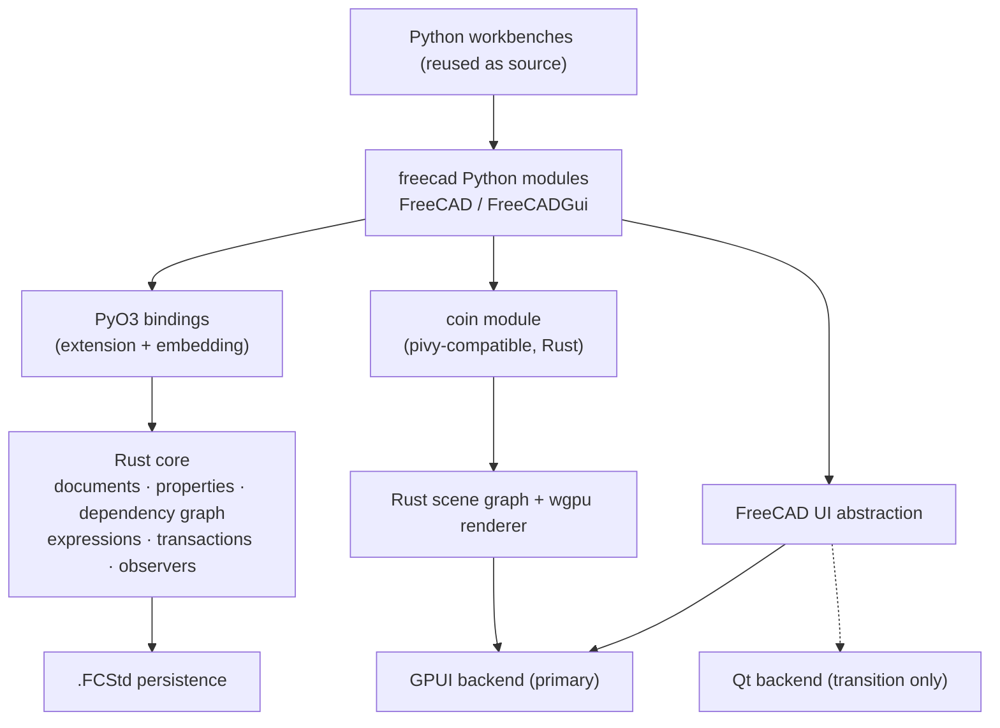

# FreeCAD-on-Rust — Rewrite Strategy

Status: **authoritative direction** (2026-10-02). Supersedes the recommendation in
[`coin-bridge-reuse-assessment.md`](coin-bridge-reuse-assessment.md), whose *evidence*
(§1–§4, §10) remains valid as the risk register below.

*Current state (see [`milestones.md`](milestones.md)):* **FerroCAD** — M0–M3 and sixteen M4 slices
are done, and the POC has been restructured into a Cargo **workspace** (edition 2024) in this
repository. A pure-Rust `ferrocad_core` + PyO3 `ferrocad` extension serve the FreeCAD Python
surface behind the `python/FreeCAD` facade, with a conformance harness tracking **160 upstream tests
passing** across eight `Mod/Test` files (`StringHasher.py` 4/4, `UnitTests.py` 12/12, the
`DocumentObserver`/`DocumentRecovery` cases, the `Proxy`/`PropertyPythonObject` save/restore tests,
the expression-parse/cycle tests, and `BaseTests` 48/49). The active track is the `Base`/`App`
surface. Naming: the repo is `ferrocad`; older sections below use the pre-restructure crate names
(`fc-core` → `crates/ferrocad_core`, `fc-python` → `crates/ferrocad_py`, `fc-gen` →
`crates/ferrocad_gen`, `fc-host` → `crates/ferrocad_gpui`). The Python namespace stays `FreeCAD`.
The M1 `freecad-py` crate (`FreeCAD._core`) was removed as dead code.

---

## 1. Decision

**Rip the bandaid: pick the clean-room Rust core instead of a gradual phase-out of C++.**

The earlier assessment recommended the opposite (keep Coin3D and everything under
`src/Gui`, replace only the Qt host). That recommendation is now explicitly rejected.
Rationale for the reversal:

- The C++/Python boundary is an ABI that spans languages (Coin's `SoType` registry, PyCXX
  modules, generated `*PyImp.cpp`). Phasing it out means maintaining *both* worlds and the
  bridge between them for the whole transition — often more work than the rewrite itself.
- The pieces we most want (a `wgpu`/GPUI 3D view, a modern async UI, a memory-safe core)
  are exactly the pieces the legacy stack makes hardest.
- The Python workbenches are, by design, *reusable as source* — so the rewrite does not start
  from zero on the largest part of the product.

This is a high-risk, high-ceiling bet. §5 keeps the concrete risks visible rather than
burying them.

---

## 2. Target architecture

The five pillars:

1. **Reuse the Python workbenches** as the source of workbench behaviour (they are already
   Python; keep them, re-point them at the new modules).
2. **Migrate the document object core to Rust** — replace the `src/App` C++ kernel
   (`Property`/`PropertyContainer`, `DocumentObject`, dependency graph, expressions,
   transactions, observers, persistence).
3. **Wrap Qt behind a FreeCAD-specific UI abstraction**, then add a **`bite-gpui` backend**
   for it, so workbench UI code stops binding to Qt directly. Direction: a
   **Python-declarative, Rust-rendered** UI (Blender-style) — see
   [`python-ui-research.md`](python-ui-research.md).
4. **Replace Coin3D** with a Rust scene graph rendered through GPUI/`wgpu`, plus a
   `coin` module (pivy-compatible) so workbench scene-graph code keeps working.
5. **Expose the whole thing to Python**, bootstrapped by a hello-world script (milestone M0,
   already working; see the [repository](..)).

---

## 3. Binding strategy (settled)

The mechanism for Rust ↔ Python is **PyO3** (both extension-module and embedding). This is no
longer provisional: it is implemented and validated across M1→M4. A temporary **C ABI +
`ctypes` fallback** existed from M0 but was **removed** (2026-10-05): it duplicated the model
rather than bridging the core, and PyO3 covers every capability it had. See
[`architecture.md`](architecture.md).

- **Extension module** — workbench code does `import FreeCAD`; implemented as the `ferrocad` PyO3
  extension (`crates/ferrocad_py`) over the `ferrocad_core` Rust library. A thin `python/FreeCAD`
  facade adds the App-level layer (document registry, `ActiveDocument`, version); it stays
  importable as `FreeCAD` and is packaged as the `ferrocad` distribution (maturin `pyproject.toml`).
- **Embedding** — the Rust host initializes CPython and runs workbenches; proven in the
  `crates/ferrocad_gpui` spike (`cargo test -p ferrocad_gpui` → 3 passed, including a Python-declared
  UI + click round-trip). Note the layering: `ferrocad_core` is pure Rust and does **not** embed
  Python; the embedding lives in the host.
- **`abi3`** is used, built against the sandbox's CPython **3.14** via
  `PYO3_USE_ABI3_FORWARD_COMPATIBILITY=1`; PyO3 **0.25** (latest 0.29). The long-term supported
  CPython range (3.12/3.13/3.14) is still an open packaging decision.
- **CPython headers are a hard build dependency.** The M0 `ctypes`/C-ABI fallback
  (`_ctypes_backend`, `crates/ferrocad_ctypes`) was removed; see [`architecture.md`](architecture.md).

**Verified versions (2026-10-02):** `bite-gpui` **1.21.0** · `pyo3` **0.25** · `serde` **1** ·
`serde_json` **1** · `petgraph` **0.6** · `rustc` 1.99 · CPython **3.14**.

---

## 4. Information to exploit

The rewrite does **not** have to reverse-engineer the Python API — upstream publishes its
contract:

- `src/Tools/bindings/` — the **legacy** XML interface model + templates + `generate.py` →
  261 `*PyImp.cpp`. Upstream is migrating away from this.
- `src/Tools/typing/` — 320 `.pyi` stubs, the current declaration format (migration target).
- `src/Mod/Test/TestCoinNodeSnapshots.py` — a snapshot suite of the Coin node API in use.

**Treat the `.pyi` stubs as the IDL and generate the Rust bindings from them.** This is the
highest-leverage move for API compatibility: swap the implementation underneath while keeping
the Python surface byte-compatible.

> **Migration note.** XML declarations are legacy; XML → `.pyi` is still in progress upstream.
> On the pinned `main` @ `99c5620` checkout no `*Py.xml` remain and every `*PyImp.cpp` has a
> matching `.pyi`, so `.pyi` is the authoritative target surface here; released binaries may still
> expose XML-declared classes, so parity is checked against the upstream Python *tests*, not the
> declaration format.

---

## 5. Risk register (carried over from the assessment)

| Risk | Evidence | Impact on the rewrite |
|---|---|---|
| Coin's `SoType` is a cross-language ABI | 35 `coin.SoType` sites; `SoBrep*` nodes live in `Mod/Part/Gui` | The `coin` compatibility module is the single hardest deliverable — it must reproduce Coin's type registry well enough that Python can `SoType.fromName(...).createInstance()` |
| ~39 custom Coin node/kit classes, 50 `initClass` registrations | `src/Gui/Inventor`, `src/Gui/SoFC*` | Each must be reimplemented or emulated in the Rust scene graph |
| 75 Python files import `pivy` | 106 × `from pivy import coin` | The `coin` module must satisfy all of them |
| 519 Python files import `PySide` | direct `QtWidgets` use, not just `FreeCADGui` | The UI abstraction must either keep Qt alive during transition or provide a `PySide`-compatible shim |
| Qt is hard-wired into the viewer | `View3DInventorViewer : QuarterWidget`, `QOpenGLWidget` | Replaced wholesale by the GPUI renderer |
| Coin uses legacy compatibility-profile GL | `Application.cpp:2625` | Moot once we own the renderer on `wgpu`; but remove any assumption that Coin's output can be reused |
| GPU interop (host/guest modes, DMA-BUF, device loss) | prior interop research | Re-scope onto the GPUI renderer; offscreen-copy first, shared-surface later |
| App layer is not fully Qt-free | `App/ConsoleQtBridge.cpp`, `App/TranslationQtBridge.cpp` | Small; must be abstracted in the Rust core |

---

## 6. Phasing

| Phase | Goal | Exit criterion |
|---|---|---|
| **M0** ✅ | Hello-world headless script on a Rust core | `hello_freecad.py` runs on the Rust object model (`freecad-rs-poc`) |
| **M1** ✅ | Replace the `ctypes` bridge with **PyO3** | `FreeCAD._core` PyO3 module; same script + 11 parity tests (the temporary `ctypes` fallback was later removed) |
| **M2** ✅ | Rust core: dependency graph, expressions, transactions, observers | `fc-core` — `Property`/`PropertyContainer`, `Quantity`, `petgraph` DAG, transactions (undo/redo), observers, expressions (25 tests) |
| **M3** ✅ | Python API parity from the upstream IDL | See `milestones.md` §3: **M3a** `.pyi` inventory (Python `ast`) · **M3b** `fc-python` primary backend · **M3c** generated skeleton bindings (`fc-gen`) · **M3d** conformance harness |
| **M4** ▶ | Rust rewrite of the `Base`/`App` surface, driven by conformance | **Slices 1–16 done:** `Base`/`Units`, geometry, `App::FeatureTest`, persistence, metadata, extensions/groups/`FreeCADGui`, origin `getSubObject`, link/`Proxy` surface, `Document.Meta`/`settings`, `LinkSub`, observers that fire, persistence/recovery, Python-object/`Proxy` persistence, the expression engine, a wider harness + `ParameterGrp` rewrite + full `Base` type surface, and matrix decomposition (`decompose`/`hasScale`/`ScaleType`) + rotation numerics. Conformance: **146 upstream tests pass** (`StringHasher.py` 4/4, `UnitTests.py` 12/12, `BaseTests` 48/49) |
| **MVP** ▶ | Headless, geometry-free **parametric document engine** as the drop-in `FreeCAD` package | See [`mvp-path.md`](mvp-path.md): upstream `Document.py` parity **minus** the C++ `App::FeatureTest` fixture (~18 real gaps left, ~176 total tests); **160 upstream tests pass**; `examples/mvp_workflow.py` passes on both backends. **Slices A1 + B1 + A2 + B2 done**; next B3 (containers/links) |
| **MVP-app** ▶ | Interactive **dev-tool app shell** over that engine | See [`app-shell-vision.md`](app-shell-vision.md): one `bite-gpui` window embedding CPython over the `FreeCAD` API — open/close/load/save, undo/redo, DOM-like inspector, property editor, Python console (slices S1–S6) |
| **M5** | UI abstraction + `bite-gpui` backend; **Python-declarative UI** (Blender-style), Rust-rendered | Headless + diffed patches proven (`rust/fc-host`); real window needs a display server (blocked in sandbox) |
| **M6** | Rust scene graph + `wgpu` renderer + `coin`/pivy-compatible module | A workbench builds a Coin-style scene and it renders |
| **M7** | `.FCStd` persistence + workbench bring-up | Round-trip a real document (POC persistence is JSON; upstream `.FCStd` format is later) |
| **M8** | First full workbench end-to-end | A real workbench is usable |

*Note:* the Python-declarative UI **spike** (now de-risked, see `rust/fc-host`) was run early
because it was the highest-uncertainty bet; the *full* UI work (M5) still lies ahead. The
document-object core (M2–M4) is the active track, and the **MVP app shell**
([`app-shell-vision.md`](app-shell-vision.md)) is the first UI deliverable built on it.

---

## 7. Open decisions

1. **Python target version** — *resolved for development*: build against CPython 3.14 via `abi3`
   + `PYO3_USE_ABI3_FORWARD_COMPATIBILITY`. The long-term supported range (3.12/3.13/3.14) is a
   packaging decision, still open.
2. **`abi3` or per-version binaries** for distribution — still open.
3. **UI abstraction scope & model** — keep Qt as a runtime dependency during transition, or
   commit early to `bite-gpui`-only widgets? How much of the 519-file `PySide` surface do we
   shim versus port? And **retained (diffed tree) vs immediate (per-frame)** rendering —
   recommendation: retained with a diff, hot paths (3D view, text, trees) kept native. See
   [`python-ui-research.md`](python-ui-research.md) §B–C.
4. **Coin strategy** — reimplement the scene graph in Rust, or temporarily keep Coin behind
   the abstraction until the renderer is ready?
5. **Repository layout** — **settled:** a cargo workspace under `crates/` (`ferrocad_core`,
   `ferrocad_py`, `ferrocad_gen`, `ferrocad_widgets`, `ferrocad_gpui`), edition 2024, packaged as the
   `ferrocad` distribution. The `fc-ui`/`fc-render`/`fc-coin-compat`/`fc-app` crates from the
   original plan (`fc` = FerroCAD) will slot in alongside these.
6. **Conformance scope** — the harness runs 5 curated `Mod/Test` files. Which additional
   upstream test files to add, and how far to drive `Document.py` (the `FeatureTest.execute()`
   recompute logic is C++ test-object behaviour, likely out of scope).

*Settled during M3 (see `milestones.md` §3.6):* `.pyi` parser = Python `ast`; codegen =
**skeleton** bindings + hand-written behaviour glue over `ferrocad_core`.

---

## 8. Relation to existing material

- [`coin-bridge-reuse-assessment.md`](coin-bridge-reuse-assessment.md) — the reuse analysis
  and measurements; **recommendation superseded**, evidence retained (§5 above).
- [`python-ui-research.md`](python-ui-research.md) — how FreeCAD hosts Python in-window, and the
  Blender-style Python-declarative UI direction over `bite-gpui`.
- [`milestones.md`](milestones.md) — the milestone record (M0 → M4 slices), the decisions
  unlocked by the spike, and the M3 (IDL codegen) plan + conformance numbers.
- [`mvp-path.md`](mvp-path.md) — **the MVP definition**: a headless, geometry-free parametric
  document engine as the drop-in `FreeCAD` package; the minimum model/workflow/persistence and the
  slices that get there (acceptance = upstream `Document.py` parity minus the C++ fixture).
- [`documentation.md`](documentation.md) — the documentation approach (Diátaxis rustdoc for the Rust
  crates; the Python surface documented by convention + upstream; Sphinx later).
- The [repository](..) — the artifact: `crates/ferrocad_core` (Rust core), `crates/ferrocad_py`
  (PyO3 `ferrocad` module), `crates/ferrocad_gen` (generated skeletons), `crates/ferrocad_widgets`
  (shared widgets), `crates/ferrocad_gpui` (app shell), `python/FreeCAD` (facade), `tools/`
  (inventory/codegen/conformance), `pyproject.toml` (maturin `ferrocad` distribution).
